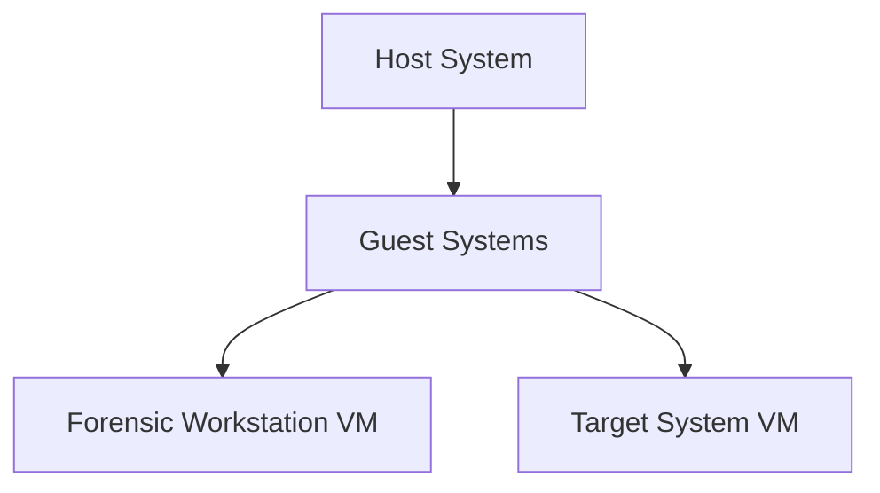

## Host System Setup
The host system must support running two guest systems as Virtual Machines (VMs):

1. **Forensic Workstation**
   - Operating System: Windows Server 2019 Essentials
   - Additional Layer: Windows Subsystem for Linux (WSL)

2. **Target System**
   - Operating System: Windows 10

### VM Resource Requirements

#### Forensic Workstation VM
- **Disk Space**: 100 GB
- **Memory**: Minimum of 4 GB RAM

#### Target System VM
- **Disk Space**: 20 GB
- **Memory**: 4 GB RAM

### Additional Storage Requirements
- **Storage Space**: 25 GB for forensic files, tools, and other necessary resources

## Summary of Resource Allocation
- **Total Disk Space**: 145 GB (100 GB for workstation + 20 GB for target + 25 GB for additional storage)
- **Total Memory**: 8 GB (4 GB for each VM)

## Mermaid.js

<mermaid>
graph TD;
    A-->B;
    A-->C;
    B-->D;
    C-->D;
</mermaid>
