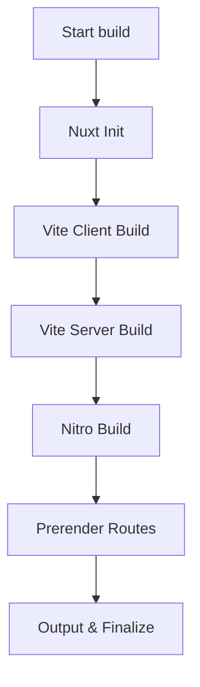

## 🧱 1. Nuxt Init

* Leest `nuxt.config.ts`
* Laadt modules, plugins, routes, composables
* Initialiseert Nitro & Vite context
* Bereidt de buildomgeving en variabelen voor

📊 **Gemiddeld:** ~4 s
📁 Geen output — enkel setup in memory

## ⚙️ 2. Vite Client Build

* Bundelt en minified de client-applicatie (`.vue`, `.ts`, `.css`)
* Maakt chunks voor lazy-loading en route-splitsing
* Schrijft naar `.nuxt/dist/client`

📊 **Gemiddeld:** ~6–7 s
📁 `.nuxt/dist/client/`

## 🧩 3. Vite Server Build

* Bouwt de SSR-versie van de app (server-entry)
* Transpileert code voor server-side rendering
* Gebruikt `vite build --ssr`

📊 **Gemiddeld:** ~7 s
📁 `.nuxt/dist/server/`

## 🔥 4. Nitro Build

* Bundelt alle server-routes, API-endpoints en middleware
* Genereert de SSR renderer en API-runtime
* Output in `.output/server/`

📊 **Gemiddeld:** ~25–35 s
📁 `.output/server/`

## 🌐 5. Prerender Routes

* Rendert alle statische HTML-routes (bijv. `/`, `/docs`, `/og-images/...`)
* Crawlt `nitro.prerender.routes` om payloads en OG-afbeeldingen te genereren
* Schrijft resultaten naar `.output/public`

📊 **Gemiddeld:** ~8 s
📁 `.output/public/`


## 📦 6. Output & Finalize

* Kopieert `public/` assets naar `.output/public/`
* Schrijft metadata-bestanden (`.output/nitro.json`)
* Verzamelt manifesten, routes en prerender-payloads
* Sluit build af en maakt gereed voor deployment

📊 **Gemiddeld:** ~0.1 s
📁 `.output/`

💡 **Resultaat:** de complete productie-output:

```
.output/
 ├─ server/   ← SSR & API
 ├─ public/   ← statische assets
 └─ nitro.json
```

---

## ▶️ Lokaal testen

Na de build kun je de productie-server lokaal draaien:

```bash
pnpm run preview
```

📍 Start een Node-server via `.output/server/index.mjs`
en serveert de prerenderde en SSR-routes.

```
─────────────────────────────────────────────
🏗️Build voltooid!
─────────────────────────────────────────────
🧱Fase 1: Nuxt init        – 4.01s
⚙️Fase 2: Vite client      – 6.52s
🧩Fase 3: Vite server      – 7.05s
🔥Fase 4: Nitro build      – 29.28s
🌐Fase 5: Prerender routes  – 8.28s
📦Fase 6: Output finalize   – 0.10s
─────────────────────────────────────────────
✅Totale buildtijd          – 52.52s
─────────────────────────────────────────────
```
