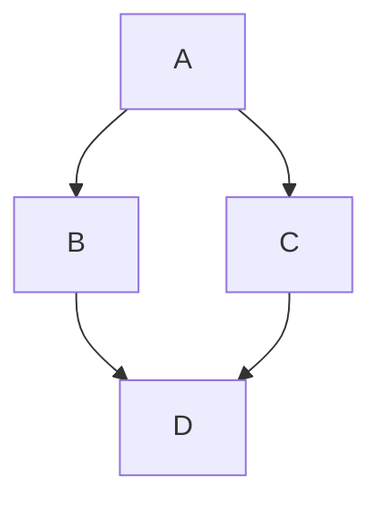

## Data Visualization

<iframe
	width="100%"
	height="750"
	src="https://observablehq.com/embed/@d3/bar-chart"
	frameborder="0"
	allowfullscreen
	allow="accelerometer; clipboard-write; encrypted-media; gyroscope; picture-in-picture"
	loading="lazy"
>
</iframe>

## Diagram and Charts



::callout
---
icon: i-mdi:nuxt
target: _blank
to: https://docs.github.com/en/get-started/writing-on-github/working-with-advanced-formatting/creating-diagrams
---
[Learn more about the diagrams and charts](https://docs.github.com/en/get-started/writing-on-github/working-with-advanced-formatting/creating-diagrams)
::

## Mathmatical Expressions

```markdown
**The Cauchy-Schwarz Inequality**
$$\left( \sum_{k=1}^n a_k b_k \right)^2 \leq \left( \sum_{k=1}^n a_k^2 \right) \left( \sum_{k=1}^n b_k^2 \right)$$
```

::callout
---
icon: i-mdi:nuxt
target: _blank
to: https://docs.github.com/en/get-started/writing-on-github/working-with-advanced-formatting/writing-mathematical-expressions
---
[Learn more about the mathmatical expressions](https://docs.github.com/en/get-started/writing-on-github/working-with-advanced-formatting/writing-mathematical-expressions)
::

## STL 3D Models

```stl
solid cube_corner
  facet normal 0.0 -1.0 0.0
	outer loop
	  vertex 0.0 0.0 0.0
	  vertex 1.0 0.0 0.0
	  vertex 0.0 0.0 1.0
	endloop
  endfacet
  facet normal 0.0 0.0 -1.0
	outer loop
	  vertex 0.0 0.0 0.0
	  vertex 0.0 1.0 0.0
	  vertex 1.0 0.0 0.0
	endloop
  endfacet
  facet normal -1.0 0.0 0.0
	outer loop
	  vertex 0.0 0.0 0.0
	  vertex 0.0 0.0 1.0
	  vertex 0.0 1.0 0.0
	endloop
  endfacet
  facet normal 0.577 0.577 0.577
	outer loop
	  vertex 1.0 0.0 0.0
	  vertex 0.0 1.0 0.0
	  vertex 0.0 0.0 1.0
	endloop
  endfacet
endsolid
```

::callout
---
icon: i-mdi:nuxt
target: _blank
to: https://docs.github.com/en/get-started/writing-on-github/working-with-advanced-formatting/creating-diagrams
---
[Learn more about the STL 3D models](https://docs.github.com/en/get-started/writing-on-github/working-with-advanced-formatting/creating-diagrams)
::
