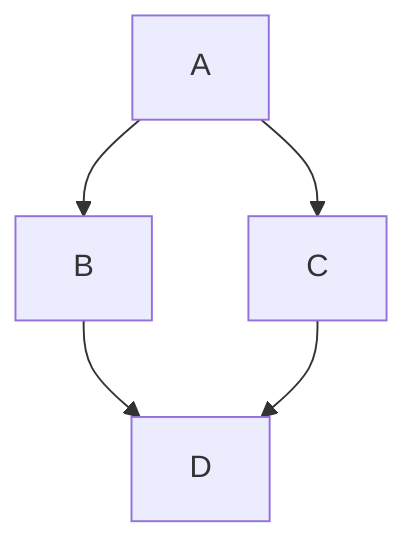

## Link

```markdown
[Link](http://localhost:3000/the-lab/the-lab/prose)
```

[Link](http://localhost:3000/the-lab/the-lab/prose)

## Link Internal

```markdown
[`Link Internal`](/instructions/app)
```

[`Link Internal`](/instructions/app)

## Callout

> Will be used to link to `external` info and note/tip/important/warnings/cautions TO `internal` domains.

```mdc
::callout
---
icon: i-mdi:nuxt
target: _blank
to: https://ui.nuxt.com/pro/prose/callout
---
[Learn more about the callouts](https://ui.nuxt.com/pro/prose/callout)
::
```

::callout
---
icon: i-mdi:nuxt
target: _blank
to: https://ui.nuxt.com/pro/prose/callout
---
[Learn more about callouts](https://ui.nuxt.com/pro/prose/callout)
::

## Github Highlights

> Will be used to display internal messages. Read more [here](https://github.com/orgs/community/discussions/16925).

::note
Highlights information that users should take into account, even when skimming.
::

::tip
Optional information to help a user be more successful.
::

::important
Crucial information necessary for users to succeed.
::

::warning
Critical content demanding immediate user attention due to potential risks.
::

::caution
Negative potential **consequences** of an action.
::

## PDF

### Callout

```mdc
::callout
  ---
  icon: i-heroicons-light-bulb
  target: _blank
  to: /assets/cyber-response-plan.pdf
  ---
  Cyber Reponse Plan PDF by ABN AMRO
::
```

::callout
---
icon: i-heroicons-light-bulb
target: _blank
to: /assets/cyber-response-plan.pdf
---
Cyber Reponse Plan PDF by ABN AMRO
::

### Preview

```markdown
<iframe
	src="/assets/cyber-response-plan.pdf"
	width="100%"
	height="600px"
>
</iframe>
```

<iframe
	src="/assets/cyber-response-plan.pdf"
	width="100%"
	height="600px"
>
</iframe>

## DOCX

> If you use the published version (Go to File > Share > Publish to the web in Google Docs.), Then we can add visible "Edit Mode" link below the iframe with a p tag.

```markdown
<iframe
	src="https://docs.google.com/document/d/1Jfcv2RIp0dE0X0wwmLZRwNfP_M1Ue9G_yMnhSHSYnqc/preview?/embed"
	width="100%"
	height="400"
>
</iframe>
<p style="text-align: center;">
	<a
		target="_blank"
		href="https://docs.google.com/document/d/1Jfcv2RIp0dE0X0wwmLZRwNfP_M1Ue9G_yMnhSHSYnqc/edit"
	>
		Switch to Edit Mode
	</a>
</p>
```

<iframe
	src="https://docs.google.com/document/d/1Jfcv2RIp0dE0X0wwmLZRwNfP_M1Ue9G_yMnhSHSYnqc/preview?/embed"
	width="100%"
	height="400"
>
</iframe>
<p style="text-align: center;">
	<a
		target="_blank"
		href="https://docs.google.com/document/d/1Jfcv2RIp0dE0X0wwmLZRwNfP_M1Ue9G_yMnhSHSYnqc/edit"
	>
		Switch to Edit Mode
	</a>
</p>

## SLIDES

> The URL Path/Endpoint:/embed part of the URL is called the "embed mode" or "embed URL". It is a specific URL path used by Google to provide an embeddable version of its documents, including Google Slides, Google Docs, Google Sheets, etc.

```html
<iframe
	src="https://docs.google.com/presentation/d/1QdRlmAGxmm4StYfHMSn-oLFmkR5kiceQfAmkIZXAjOA/embed"
	width="100%"
	height="400"
>
</iframe>
```

<iframe
	src="https://docs.google.com/presentation/d/1QdRlmAGxmm4StYfHMSn-oLFmkR5kiceQfAmkIZXAjOA/embed"
	width="100%"
	height="400"
>
</iframe>

## IMG

```markdown

```


## SVG

> In your use case, if you want more specific control over how the image is presented (like in your detailed Git workflow document), the HTML `` tag would give you the flexibility needed.

```markdown

```


## GIF

```markdown

```


## Lottie Animation

Lottie animation allows you to embed lightweight, scalable animations in your documents using JSON-based vector files for high-quality visuals.

## Audio

```html
<audio controls>
	<source src="/assets/Xeno - SSD (prod. MILØS & K Akira) (Directed by Ivar Atilgan).mp3" type="audio/mpeg" />
	Your browser does not support the audio element.
</audio>
```

<audio controls>
	<source src="/assets/Xeno - SSD (prod. MILØS & K Akira) (Directed by Ivar Atilgan).mp3" type="audio/mpeg" />
	Your browser does not support the audio element.
</audio>

## Video

> Can't use the multline formatting. Won't render the video.

```markdown
<video
	controls
	title="title"
	poster="/content/1.the-lab/1.the-lab/13.prose/DAN-DAN-DAN.webp">
	<source
		src="/content/1.the-lab/1.the-lab/13.prose/DAN-DAN-DAN.mp4"
		type="video/mp4">
	Your browser does not support the video tag.
</video>
```

<video
	controls
	title="title"
	poster="/content/1.the-lab/1.the-lab/13.prose/DAN-DAN-DAN.webp">
	<source
		src="/content/1.the-lab/1.the-lab/13.prose/DAN-DAN-DAN.mp4"
		type="video/mp4">
	Your browser does not support the video tag.
</video>

## YouTube

> To maintain the correct aspect ratio (16:9) for a YouTube video when its width is set to 100%, you can use a responsive embed technique. This ensures the video scales proportionally while keeping the aspect ratio intact.

```html
<div style="position: relative; width: 100%; height: 0; padding-bottom: 56.25%; overflow: hidden">
	<iframe
		src="https://www.youtube.com/embed/msGQOO6f3h0"
		frameborder="0"
		allow="accelerometer; autoplay; encrypted-media; gyroscope; picture-in-picture"
		allowfullscreen
		style="position: absolute; top: 0; left: 0; width: 100%; height: 100%"
	>
	</iframe>
</div>
```

<div style="position: relative; width: 100%; height: 0; padding-bottom: 56.25%; overflow: hidden">
	<iframe
		src="https://www.youtube.com/embed/msGQOO6f3h0"
		frameborder="0"
		allow="accelerometer; autoplay; encrypted-media; gyroscope; picture-in-picture"
		allowfullscreen
		style="position: absolute; top: 0; left: 0; width: 100%; height: 100%"
	>
	</iframe>
</div>

## Maps

```html
<iframe
	src="https://www.google.com/maps/embed?pb=!1m18!1m12!1m3!1d52013.23489943439!2d34.40808693420224!3d31.50172527745371!2m3!1f0!2f0!3f0!3m2!1i1024!2i768!4f13.1!3m3!1m2!1s0x14fd7f1e7b49c7e9%3A0xe9d3f47c1dc5a4c4!2sGaza!5e0!3m2!1sen!2s!4v1690399214876!5m2!1sen!2s"
	width="100%"
	height="750"
	style="border: 0"
	allowfullscreen=""
	loading="lazy"
	referrerpolicy="no-referrer-when-downgrade"
>
</iframe>
```

<iframe
    src="https://www.google.com/maps/embed?pb=!1m18!1m12!1m3!1d52013.23489943439!2d34.40808693420224!3d31.50172527745371!2m3!1f0!2f0!3f0!3m2!1i1024!2i768!4f13.1!3m3!1m2!1s0x14fd7f1e7b49c7e9%3A0xe9d3f47c1dc5a4c4!2sGaza!5e0!3m2!1sen!2s!4v1690399214876!5m2!1sen!2s"
    width="100%"
    height="750"
    style="border:0;"
    allowfullscreen=""
    loading="lazy"
    referrerpolicy="no-referrer-when-downgrade"
>
</iframe>

## GeoJSON and TopoJSON maps

```geojson
{
  "type": "FeatureCollection",
  "features": [
    {
      "type": "Feature",
      "id": 1,
      "properties": {
        "ID": 0
      },
      "geometry": {
        "type": "Polygon",
        "coordinates": [
          [
              [-90,35],
              [-90,30],
              [-85,30],
              [-85,35],
              [-90,35]
          ]
        ]
      }
    }
  ]
}
```

## Sandbox

```html
<iframe
	style="width: 100%"
	height="750"
	scrolling="yes"
	title="Sandbox"
	src="https://icon-sets.iconify.design"
	frameborder="no"
	allowfullscreen="true"
>
</iframe>
```

<iframe
	style="width: 100%"
	height="750"
	scrolling="yes"
	title="Sandbox"
	src="https://icon-sets.iconify.design"
	frameborder="no"
	allowfullscreen="true"
>
</iframe>

## Data Visualization

<iframe
    width="100%"
    height="750"
    src="https://observablehq.com/embed/@d3/bar-chart"
    frameborder="0"
    allowfullscreen
    allow="accelerometer; clipboard-write; encrypted-media; gyroscope; picture-in-picture"
    loading="lazy"
>
</iframe>

## Diagram and Charts



::callout
---
icon: i-mdi:nuxt
target: _blank
to: https://docs.github.com/en/get-started/writing-on-github/working-with-advanced-formatting/creating-diagrams
---
[Learn more about the diagrams and charts](https://docs.github.com/en/get-started/writing-on-github/working-with-advanced-formatting/creating-diagrams)
::

## Mathmatical Expressions

```markdown
**The Cauchy-Schwarz Inequality**
$$\left( \sum_{k=1}^n a_k b_k \right)^2 \leq \left( \sum_{k=1}^n a_k^2 \right) \left( \sum_{k=1}^n b_k^2 \right)$$
```

::callout
---
icon: i-mdi:nuxt
target: _blank
to: https://docs.github.com/en/get-started/writing-on-github/working-with-advanced-formatting/writing-mathematical-expressions
---
[Learn more about the mathmatical expressions](https://docs.github.com/en/get-started/writing-on-github/working-with-advanced-formatting/writing-mathematical-expressions)
::

## STL 3D Models

```stl
solid cube_corner
  facet normal 0.0 -1.0 0.0
    outer loop
      vertex 0.0 0.0 0.0
      vertex 1.0 0.0 0.0
      vertex 0.0 0.0 1.0
    endloop
  endfacet
  facet normal 0.0 0.0 -1.0
    outer loop
      vertex 0.0 0.0 0.0
      vertex 0.0 1.0 0.0
      vertex 1.0 0.0 0.0
    endloop
  endfacet
  facet normal -1.0 0.0 0.0
    outer loop
      vertex 0.0 0.0 0.0
      vertex 0.0 0.0 1.0
      vertex 0.0 1.0 0.0
    endloop
  endfacet
  facet normal 0.577 0.577 0.577
    outer loop
      vertex 1.0 0.0 0.0
      vertex 0.0 1.0 0.0
      vertex 0.0 0.0 1.0
    endloop
  endfacet
endsolid
```

::callout
---
icon: i-mdi:nuxt
target: _blank
to: https://docs.github.com/en/get-started/writing-on-github/working-with-advanced-formatting/creating-diagrams
---
[Learn more about the STL 3D models](https://docs.github.com/en/get-started/writing-on-github/working-with-advanced-formatting/creating-diagrams)
::

## CodeInline

```markdown
`CodeInline`
```
`CodeInline`

## CodeBlock

````markdown
```js
function Nameless() {
  this.code = 'No Name'
}

console.log
```
````

```js
function Nameless() {
	this.code = 'No Name'
}

console.log
```

## CodeGroup

````markdown
::code-group

  ```shell [pnpm]
  pnpm add @nuxt/ui
  ```

  ```shell [yarn]
  yarn add @nuxt/ui
  ```

  ```shell [npm]
  npm install @nuxt/ui
  ```
::
````

::code-group

```shell [pnpm]
pnpm add @nuxt/ui
```

```shell [yarn]
yarn add @nuxt/ui
```

```shell [npm]
npm install @nuxt/ui
```
::

## CodeTabs

````mdc
::tabs
  ::div
  ---
  label: Code
  icon: i-heroicons-code-bracket-square
  ---

  ```mdc
  ::callout
  Lorem velit voluptate ex reprehenderit ullamco et culpa.
  ::
  ```
  ::

  ::div
  ---
  label: Preview
  icon: i-heroicons-magnifying-glass-circle
  ---

  ::callout
  Lorem velit voluptate ex reprehenderit ullamco et culpa.
  ::
  ::
::
````

::tabs
  ::div
  ---
  label: Code
  icon: i-heroicons-code-bracket-square
  ---

  ```mdc
  ::callout
  This is a `Tab` of a `TabGroup` with full **markdown** support. It can be used to link to [read more about it]([prose](https://ui.nuxt.com/pro/prose/tabs)).
  ::
  ```
  ::

  ::div
  ---
  label: Preview
  icon: i-heroicons-magnifying-glass-circle
  ---

  ::callout
  This is a `tab` with full **markdown** support. It can be used to link to [read more about it]([prose](https://ui.nuxt.com/pro/prose/tabs)).
  ::
::

## H1

```markdown
# This is a H1
```

# This is a H1

## H2

```markdown
## This is a H2
```

## H3

```markdown
### This is a H3
```

### This is a H3

## H4

```markdown
#### This is a H4
```

#### This is a H4

## H5

```markdown
##### This is a H5
```

##### This is a H5

## H6

```markdown
###### This is a H6
```

###### This is a H6

## HR

```markdown
---
```

## P

```markdown
Just regular text
```
Regular dagular

## Bold

```markdown
Making it **BOLD**
```

**This is bold text**

## Italic

```markdown
Writing text in _italic_
```

*This text is italicized*

## Strikethrough

```markdown
~~This was mistaken text~~
```

~~This was mistaken text~~

## Subscript

```markdown
This is a <sub>subscript</sub> text
```

This is a <sub>subscript</sub> text

## Superscript

```markdown
This is a <sup>superscript</sup> text
```

This is a <sup>superscript</sup> text

## Underline

```markdown
This is an <ins>underlined</ins> text
```

Underlines are <u>hard to read</u> and are reserved for hyperlinks.

## Blockquote

```markdown
> This would render a blockquote
```

> The blockquote element (>> in Markdown) is used to indicate a section of content that is a quotation from another source. It is often used when quoting someone else’s writing, providing citations, or highlighting a noteworthy part of a text that comes from another author or reference material.

## Footnotes

Footnotes are used to add additional information, references, or clarifications without interrupting the main flow of text. They are useful for:

  - Providing citations to back up claims.
  - Offering additional context that would otherwise clutter the main body.
  - Including supplementary comments, references, or definitions.

```markdown
[^1]: My **reference point**.
[^2]: To inject **line breaks** into the node, prefix new lines with 2 spaces.
  This is the second line of the code.
```

## Table

```markdown
| Phase             | Duration   | Key Focus                              |
| ----------------- | ---------- | -------------------------------------- |
| Experimental      | 1-2 months | Explore ideas, test core concepts      |
| MVP               | 2-4 months | Build core features, internal feedback |
| Alpha             | 1-2 months | Feature complete, internal testing     |
| Beta              | 2-3 months | External testing, bug fixes, polish    |
| Pre-release       | 1-2 months | Final fixes, release prep              |
| Early Release     | Ongoing    | Public launch (Version 1.0.0)          |
| **Version 2.0.0** | 4-6 months | Major new features, breaking changes   |
```

| Phase             | Duration   | Key Focus                              |
| ----------------- | ---------- | -------------------------------------- |
| Experimental      | 1-2 months | Explore ideas, test core concepts      |
| MVP               | 2-4 months | Build core features, internal feedback |
| Alpha             | 1-2 months | Feature complete, internal testing     |
| Beta              | 2-3 months | External testing, bug fixes, polish    |
| Pre-release       | 1-2 months | Final fixes, release prep              |
| Early Release     | Ongoing    | Public launch (Version 1.0.0)          |
| **Version 2.0.0** | 4-6 months | Major new features, breaking changes   |

## Matrix [old vitepress table]

::matrix
::

## Collapsible

```mdc
::collapsible
  :field{name="label" type="string" required}
::
```

::collapsible{name="properties"}
  :field{name="label" type="string" required}
::

::callout
---
icon: i-mdi:nuxt
target: _blank
to: https://ui.nuxt.com/pro/prose/collapsible
---
[Learn more about collapsible](https://ui.nuxt.com/pro/prose/collapsible)
::

## Foldable

<!-- Old Nuxt Example -->
<!-- <foldable>
  <template v-slot:title>
    Networking Basics
  </template>
  <template v-slot:content>
    <ul class="square-list">
      <li>IP Addressing</li>
      <li>Subnetting</li>
      <li>Routing Protocols</li>
    </ul>
  </template>
</foldable> -->

<!-- MDC Example 🔥 -->
::foldable
#title
Networking Basics

#content
- IP Addressing
- Subnetting
- Routing Protocols
::

```markdown
::foldable
#title
Networking Basics

#content
- IP Addressing
- Subnetting
- Routing Protocols
::
```
## Card

```mdc
::card
---
title: Components
icon: i-heroicons-cube
to: https://nuxt.com/docs/api/components/client-only
target: _blank
---
Explore Nuxt built-in components for pages, layouts, head, and more.
::
```

::card
---
title: Components
icon: i-heroicons-cube
to: https://ui.nuxt.com/pro/prose/card
target: _blank
---
Explore Nuxt built-in components for pages, layouts, head, and more.
::

## CardGroup

```mdc
::card-group
  ::card
  ---
  title: CardGroup
  icon: i-heroicons-arrows-right-left
  to: https://nuxt.com/docs/api/composables/use-app-config
  target: _blank
  ---
  Group cards together in a grid.
  ::
  ::card
  ---
  title: Commands
  icon: i-heroicons-command-line
  to: https://ui.nuxt.com/pro/prose/card-group
  target: _blank
  ---
  List of Nuxt CLI commands to init, analyze, build, and preview your application.
  ::
::
```
::card-group
  ::card
  ---
  title: CardGroup
  icon: i-heroicons-arrows-right-left
  to: https://ui.nuxt.com/pro/prose/card-group
  target: _blank
  ---
  Group cards together in a grid.
  ::
  ::card
  ---
  title: Commands
  icon: i-heroicons-command-line
  to: https://nuxt.com/docs/api/commands/add
  target: _blank
  ---
  List of Nuxt CLI commands to init, analyze, build, and preview your application.
  ::
::

## Field

```mdc
::field{name="field" type="string" required}
The `field` prose can be read about on about clicking [here](ttps://ui.nuxt.com/pro/prose/field).
::
```

::field{name="field" type="string" required}
The `field` can be read about on about clicking [here](ttps://ui.nuxt.com/pro/prose/field).
::

## FieldGroup

```mdc
::field-group
  ::field{name="FieldGroup" type="Array<string>"}
  Learn more about the FieldGroup on [Nuxt 4](https://ui.nuxt.com/pro/prose/field-group)
  ::

  ::field{name="modules" type="Array<string>"}
  A list of modules used in your Nuxt application, enhancing functionality and features.
  ::

  ::field{name="future" type="Object"}
  Defines future compatibility settings for your Nuxt project. Opting in the [Nuxt 4](https://nuxt.com/docs/getting-started/upgrade#opting-in-to-nuxt-4)
  ::
::
```

::field-group
  ::field{name="FieldGroup" type="Array<string>" required}
  Learn more about the FieldGroup on [FieldGroup](https://ui.nuxt.com/pro/prose/field-group)
  ::

  ::field{name="modules" type="Array<string>"}
  A list of modules used in your Nuxt application, enhancing functionality and features.
  ::

  ::field{name="future" type="Object"}
  Defines future compatibility settings for your Nuxt project. Opting in the [Nuxt 4](https://nuxt.com/docs/getting-started/upgrade#opting-in-to-nuxt-4)
  ::
::

## Tabs

````mdc
::tabs
  ::div
  ---
  label: Code
  icon: i-heroicons-code-bracket-square
  ---

  ```mdc
  ::callout
  Lorem velit voluptate ex reprehenderit ullamco et culpa.
  ::
  ```
  ::

  ::div
  ---
  label: Preview
  icon: i-heroicons-magnifying-glass-circle
  ---
  Lorem velit voluptate ex reprehenderit ullamco et culpa.
  ::
::
````

::tabs
  ::div
  ---
  label: Code
  icon: i-heroicons-code-bracket-square
  ---
  Lorem velit voluptate ex reprehenderit ullamco et culpa.
  ::

  ::div
  ---
  label: Preview
  icon: i-heroicons-magnifying-glass-circle
  ---
   Lorem velit voluptate ex reprehenderit ullamco et culpa.
  ::
::

## Shortcut :shortcut{value="meta"} :shortcut{value="K"}

```mdc
:shortcut{value="shift"} :shortcut{value="meta"} :shortcut{value="K"}
```

**dasds**

*asdasd*
~~asdas~~
<sub>subscript</sub>
<sup>superscript</sup><ins>underlined</ins>

>
