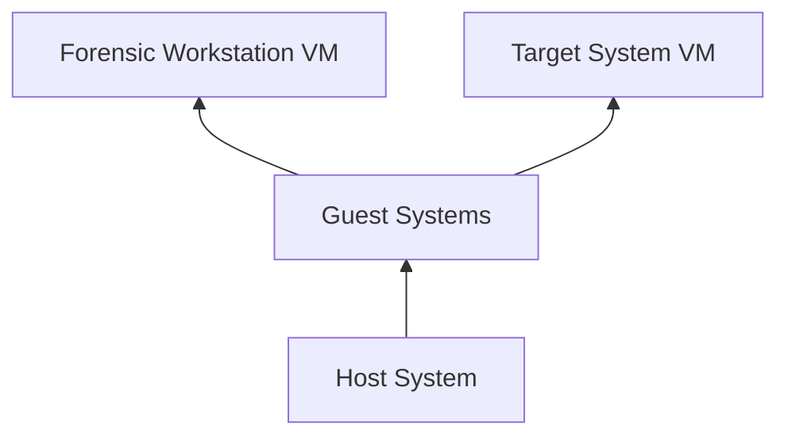

---

title: Build Your Forensic Workstation
description: Forge your ultimate digital blade for dissecting the dark corners of the cyber grid.
-------------------------------------------------------------------------------------------------

In this guide, you will learn how to create your own forensic workstation using popular tools used by professionals for real-world investigations.

We're going to initially set this up in `VirtualBox`, but using `VMware` or `Hyper-V on Windows` would do the job just as good, if not better.

Why? Because if we misconfigure something or blow it up, we can revert back to an older snapshot.

## Why Build a Forensic Workstation?

The digital forensics and incident response (DFIR) world is full of open-source projects and tools. Forensic analysts often need to investigate a wide variety of file types, operating systems, and image formats. Having a dedicated forensic workstation with the right tools ready at all times is essential for efficient analysis.

## Workstation Setup Instructions

### 1. Install a Hypervisor

To start, you'll need a hypervisor for managing virtual machines. We'll use VirtualBox for this tutorial.

1.1 **Download and Install VirtualBox**

- [VirtualBox Download Link](https://www.virtualbox.org/)

1.2 **Install VirtualBox Extension Pack**

- Download and install the [VirtualBox Extension Pack](https://www.virtualbox.org/wiki/Downloads) to add additional functionality, such as USB 2.0/3.0 support, RDP, and disk encryption.

> **Note**: VirtualBox now supports WSL2, which offers better performance and compatibility for this setup.

1.3 **Create a NAT Network in VirtualBox**

In VirtualBox, create a "NATNetwork". This allows VM to VM communication as well as internet access via the host system.

- **Steps**:
  - In VirtualBox, go to **Settings** -> **Network** and click the + sign to add a new "NATNetwork".
  - Attach this network to the Windows 10 VM network interface and all VMs going forward.

### 2. Install Windows Guest VM

2.1 **Download the Guest VM**
- [Windows Server 2019 VHD](https://www.microsoft.com/en-us/evalcenter/evaluate-windows-server-2019)

   Alternatively, you can also use other Windows versions by following the instructions for WSL setup carefully.

2.2 **Use an Existing Windows VHD**  

If you already have a VHD file for Windows Server, you can attach it to a new virtual machine in VirtualBox without creating a brand-new VM from scratch.

**Steps to Use an Existing VHD File in VirtualBox**:

1. **Open VirtualBox**: Launch the VirtualBox application.
2. **Create a New Virtual Machine**:
   - Click the **"New"** button to create a new virtual machine.
   - Name your VM and select **Microsoft Windows** as the type, and choose the appropriate version (e.g., **Windows Server 2019 (64-bit)**).
3. **Set the Memory Size**:
   - Set the RAM (at least **4 GB** as per the requirements).
4. **Attach Existing VHD File**:
   - When you get to the **"Hard disk"** section:
     - Select **"Use an existing virtual hard disk file"**.
     - Click the folder icon to browse.
     - Locate your existing **.vhd** file and select it.
5. **Complete the VM Setup**:
   - Complete the rest of the setup options, like **CPUs**, **networking**, etc., as per your requirements.
6. **Start the VM**:
   - Once setup is complete, click **"Start"** to boot your Windows Server VM from the existing VHD file.

2.3 **Install the Windows VM**

- Follow detailed setup guides for [VirtualBox](https://www.virtualbox.org/manual/ch01.html) and Windows VMs.

**VM Requirements**:

- **Disk Space**: 100 GB (dynamically allocated)
- **Memory**: 4+ GB RAM
- **CPUs**: 2 or more
- **Networking**: NAT Mode
- **Additional Setup**: After starting the Windows VM for the first time, install VirtualBox Guest Additions to enable features like drag-and-drop, bi-directional clipboard, and folder sharing with the host. To install Guest Additions:

1. Start the Windows VM.
2. From the VirtualBox menu, click **Devices** > **Insert Guest Additions CD Image**.
3. Open File Explorer inside the VM, navigate to the CD drive, and run `VBoxWindowsAdditions.exe`.
4. Follow the on-screen instructions to complete the installation.
5. Reboot the VM after installation.

Once Windows is installed, shut down the VM and create a snapshot to save the initial clean state.

2.4 **Install a Windows Server 2019 VM**

This guide describes how to install Windows 2019 Server from an ISO. Alternatively, you can also download a VHD from the site below, attach it to a new VM, and skip most of the installation!

- **Download the Windows Server 2019 Essentials ISO** from the Microsoft Evaluation center.
- In VirtualBox, create a new VM and select type **Windows** and version **Windows 2019 (64-bit)**. Ensure the VM has at least **2 GB RAM** assigned and create a virtual hard disk (preferably select **dynamic** and **VMDK** for hard disk file type – for compatibility reasons with various forensic tools). Assign at least **30 GB** for disk size.
- Before starting the VM, open its settings and in:
  - **Storage** – attach the downloaded Windows 2019 ISO to the VM’s optical drive.
  - **Networking** – attach “NATNetwork” to the networking adapter.
- Start the VM and follow the Windows Server installation instructions:
  - When prompted, there is no need to provide a product key.
  - Select **“Custom”** install since there is no pre-existing Windows installation.
  - It will prompt you to create a password for the built-in administrator account.
- After a reboot, you will be prompted with the login screen. In the VirtualBox menu, select **Input** -> **Keyboard** -> **Insert Ctrl+Alt+Del** to enter your password.
- If prompted after startup “allow your PC to be discoverable”, select **yes**.
- **Recommended**: Install VirtualBox Guest Additions as outlined in the Virtualization Primer. This will enable full-screen display and other features like shared folders, copy & paste, etc.
- **Important**: If you want to change the hostname, now is the time. Do not change it after setting up the Active Directory services!
  - Go to **Settings** -> **System** -> scroll down to the menu **“About”**.
  - Find the button **“Rename this PC”** to update the hostname.
- **Take a snapshot** once the VM is set up and powered off.

For detailed instructions see the setup guide on how to configure a full DC [Windows 2019 Server](https://bluecapesecurity.com/build-your-lab/medium-lab/)


### 3. Enable Windows Subsystem for Linux (WSL) and Install Ubuntu

VirtualBox now supports WSL2, which provides improved performance and compatibility.

3.1 **Enable WSL2 on Windows**

- Open PowerShell as Administrator and run:
  ```
  wsl --install
  ```

3.2 **Install Ubuntu 20.04**

- [Download Ubuntu 20.04](https://ubuntu.com/download)
- Rename the downloaded file from `.appxbundle` to `.zip` and extract it.
- Install the `.appx` package using PowerShell:
  ```
  Add-AppxPackage .\Ubuntu_2004.4.2.0_x64.appx
  ```
- Reboot the system and open Ubuntu from the Start Menu to complete the setup.

> **Note**: Ensure you use the `wsl --install` command to install WSL2, which is now compatible with VirtualBox.

### 4. Configure the Windows Environment

For digital forensics best practices, configure the following settings on your Windows VM:

- **Time Zone**: Set to UTC for consistency in forensic analysis.
- **Windows Explorer Settings**: Enable "Hidden items" and "File name extensions" to view important system files.
- **Create Directories**: Create `C:\Cases` for evidence data and `C:\Tools` for your forensic tools to easily access these folders.
- **Microsoft Defender**: Configure Defender to avoid interference:
  - Turn off "Real-time protection" temporarily when needed.
  - Exclude `C:\Cases` and `C:\Tools` from scans to prevent false positives.

### 5. Install Forensic Tools

The tools you need depend on the type of investigation. Here are the basic Linux and Windows forensic tools to install:

#### a) Linux-Based Tools (Install on Ubuntu Subsystem)

- **pip3** (Python package manager):
  ```
  sudo apt install python3-pip
  ```
- **Volatility3** (memory analysis tool):
  ```
  pip3 install volatility3
  pip3 install capstone  # Optional capstone library
  ```
- **Log2Timeline (plaso tools)**:
  ```
  sudo add-apt-repository ppa:gift/stable
  sudo apt-get install plaso-tools
  ```
- **oletools** (analyzing MS Office documents):
  ```
  pip3 install oletools
  ```

#### b) Windows-Based Tools

- **VirtualBox**: Hypervisor for managing VMs.
- **Windows Server 2019 Evaluation**: Main forensic workstation OS.
- **Notepad++**: Text editor for viewing code and formatted text.
- **Firefox**: Browser with developer tools useful for debugging.
- **Microsoft Excel**: Ideal for handling large CSV files.
- **Visual Studio Code**: Advanced text editor with plugins for reading code.
- **7-Zip**: For file compression and decompression.
- **FTK Imager**: Tool for acquiring disk images.
- **KAPE**: Tool for collecting triage data from disk images.

> **Tip**: Take a snapshot of your VM once all tools are installed to save a clean starting point for future investigations.

## System Setup Diagram



## Finish

Congratulations! Your forensic workstation is now ready. Remember to keep your system snapshots up to date to make resetting your environment quick and easy. This setup will help you practice and develop your digital forensic skills effectively.

For more details, visit [Blue Cape Security's Guide](https://bluecapesecurity.com/build-your-forensic-workstation/).

