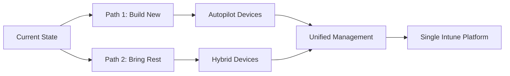

## 🛣️ De Uitdaging

Tot nu toe hebben we onderzocht:
- Het evalueren van je omgeving
- Het kiezen van initiële use cases
- Het plannen en bouwen van je deployment
- Het ontmoedigende proces van het verplaatsen van Group Policy objects naar Intune

Maar uiteindelijk realiseer je je dat er een uitdaging voorhanden is:

::important
**De Kernvraag:**Hoe ga je omgaan met het beheren van je nieuwe, shiny Autopilot devices naast je huidige, hybrid joined fleet?

- Handel je beide omgevingen apart?
- Moet help-desk uitzoeken waar elk device wordt beheerd voordat ze een end user helpen, wat leidt tot langzaam verlies van hun sanity?
::

**Nee.** Gelukkig heb ik dit doordacht met iets genaamd de **"Two Paths" approach** — één voor het bouwen van je toekomst, en één voor het meenemen van je verleden.

## 🎯 The Two Paths Strategy

Wanneer je Intune en Autopilot integreert in een landschap waar hybrid joined of co-managed devices al in gebruik zijn, worstelen veel organisaties om de balans te vinden tussen onboarding nieuwe devices en retrofitting bestaande devices.

**Het antwoord?** Start met focussen op de nieuwe devices en werk backwards vanaf daar.

### 💡 Why Start with Autopilot?

Je denkt misschien: "Waarom beginnen met Autopilot? Waarom niet gewoon de bestaande fleet direct aanpakken?"

**Here's the deal:**

#### 1️⃣ Prove It Out

Configureren van Intune voor een Autopilot-scenario dient als je **real-world test environment**.

Als je een effectieve, Entra Joined PC from scratch kunt bouwen met alleen Intune, weet je dat je policies en apps **stabiel** zijn.

#### 2️⃣ Iterative Improvements

Werken met nieuwe devices geeft je de **vrijheid om fouten te maken**, te leren en te itereren zonder impact op je bestaande user base.

::tip
Tegen de tijd dat je klaar bent om je huidige devices te onboarden, heb je de rough edges al gladgestreken.
::

#### 3️⃣ Cloud Native

Autopilot omarmen helpt je team een **moderne aanpak** te adopteren.

Dit is niet alleen een technische shift — het is **cultureel**. Teams beginnen te denken in termen van cloud-first policies en configuraties, wat hen uiteindelijk flexibeler maakt bij het aanpakken van de bestaande omgeving.

Met dat begrip presenteer ik **Path 1**.

## 🚀 Path 1: Build for the New

### 🎨 Focus on Autopilot

Configureer je apps, policies en settings in Intune met het doel om een **net-new, Autopilot-provisioned Entra Joined PC** te ondersteunen.

**Waarom?**

::important
Als je omgeving **flawless werkt** voor een Autopilot deployment, is het **robuust genoeg** om je bestaande hybrid devices te ondersteunen.
::

### 📋 Simplify Policy

Door je Intune policies te ontwikkelen met een nieuwe Autopilot deployment in gedachten, word je gedwongen een **harde kijk te nemen** op wat essentieel is.

**Start met:**
- Security baselines
- Core apps
- Key compliance policies

→ Een **minimale, goed-gedocumenteerde set** configuraties

### 🔬 Stress Test

Laat je security teams **tests en audits** uitvoeren op de nieuwe build.

- ✅ **Als die tests hun zorgen bevredigen** → je bent good to go wanneer het tijd is om de huidige fleet te onboarden
- ❌ **Als niet** → je weet wat je nog moet bouwen

## 🔄 Onboarding Hybrid Joined Devices to Intune: What to Expect

Zodra je je nieuwe Autopilot deployment hebt geregeld, begint de echte fun. Het is tijd om die **hybrid beasts** te onboarden.

**Here's what to expect:**

### 🤖 Automate It

Afhankelijk van je setup zou je dit moeten kunnen **automatiseren**.

::tip
De **Group Policy om hybrid devices in Intune in te schrijven** is seamless en, in de meeste gevallen, weten gebruikers niet wat hen heeft geraakt.

Als je wel manual user intervention nodig hebt, **communiceer clear and often**.
::

### ⚖️ Policy Reconciliation

Dit is waar je je **past self bedankt** voor het starten met Autopilot.

Als je het goed hebt gedaan:
- De policies in place zijn **comprehensive en stabiel**
- Eventuele aanpassingen nodig voor hybrid joined devices zijn **minor**

### 📊 Compliance Shifts

Devices die ooit werden beheerd door GPOs moeten nu je **brand-new Intune policies** volgen.

::warning
**Watch compliance reports carefully** terwijl je devices onboard om te verzekeren dat ze conformeren zoals verwacht.
::

**Excited yet?** Good. Time to start the second path.

## 🔁 Path 2: Bring the Rest

### 📥 Enroll the Hybrid Devices

Zodra je je nieuwe build hebt gevalideerd en bewezen dat Intune een net-new device kan ondersteunen, is het tijd om je **bestaande fleet** aan te pakken.

**Start onboarding hybrid joined devices** into Intune, confident dat je policies en configuraties **solid** zijn.

::important
**Critical:** Zorg ervoor dat je **inheritance blokkeert** van de on-premises GPOs zodat je conflicten tegen Intune policy minimaliseert.
::

### 🔀 Co-Management Strategy

Gebruik **co-management** om Intune capabilities over tijd in te faseren.

**Geleidelijk shift workloads** van ConfigMgr (of welke on-prem management tool je ook hebt vastgehouden) naar Intune:

#### Start met Minder Disruptive Workloads

1. **Compliance policies**
2. **Endpoint protection**

#### Move Up naar Complexere Workloads

3. **Windows Update** - altijd een easy win, vooral om te helpen naar Windows 11 te bewegen

### 🎯 Unified Support

Het **end goal** is dat je help desk **alleen Intune** hoeft te dealen voor het beheren van zowel nieuwe als bestaande devices.

::note
**No more split-brain management** waar ze moeten togglen tussen verschillende tools en interfaces.

**Just Intune.** Clean, consistent, en centralized.
::

## 🆘 Getting Help Desk on Board

Je help desk gaat je **grootste ally** of je **grootste obstacle** zijn, afhankelijk van hoe je deze transitie aanpakt.

**Here's how to make sure it's the former:**

### 📚 Start Training

**Don't wait** totdat alles is set up om je support teams te loopen.

::tip
**Get them acquainted** met de Intune console en de common tasks die ze zullen uitvoeren **zodra je je eerste werkende Autopilot deployment hebt**.
::

### 📖 Create Runbooks

**Document, document, document.**

Van:
- Hoe device enrollment hiccups te handelen
- Tot troubleshooting compliance issues

→ **Geef je help desk gedetailleerde guides** zodat ze prepared voelen en niet scrambling worden.

### 🔄 Feedback Loop

De mensen op de **front lines** hebben **invaluable insights** in wat werkt en wat niet.

::important
**Zorg ervoor** dat er een mechanisme is voor hen om feedback te delen en dat changes snel kunnen worden gemaakt gebaseerd op hun ervaringen.
::

## 🎯 Single Pane of Gl…

Ik weet het, we zijn allemaal **sick** van die phrase.

Maar het doel van deze **"Two Paths" approach** is om een management environment te creëren dat zowel nieuwe, Autopilot-deployed devices als de bestaande fleet ondersteunt — **all from a single… eh… unified platform**.

### 🏆 Voordelen

| Voordeel | Impact |
|----------|--------|
| **🛠️ Simplifies life** | Voor je help desk |
| **📋 Streamlines policy** | Management wordt unified |
| **🔨 Solid foundation** | Voor whatever comes next in de ever-changing wereld van IT |

## 💭 De Grootste Vraag

::note
**Hoe beide device types te handelen** is misschien de grootste vraag die jij en je organisatie hebben over het adopteren van Intune.

**Now, hopefully, you have an answer.**
::

## 📈 Two Paths Overzicht

::tip
**Best Practice:** Start met Path 1 (Autopilot) om je policies te proven, dan voeg Path 2 (Hybrid) toe met confidence.
::
