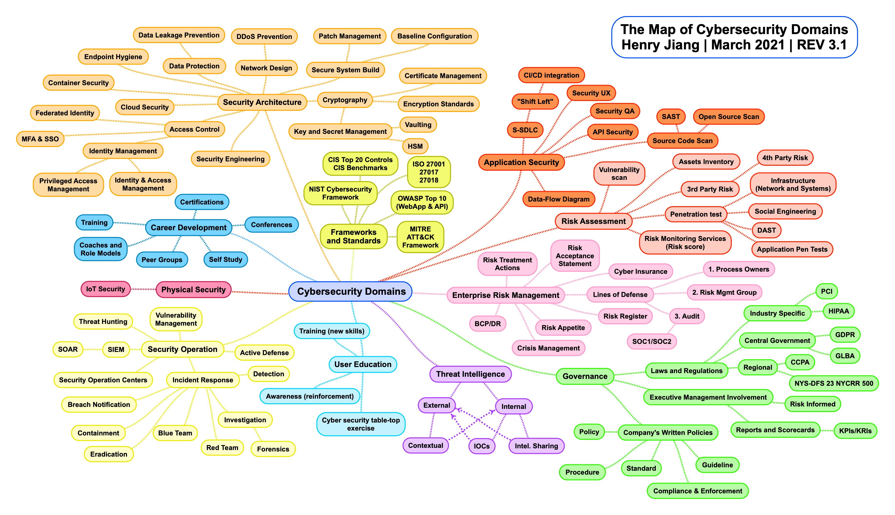

# Nameless

Welcome to the that which cannot be named. 🧪

## Domains

## Difference Exploits vs. Vulnerability

Vulnerabilities: These are weaknesses or flaws in software, hardware, or systems that can be exploited by attackers to compromise their security. Examples include SQL injection vulnerabilities, XSS vulnerabilities, and buffer overflow vulnerabilities.

Exploits: Exploits are techniques or tools used by attackers to take advantage of vulnerabilities and gain unauthorized access, perform malicious actions, or compromise systems. Exploits are essentially the means by which vulnerabilities are leveraged for nefarious purposes. Examples include DDoS attacks, SQL injection attacks, and phishing campaigns.

In summary, vulnerabilities represent weaknesses in security defenses, while exploits are the methods or actions taken to exploit those weaknesses.
