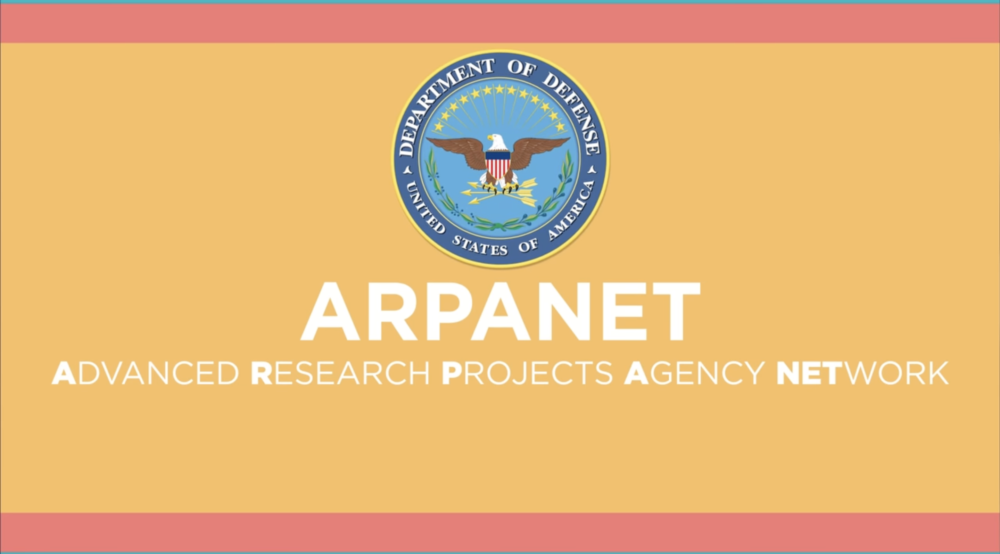
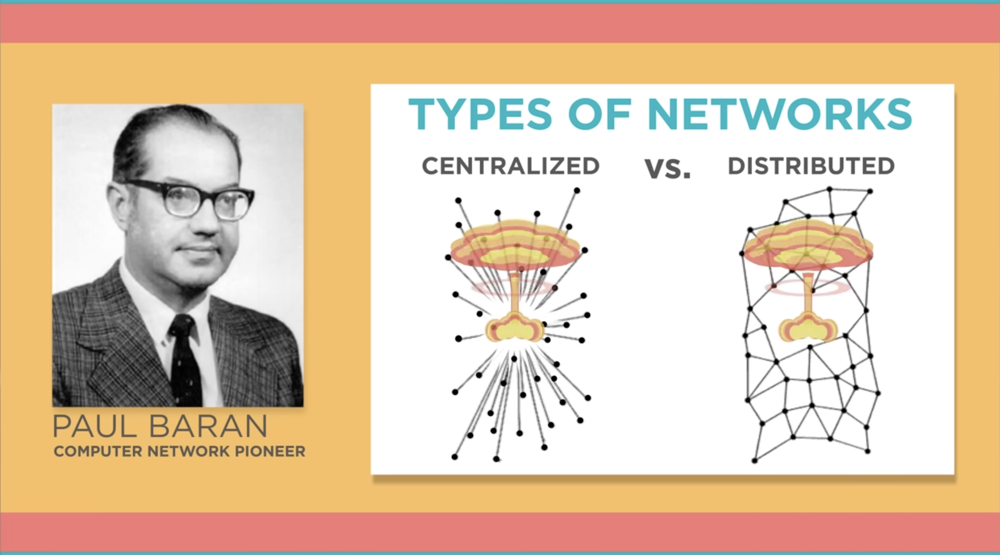
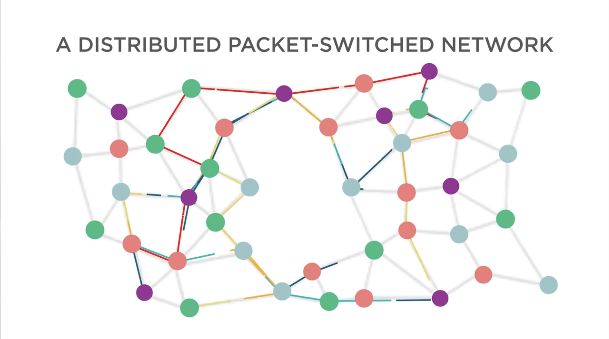
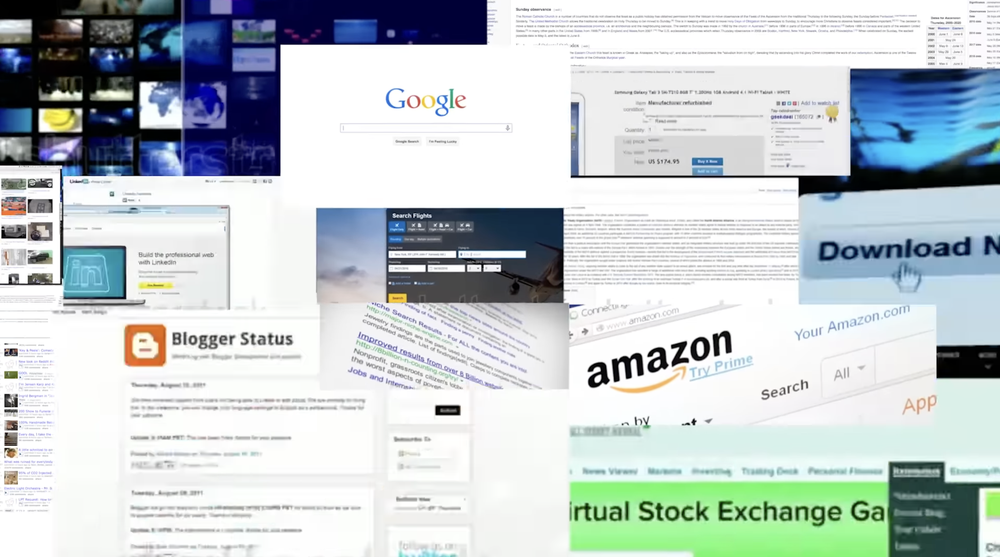
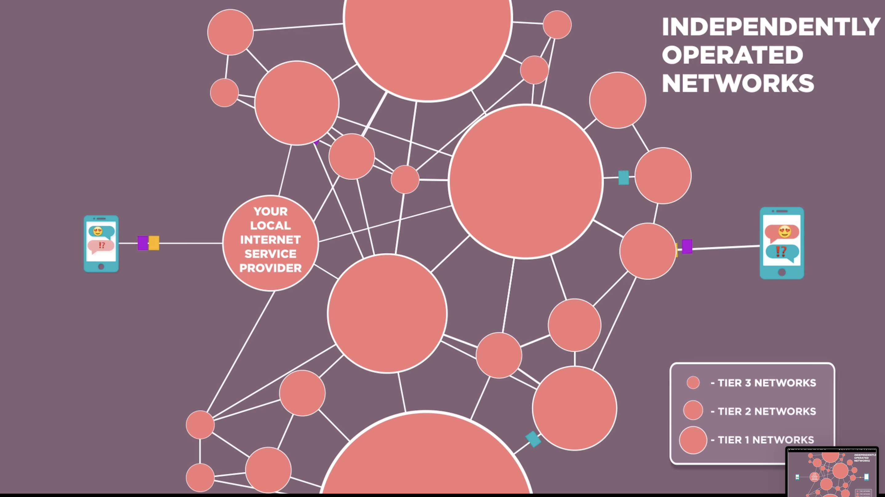
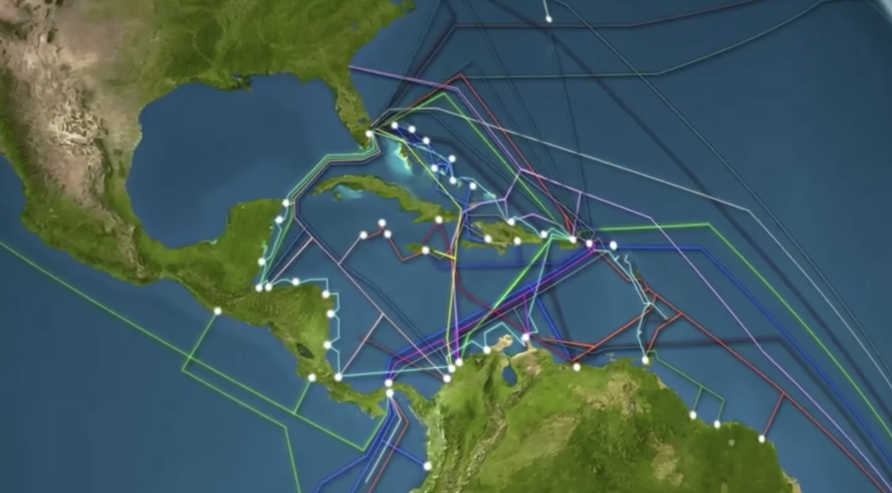
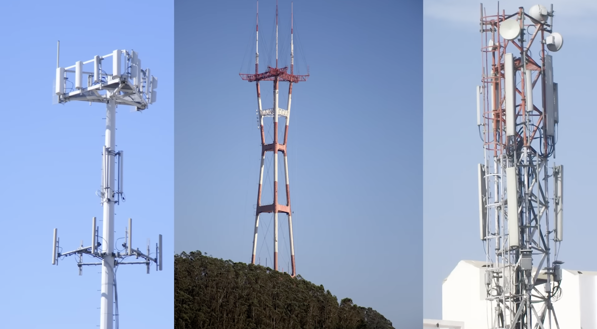

# What is the Internet?

What is the internet?

The internet is like a popular thing.

"Some satellites up there."

"I picture it in my head with like waves of internet going to the phone."

"Somebody told me a cloud once."

"The internet is a lot like plumbing."

"It’s always moving."

**Most people don’t have any idea where the internet came from, and it doesn’t matter, they don’t need to.**

It’s sort of like asking who invented the ballpoint pen.

Or the flush toilet.

Or, you know, the zipper.

These are all things we just use every day.

We don’t even think about the fact that one day, somebody invented them.

So, the internet is just like that.

## Origins of the Internet

Many, many years ago, in the early 1970s, my partner `Bob Kahn` and I began working on the design of what we now call the internet.

It was a result of another experiment called `the ARPANET`, which stood for [Advanced Research Projects Agency Network](https://nl.wikipedia.org/wiki/ARPANET).

It was a Defense Department research project.

`Paul Baran` was trying to figure out how to build a communication system that might actually survive a nuclear attack.

So he had this idea of breaking messages up into blocks and sending them as fast as possible in every possible direction through the mesh network.

So we built what eventually became a nationwide experimental packet network, and it worked! [Loud, electronic music]

## Governance of the Internet

Is anybody in charge of the internet?

`The government controls it.`

`Elves.`

`Obviously elves!`

`The people who control the Wi-Fi because then no Wi-Fi, no internet.`

`T-Mobile, um, Xfinity.`

`Bill Gates.`

.. Right?

`The honest answer is well nobody`, and maybe another answer is everybody.

The real answer is that the internet is made up of an `incredibly large number of independently operated networks`.

## Decentralized Structure

What’s interesting about the system is that it’s fully distributed.

There’s no central control that’s deciding how packets are routed or where pieces of network are built, or even who interconnects with whom.

These are all business decisions that are made independently by the operators.

They are all motivated to assure that there is end-to-end connectivity of every part of the network because the utility of the net is that any device can communicate with any other device, just like you want to be able to make phone calls to any other telephone in the world.

There’s nothing like this that has ever been built before.

## Collaboration and Innovation

The idea that what you know might be useful to somebody else or vice versa is a very powerful motivator for sharing information.

By the way, that's how science gets done, people share information.

So, this is an opportunity for people to think up new applications, maybe program them as apps on a mobile phone, maybe become part of the continued growth of the infrastructure of the network to bring it to people who don’t have access to it yet, or just make use of it on a day-to-day basis.

## Embracing the Internet

You can’t escape from contact with the internet, so why not get to know it and use it?
