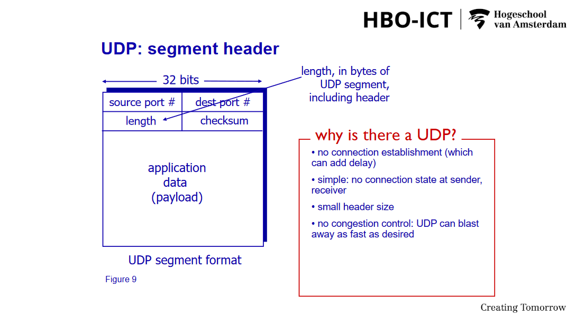
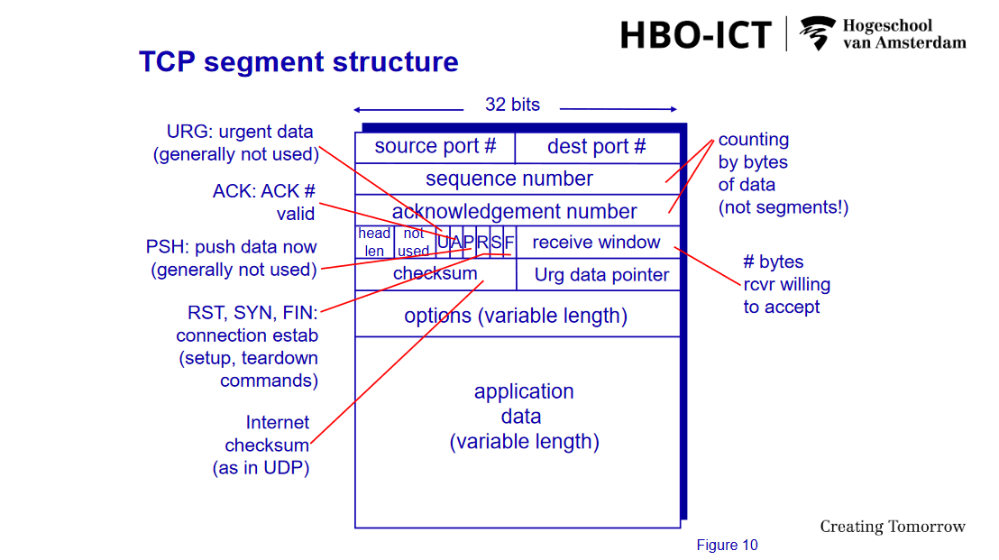
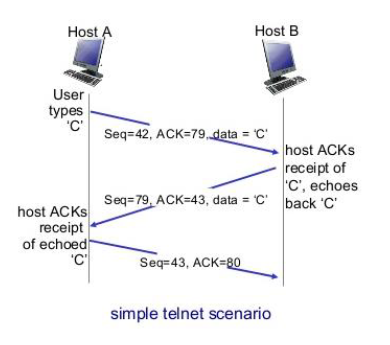

# A Top Down Approach

## Leerdoelen

### Dag 1 t/m 3

- [ ] Basisconcepten voor netwerkarchitectuur begrijpen
- [ ] Begrijp de TCP/IP-protocolstack en de functies van elke laag
- [ ] Begrijp belangrijke internetprotocollen zoals HTTP, SMTP, DHCP, DNS, TCP, UDP en IP
- [ ] Begrijp transport layer services en hoe applicaties deze kunnen gebruiken
- [ ] Begrijp netwerk layer functies zoals routering en doorsturen
- [ ] Begrijp subnetten en het verdelen van een netwerk in subnetten van de juiste grootte
- [ ] Basisbedreigingen en beperking van netwerkbeveiliging begrijpen

### Dag 4 t/m 6

- [ ] Begrijpen van de werking en beveiligingsaspecten van de TCP verbinding.
- [ ] Begrijpen van de werking en beveiligingsaspecten van protocollen voor routing en name resolution.
- [ ] Begrijpen van basisconcepten van het beheer van netwerken en SDN (Software Defined Networking).
- [ ] Begrijpen van de werking en beveiligingsaspecten van adressering en switching op de linklaag.
- [ ] Begrijpen van de werking en beveiligingsaspecten van draadloze en mobiele netwerkverbindingen.
- [ ] Begrijpen van bedreigingen en bijbehorende tegenmaatregelen op het gebied van netwerkbeveiliging.
- [ ] Begrijpen van basisconcepten van forensisch onderzoek en het verzamelen van bewijs in netwerken.

**On completion of the course, students should be able to:**

1. **Terminology associated with computer networks:**
    ::: details Antwoord
    Termonologie die verband houdt met computernetwerken omvat begrippen zoals IP-adressen, subnetmaskers, gateways, routers, switches, firewalls, DNS (Domain Name System), DHCP (Dynamic Host Configuration Protocol), LAN (Local Area Network), WAN (Wide Area Network), MAN (Metropolitan Area Network), TCP/IP (Transmission Control Protocol/Internet Protocol), OSI-model (Open Systems Interconnection model), enzovoort.
    :::

1. **Belang van de ISO 7-laags/IP-laag 5 referentiemodellen:**
   ::: details antwoord
   De ISO 7-laags en het TCP/IP-model (vaak gezien als een 5-laags model) zijn referentiemodellen die dienen als richtlijnen voor de architectuur en het ontwerp van computernetwerken. Deze modellen helpen bij het begrijpen van de verschillende protocollen, hun functionaliteiten en hoe ze met elkaar communiceren. Ze bieden een gestructureerd kader voor het begrijpen en oplossen van netwerkproblemen.

   -

2. **Belangrijke kwesties voor de realisatie van LAN/WAN/MAN-netwerkarchitecturen:**
   ::: details Antwoord
   Voor LAN (Local Area Network), WAN (Wide Area Network) en MAN (Metropolitan Area Network) zijn enkele van de belangrijkste kwesties onder andere bandbreedtebeheer, netwerkbeveiliging, schaalbaarheid, betrouwbaarheid, kosten, interoperabiliteit, netwerkbeheer en -onderhoud.
   :::

3. **Hybride netwerkarchitecturen in de bedrijfsomgeving:**
   ::: details Antwoord
   In de bedrijfsomgeving worden vaak hybride netwerkarchitecturen gebruikt, waarbij LAN, WAN en MAN worden gecombineerd met cloudservices, virtualisatie en softwaregedefinieerde netwerken (SDN). Dit helpt bij het optimaliseren van prestaties, schaalbaarheid en kostenbesparing.
   :::

4. **Ontwerpprincipes van bekabelde en draadloze communicatienetwerken:**
   ::: details Antwoord
   De ontwerpprincipes van bekabelde en draadloze communicatienetwerken omvatten aspecten zoals de selectie van geschikte bekabeling en draadloze technologieën, RF-interferentiebeheer, dekking en capaciteitsplanning, beveiliging, redundantie, schaalbaarheid en naleving van industriestandaarden.
   :::

5. **Cyber Risk Management Concepts & Threat Modelling:**
   ::: details Antwoord
   Cyber Risk Management omvat het identificeren, beoordelen en beheren van cyberbeveiligingsrisico's binnen een organisatie. Threat Modelling is een methodologie die wordt gebruikt om potentiële bedreigingen en kwetsbaarheden in een systeem of netwerk te identificeren en te beoordelen, zodat passende beveiligingsmaatregelen kunnen worden genomen.
   :::

6. **Huidige netwerkauthenticatietoepassingen, PKI, web- en netwerkbeveiliging en hun kwetsbaarheden:**
    ::: details Antwoord
    Netwerkauthenticatietoepassingen omvatten protocollen zoals RADIUS (Remote Authentication Dial-In User Service), TACACS+ (Terminal Access Controller Access Control System Plus), 802.1X, enz. PKI (Public Key Infrastructure) wordt gebruikt voor het beheren van digitale certificaten en sleuteluitwisseling. Web- en netwerkbeveiligingskwetsbaarheden omvatten onder andere XSS (Cross-Site Scripting), SQL-injectie, CSRF (Cross-Site Request Forgery), phishing, DDoS-aanvallen (Distributed Denial of Service), enz.
    :::

7. **Netwerkaanvallen en basisnetwerkverdedigingstools:**
   ::: details Antwoord
   Netwerkaanvallen kunnen verschillende vormen aannemen, waaronder malware-infecties, DDoS-aanvallen, phishing-aanvallen, man-in-the-middle-aanvallen, enz. Basisnetwerkverdedigingstools omvatten firewalls, intrusion detection/prevention systems (IDPS), antivirussoftware, VPN's (Virtual Private Networks), encryptieprotocollen, beveiligde authenticatieprotocollen, enz.
   :::

### Leeswijzer

Overzicht van de hoofdstukken die bestudeerd moeten worden voor aanvang van de les.

**Les 1a: Network architecture & physical layer**

- K&R 1.1 - 1.6: Bestudeer met uitzondering van paragraaf 1.3.2
- K&R 1.7: Lees dit hoofdstuk om een algemeen beeld te krijgen van de geschiedenis. Je hoeft de genoemde datums, gebeurtenissen of genoemde personen niet te onthouden.

**Les 1b: Application layer & application protocols**

- K&R 2.1, 2.2, 2.3: Paragraaf 2.2.6 is optioneel.
- K&R 2.5: Bestudeer met de volgende uitzondering:
  - Je hoeft de berekeningen in de sectie “Scalability of P2P Architectures” niet te onthouden. Wel moet je de distributietijd voor een P2P-architectuur moeten kunnen vergelijken met een client-server-architectuur, zoals weergegeven in figuur 2.23.

**Les 2a: DNS & transport layer**

- K&R 2.4
- K&R 3.1, 3.2, 3.3, 3.5.1, 3.5.2, 3.5.6

**Les 2b: Network layer**

- K&R 4.1
- K&R 4.2 - 4.2.4: Bestudeer met de volgende uitzonderingen:
  - Voor 4.2.2 moet je de rol van het switching fabric in een router begrijpen, maar je hoeft de specifieke eigenschappen van de verschillende technologieën die worden beschreven (geheugen, bus, interconnectienetwerk) niet te onthouden.
  - Bestudeer voor 4.2.4 alleen het eerste deel (tot 'input wachtrijen') dat beschrijft waar pakketverlies kan optreden in een router.
- K&R 4.3, 5.6

**Les 3a: Subnetting & link layer**

- Bestudeer de materialen die beschikbaar zijn op de DLO over subnetten.
- K&R 6.1
- K&R 6.2: Bestudeer met de volgende uitzondering:
  - Je moet kunnen beschrijven wat CRC is en hoe het wordt gebruikt, maar je hoeft de berekeningen die in dit hoofdstuk worden beschreven niet te kunnen doen.

**Les 3b: Network security**

- K&R 8.1
- K&R 8.2 - 8.2.1: Bestudeer het eerste deel tot (maar niet inclusief) ‘block ciphers’
- K&R 8.2.2: Bestudeer het eerste deel tot (maar niet inclusief) ‘RSA’
- K&R 8.3
- K&R 8.6
- K&R 8.7 - 8.7.2
- K&R 8.9

**Les 4a: TCP**

- K&R 3.5: bestudeer geheel. Deze stof is deels al behandeld tijdens Infrastructure, maar we gaan nu dieper in op de details.
- K&R 3.7: bestudeer tot (niet tot en met) de sectie: Macroscopic description of TCP Cubic
- The Internet Protocol Journal, december 2006: SYN Flooding Attacks (zie DLO)

**Les 4b: DNS**

- K&R 2.4
- Tweakers.net, 14-10-2019: Dns-over-https: vloek of zegen? (zie DLO)

**Routing algorithms & protocols**

- K&R 5.2: zorg dat je bekend bent met de eigenschappen van link state en distance vector algoritmes. Je hoeft niet zelf met deze algoritmes routing tabellen te kunnen bepalen.
- K&R 5.3 - 5.4: bestudeer geheel.
- Tweakers.net, 22-8-2015: De achilleshiel van het internet (zie DLO

**Les 5a: Network management: SDN & SNMP**

- K&R 4.4, 5.1, 5.5, 5.8 (5.7 in 7th edition): bestudeer geheel

**Link layer: ARP**

- K&R 6.4 - 6.4.1: bestudeer geheel

**Les 5b: Link layer: Ethernet en switches**

- K&R 6.4 vanaf 6.4.2: bestudeer geheel
- K&R 6.6: bestudeer geheel
- K&R 6.7: bestudeer geheel

**Draadloze netwerken**

- K&R 7 - 7.1: bestudeer geheel
- K&R 7.2: bestudeer tot 7.2.1, dus niet het hoofdstuk over CDMA
- K&R 7.3: bestudeer met de volgende uitzonderingen:
  - Hoofdstuk 7.3.2 over het 802.11 MAC protocol hoort niet tot de stof
  - Hoofdstuk 7.3.6 gaat over Bluetooth. Zorg dat je weet wat deze protocollen zijn en in welke situaties ze gebruikt worden. Je hoeft niet bekend te zijn met de details over hoe deze protocollen werken.
- K&R 8.8: bestudeer geheel

**Les 6a: Network security**

- Een deel van dit materiaal is eerder behandeld tijdens dag 1 t/m 3.
- K&R 8.1: bestudeer geheel
- K&R 8.2: bestudeer met de volgende uitzonderingen:
  - De gebruikte wiskunde hoef je niet te kunnen reproduceren. Dat geldt ook voor de sectie “Why Does RSA work?”.
- K&R 8.3, 8.4, 8.6: bestudeer geheel
- Acunetix, 31-3-2019, Examples of TLS Vulnerabilities and Attacks (zie DLO)

## Life Of A Packet

## Chapter 1

### Computer Networks and the Internet

- **1.1** What Is the Internet?
:::details Antwoord
Vele jaren geleden, in het begin van de jaren 1970, begonnen Bob Kahn en ik te werken aan het ontwerp van wat we nu het internet noemen.

Het was het resultaat van een ander experiment genaamd ARPANET, wat staat voor Advanced Research Projects Agency Network. Dit was een onderzoeksproject van het Ministerie van Defensie.

Paul Baran probeerde uit te vogelen hoe hij een communicatiesysteem kon bouwen dat een nucleaire aanval zou kunnen overleven. Hij bedacht het idee om berichten op te breken in blokken en ze zo snel mogelijk in elke mogelijke richting door het netwerk te sturen.

Het oorspronkelijke doel van ARPANET was om universiteiten te laten communiceren en kennis te delen.
:::

- **1.1.1** A Nuts-and-Bolts Description
    ::: details Antwoord
    Het internet is een computer netwerk die miljarden computer apparaturen[HOSTS] met elkaar verbindt.
    :::

- **1.1.2** A Services Description
    ::: details Antwoord
    Het internet wordt beschreven als een infrastructuur die diensten levert aan applicaties.

    Applicaties draaien op eindsystemen en communiceren via een internetsocket-interface om gegevens uit te wisselen.

    Iedereen kan deze applicaties bouwen en informatie delen met de wereld.
    :::

- **1.1.3** What Is a Protocol?
    ::: details Antwoord
    Een protocol is een set regels die de format en volgorde van berichten tussen communicerende entiteiten bepaalt

    Deze protocollen bepalen bijvoorbeeld de stroom van gegevens tussen computers, de transmissiesnelheid van pakketten en de routering van gegevenspakketten.

    Humand Analogy - Greetings

    **For different systems to be able to communicate over the Internet, protocols are very important. Standards and protocols for the Internet are developed by the Internet Engineering Task Force (IETF) and written in specific documents. What is the name of these documents that define Internet protocols?**

    ::: details Antwoord
    Answer: RFC
    :::

- **1.2** The Network Edge
    ::: details Antwoord
    De network edge verwijst naar de grens van een netwerk waar eindapparaten, zoals computers, smartphones en tablets, verbinding maken met het netwerk.
    :::

  - **1.2.1** Access Networks
    ::: details Antwoord
    Access networks zijn de fysieke infrastructuren waarmee eindgebruikers toegang krijgen tot een bredere netwerkinfrastructuur, zoals het internet.

    Dit omvat verschillende technologieën zoals DSL, kabelmodems, glasvezel, draadloze netwerken en satellietverbindingen.
    :::
  - **1.2.2** Physical Media
    ::: details Antwoord
    Fysieke media verwijst naar de feitelijke middelen die worden gebruikt om gegevens fysiek te verzenden, zoals koperen kabels, glasvezelkabels en draadloze signalen.
    :::

- **1.3** The Network Core
    ::: details Antwoord
    De network core is het centrale deel van het internet dat grote hoeveelheden data doorstuurt tussen verschillende netwerksegmenten.

    Het bestaat uit routers en switches die zorgen voor de snelle en efficiënte transmissie van data.
    :::

  - **1.3.1** Packet Switching
    ::: details Antwoord
    Packet switching is een methode van dataoverdracht waarbij gegevens worden opgedeeld in kleine pakketten.

    Elk pakket reist onafhankelijk door het netwerk en kan verschillende routes volgen naar de bestemming.

    Bij aankomst worden de pakketten weer samengevoegd tot de oorspronkelijke boodschap. Dit verhoogt de efficiëntie en betrouwbaarheid van netwerkcommunicatie.
    :::

  - **1.3.2** Circuit Switching
    ::: details Antwoord
    Circuit switching is een dataoverdrachtmethode waarbij een dedicated communicatiepad tussen twee eindpunten wordt opgezet en behouden gedurende de hele sessie.

    Het zorgt voor constante en betrouwbare verbinding, maar kan inefficiënt zijn omdat de bandbreedte altijd gereserveerd blijft, zelfs zonder dataverkeer.
    :::

  - **1.3.3** A Network of Networks
    ::: details Antwoord
    Een "Network of Networks" is het internet, bestaande uit vele verbonden kleinere en grotere netwerken zoals ISPs en Thuis/Bedrijfsnetwerken die samenwerken om data wereldwijd te verzenden en ontvangen.

    Wat resulteert in een complexe infrastructuur.
    :::

- **1.4** Delay, Loss, and Throughput in Packet-Switched Networks
    ::: details Antwoord
    "Delay, Loss, and Throughput in Packet-Switched Networks" gaat over drie belangrijke prestatiemaatstaven in netwerken:

    1. **Delay (vertraging)**: De tijd die een pakket nodig heeft om van de bron naar de bestemming te reizen.
    2. **Loss (verlies)**: Pakketten die verloren gaan en niet de bestemming bereiken.
    3. **Throughput (doorvoer)**: De hoeveelheid data die succesvol over een netwerk wordt verzonden in een bepaalde tijdsperiode.

    Deze factoren bepalen de efficiëntie en betrouwbaarheid van netwerkcommunicatie.
    :::

  - **1.4.1** Overview of Delay in Packet-Switched Networks
    ::: details Antwoord
    delay
    1. **Processing Delay**: Tijd die routers nodig hebben om een pakket te verwerken.
    2. **Queuing Delay**: Tijd die pakketten in de wachtrij doorbrengen in routers.
    3. **Transmission Delay**: Tijd die nodig is om alle bits van een pakket op de link te zetten.
    4. **Propagation Delay**: Tijd die het signaal nodig heeft om door de fysieke media te reizen.

    Elke van deze vertragingen draagt bij aan de totale end-to-end vertraging van pakketten in een netwerk.
    :::

  - **1.4.2** Queuing Delay and Packet Loss
    ::: details Antwoord
    1. **Queuing Delay**:
       - Tijd die pakketten in de wachtrij doorbrengen in routers of switches.
       - Afhankelijk van de verkeersintensiteit en de capaciteit van de router.
       - Toeneemt bij netwerkcongestie.

    2. **Packet Loss**:
       - Treedt op wanneer pakketten worden gedropt omdat de wachtrij vol is.
       - Oorzaken: buffer overflows, netwerkcongestie.
       - Verlies kan leiden tot hertransmissies, wat de algehele vertraging en netwerkbelasting vergroot.
    :::

  - **1.4.3** End-to-End Delay
    ::: details Antwoord
    End-to-end delay is de totale tijd die een pakket nodig heeft om van de bron naar de bestemming te reizen. Het bestaat uit vier componenten:

    1. **Verwerkingstijd**: Tijd nodig voor het verwerken van een pakket bij elke router.
    2. **Queuing Delay**: Tijd doorgebracht in wachtrijen bij routers onderweg.
    3. **Transmissietijd**: Tijd nodig om de bits van het pakket op de link te plaatsen.
    4. **Propagatietijd**: Tijd die het signaal nodig heeft om door het fysieke medium te reizen.
    :::

  - **1.4.4** Throughput in Computer Networks
    ::: details Antwoord
    Throughput is de mate van succesvolle gegevensoverdracht binnen een netwerk gedurende een bepaalde periode.

    Het wordt gemeten in bits per seconde (bps) en vertegenwoordigt de hoeveelheid gegevens die in een bepaalde tijdseenheid worden overgedragen tussen de bron en de bestemming.
    :::
- **1.5** Protocol Layers and Their Service Models
    ::: details Antwoord
    Protocol layers zijn gestructureerd in een hiërarchie en bieden services aan de bovenliggende lagen, zoals point-to-point communicatie en foutdetectie.
    :::

  - **1.5.1** Layered Architecture
    ::: details Antwoord
    Layered architecture is een concept in netwerken waarbij de functionaliteit van een netwerk wordt verdeeld over verschillende lagen, elk met specifieke verantwoordelijkheden en taken zoals het OSI of TCP/IP model.
    :::

  - **1.5.2** Encapsulation
    ::: details Antwoord
    Encapsulation is het proces waarbij gegevens worden verpakt in een protocolheader en body, waardoor ze kunnen worden overgedragen door het netwerk net als een matroeska pop met de juiste routing- en bestemmingsinformatie toegevoegd aan elk niveau van het bericht.

    - Een bericht op het applicatieniveau
    - Een segment op het transportniveau
    - En een frame op het datalinkniveau.
    :::

- **1.6** Networks Under Attack
    ::: details Antwoord
  - Vulnerability Attack
  - Bandwidth flooding
  - Connection Flooding
    :::

- **1.7** History of Computer Networking and the Internet
  - **1.7.1** The Development of Packet Switching: 1961–1972
    ::: details Antwoord
    Tijdens de ontwikkeling van pakketomschakeling tussen 1961 en 1972 werden de fundamenten gelegd voor de moderne computer- en netwerktechnologieën.
    :::
  - **1.7.2** Proprietary Networks and Internetworking: 1972–1980
    ::: details Antwoord
    Tussen 1972 en 1980 werden eigen netwerken ontwikkeld en begon het concept van interconnectiviteit tussen verschillende netwerken vorm te krijgen.
    :::
  - **1.7.3** A Proliferation of Networks: 1980–1990
    ::: details Antwoord
    In de periode van 1980 tot 1990 was er een snelle groei van verschillende soorten netwerken, wat leidde tot een overvloed aan netwerkvariëteiten.
    :::
  - **1.7.4** The Internet Explosion: The 1990s
    ::: details Antwoord
    In de jaren 90 explodeerde het internetgebruik, met een enorme groei van het aantal gebruikers, websites en online diensten.
    :::
  - **1.7.5** The New Millennium
    ::: details Antwoord
    Verdere groei van internet, breedbandverbindingen, opkomst van sociale media en mobiele technologieën.
    :::

- **1.8** Summary
    ::: details
    Sure, here's a brief summary:

    1. **What is the Internet?**
  - A network of networks, enabling communication and sharing of information globally.

    1. **What is a protocol?**
  - A set of rules governing communication between devices, ensuring effective data exchange.

    1. **What is the network edge?**
  - The outermost part of a network, where end-user devices connect to the internet.

    1. **What are access networks?**
  - Infrastructure connecting end-user devices to the internet.

    1. **What is the network core?**
  - The central part of a network, responsible for routing data between different networks.

    1. **What is packet switching?**
  - A method of data transmission where data is divided into packets for efficient routing over a network.

    1. **What is circuit switching?**
  - A method of data transmission establishing a dedicated communication path before data transfer.

    1. **What is a "Network of Networks"?**
  - An interconnected system of multiple individual networks forming a larger network.

    1. **Overview of Delay in Packet-Switched Networks**
  - Delay refers to the time taken for data to travel across a network, affected by factors like queuing delay and end-to-end delay.

    1. **Queuing Delay and Packet Loss**
        - Delay caused by packets waiting in queues at network routers, leading to potential packet loss during congestion.

    2. **End-to-End Delay**
        - Total time taken for data to travel from source to destination, including processing and transmission delays.

    3. **Throughput in Computer Networks**
        - The rate at which data is successfully transmitted over a network, measured in bits per second.

    4. **Protocol Layers and Their Service Models**
        - Protocols are organized into layers, each providing specific services for communication between devices.

    5. **Layered Architecture**
        - A hierarchical structure of protocols, enabling modular and efficient communication between network components.

    6. **Encapsulation**
        - The process of wrapping data in protocol headers and possibly a body for transmission over a network.

    7. **Networks Under Attack**
        - Networks face various threats such as malware, DDoS attacks, and intrusion attempts, requiring robust security measures.

    8. **The Development of Packet Switching: 1961–1972**
        - The early stages of packet switching technology, leading to the creation of ARPANET and the foundation of the internet.

    9. **Proprietary Networks and Internetworking: 1972–1980**
        - Expansion of packet-switched networks and the development of internetworking protocols, paving the way for global connectivity.

    10. **A Proliferation of Networks: 1980–1990**
        - Rapid growth of interconnected networks, facilitating the exchange of information and accelerating technological advancements.

    11. **The Internet Explosion: The 1990s**
        - The widespread adoption of the internet, fueled by advancements in web technologies and the emergence of commercial services.

    12. **New Millennium**
        - Continued growth of the internet, expansion of broadband connections, rise of social media, and mobile technologies.
    :::

- **1.9 Netwerk Security**
  ::: details Antwoord
    1. **Aanval en verdediging:**
       - Begrip van aanvalstechnieken en implementatie van verdedigingsmaatregelen.
    2. **Ontwerp van veilige netwerken:**
       - Netwerken ontwerpen die bestand zijn tegen aanvallen, gezien het internet oorspronkelijk niet met veiligheid als prioriteit is ontwikkeld.
    3. **Cybersecurity:**
       - Beveiligen van gegevens en infrastructuur tegen externe en interne bedreigingen, zowel preventief als reactief.
    4. **Bedreigingen:**
       - Externe bedreigingen van hackers, overheden, of cybercriminelen, en interne bedreigingen van goedbedoelende gebruikers of kwaadwillende werknemers.
    5. **CIA Triad:**
       - Basisprincipes van informatiebeveiliging: Vertrouwelijkheid, Integriteit en Beschikbaarheid.
    6. **Uitdagingen voor de infrastructuur:**
       - Sociale technieken zoals social engineering, ransomware-aanvallen, DDoS-aanvallen, kwetsbaarheden in software van derden en cloud computing kwetsbaarheden.
    7. **Malware:**
       - Verschillende vormen van malware, zoals virussen, wormen, spyware en ransomware, vormen een voortdurende bedreiging voor netwerkbeveiliging.
  :::

## Chapter 2

### Application Layer

- **2.1** Principles of Network Applications
    ::: details Antwoord
    1. **Idee naar Toepassing:**

       - Het proces begint met het hebben van een idee voor een nieuwe netwerktoepassing, dat kan variëren van dienstbaarheid aan de mensheid tot persoonlijke belangen.

    2. **Ontwikkeling van Toepassingen:**

        - Netwerktoepassingen worden ontwikkeld door programma's te schrijven die op verschillende eindsystemen draaien en met elkaar communiceren over het netwerk.

    3. **Programma's voor Communicatie:**

        - Voorbeeld: In een Web-toepassing communiceren de browser en de Web-server programma's met elkaar, elk op hun respectievelijke hosts.

        - Voorbeeld: In een Video on Demand-toepassing zoals Netflix, draaien de client- en serverprogramma's op respectievelijk de gebruikersapparaten en de Netflix-serverhost.

    4. **Softwareontwikkeling:**

        - Bij het ontwikkelen van een nieuwe toepassing is het belangrijk software te schrijven die op meerdere eindsystemen kan draaien, zoals desktops, laptops, smartphones, etc.

        - Deze software kan worden geschreven in talen zoals C, Java of Python, gericht op eindsystemen, niet op netwerkkernapparaten.

    5. **Beperkingen in Ontwikkeling:**

        - Het is niet nodig software te schrijven voor netwerkkernapparaten zoals routers of link-layer switches; deze werken op lagere lagen en niet op de toepassingslaag.

    6. **Snelle Ontwikkeling:**

        - Deze aanpak heeft geleid tot snelle ontwikkeling en implementatie van een breed scala aan netwerktoepassingen.
    :::

  - **2.1.1** Network Application Architectures
    ::: details Antwoord
    1. **Client-Server Architectuur:**
        - Centrale server die verzoeken verwerkt van meerdere clients, zoals bij webtoepassingen.

        - **Server:**
          - Altijd beschikbare host.
          - Permanent IP-adres.
          - Gebruik van datacenters voor schaalbaarheid.

        - **Clients:**
          - Communiceren met de server.
          - Kunnen intermitterend verbonden zijn.  
          - Kunnen dynamische IP-adressen hebben.  
          - Communiceren niet rechtstreeks met elkaar.

    2. **Peer-to-Peer (P2P) Architectuur:**
        - Directe communicatie tussen peers zonder centrale server, zoals bij BitTorrent.
        - Server niet altijd beschikaar
        - Eindsystemen communiceren rechtstreeks.
        - Peers vragen service aan andere peers en bieden op hun beurt service aan andere peers.
        - Zelfschaalbaarheid: nieuwe peers brengen nieuwe servicecapaciteit en nieuwe service-eisen met zich mee.
        - Peers zijn intermitterend verbonden en veranderen van IP-adressen.
        - Complex beheer.

    3. **Hybride Architectuur:**
        - Combineert client-server en peer-to-peer, waarbij taken verdeeld zijn tussen een centrale server en peers, bijvoorbeeld bij online multiplayer games.
    :::

  - **2.1.2** Processes Communicating
    ::: details Antwoord
    Bij netwerktoepassingen is communicatie tussen processen op verschillende eindsystemen essentieel voor functionaliteit.

    Processen kunnen bijvoorbeeld zijn: een browserprogramma op een gebruikershost en een webserverprogramma op een serversysteem
    :::
  - **2.1.3** Transport Services Available to Applications
    ::: details Antwoord
    Netwerkapplicaties maken gebruik van transportdiensten voor het verzenden en ontvangen van gegevens tussen eindsystemen.

    Deze diensten omvatten functies zoals error detection, error correction, en het sequential delivery of data packets.
    :::
  - **2.1.4** Transport Services Provided by the Internet
    ::: details Antwoord
    - TCP

    - UDP
    :::

  - **2.1.5** Application-Layer Protocols
    ::: details Antwoord
    HTTP

    SMTP

    DNS

    DHCP
    :::
  - **2.1.6** Network Applications Covered in This Book
    ::: details Antwoord
    HTTP, SMTP, DNS, FTP, P2P
    :::

- **2.2** The Web and HTTP
    ::: details Antwoord
    Het World Wide Web bracht in de jaren 90 een revolutie teweeg, waardoor het internet voor iedereen toegankelijk werd. Met on-demand toegang tot informatie en gemakkelijke publicatiemogelijkheden veranderde het de manier waarop we informatie vinden en delen.

    Hyperlinks, zoekmachines en multimedia zorgden voor interactieve ervaringen en vormden de basis voor platforms zoals YouTube, Gmail, Instagram en Google Maps.
    :::
  - **2.2.1** Overview of HTTP
    ::: details Antwoord
    **HTTP: Het Protocol van het World Wide Web**

    HTTP, het protocol van het World Wide Web, laat clients en servers met elkaar communiceren door HTTP-berichten uit te wisselen. Een webpagina bestaat uit objecten zoals HTML-bestanden, afbeeldingen en video's, elk bereikbaar via een URL.

    **TCP als Transportprotocol en Stateless Client-Server Architectuur**

    HTTP gebruikt TCP als transportprotocol en werkt via een stateless client-server architectuur, waarbij servers verzoeken van browsers ontvangen en reageren met de gevraagde objecten zonder clientinformatie op te slaan.

    **Evolutie van HTTP: Van HTTP/1.0 naar HTTP/1.1 en HTTP/2**

    Het oorspronkelijke HTTP/1.0 dateert uit de jaren 90, met HTTP/1.1 als de meest gebruikte versie, hoewel HTTP/2 steeds meer wordt ondersteund.
    :::

  - **2.2.2** Non-Persistent and Persistent Connections
    ::: details Antwoord
    **Langdurige communicatie tussen client en server**

    Veel internettoepassingen vereisen langdurige interactie tussen de client en de server, waarbij de client verzoeken doet en de server reageert.

    **Keuze tussen niet-persistente en persistente verbindingen**

    Bij TCP-gebaseerde communicatie moeten ontwikkelaars beslissen of verzoeken/responsen over afzonderlijke of dezelfde TCP-verbindingen moeten worden verzonden.

    **Niet-persistente verbindingen**

    Bij niet-persistente verbindingen wordt voor elke HTTP-transactie een nieuwe TCP-verbinding opgezet en na voltooiing verbroken.

    **Persistente verbindingen**

    Persistente verbindingen laten de TCP-verbinding open na het verzenden van een reactie, waardoor meerdere verzoeken en reacties over dezelfde verbinding kunnen worden verzonden.

    **Standaardgebruik van persistente verbindingen in HTTP/1.1**

    HTTP/1.1 maakt standaard gebruik van persistente verbindingen met pipelining, waardoor meerdere verzoeken zonder onderbreking kunnen worden verzonden.
    :::

  - **2.2.3** HTTP Message Format
    ::: details Antwoord
    Request:

    ```html
    GET /somedir/page.html
    HTTP/1.1 Host: www.someschool.edu
    Connection: close
    User-agent: Mozilla/5.0
    Accept-language: fr
    ```

    Response:

    ```html
    HTTP/1.1 200 OK
    Connection: close
    Date: Fri, 24 Sep 2021 12:40:00 GMT
    Server: Apache/2.2.3 (CentOS)
    Last-Modified: Fri, 24 Sep 2021 12:05:00 GMT
    Content-Length: 9000
    Content-Type: text/html
    (data data data data data data data data...)

    ```

    **HTTP Request Methods**

    HTTP-requests kunnen verschillende methoden gebruiken, die we request methods noemen. Enkele veelvoorkomende methoden zijn:

    - **GET**: Gebruikt om een object van de server op te vragen, zoals een pagina of afbeelding.
    - **POST**: Gebruikt om een object van de server op te vragen, terwijl tegelijkertijd informatie wordt verzonden. Dit wordt vaak gebruikt bij het invullen van formulieren, zoals een login-formulier, waarbij de ingevoerde gegevens worden verzonden naar de server.
    - **PUT**: Gebruikt om een bestaand object op de server bij te werken met nieuwe gegevens.
    - **DELETE**: Gebruikt om een bestaand object op de server te verwijderen.
    :::

  - **2.2.4** User-Server Interaction: Cookies
    ::: details Antwoord
    **Cookies: Een Definitie volgens RFC 6265**

    Cookies, zoals gedefinieerd in [RFC 6265], stellen websites in staat om gebruikers te volgen en te identificeren. Ze bestaan uit vier componenten: een cookie headerlijn in het HTTP-antwoordbericht, een cookie headerlijn in het HTTP-verzoekbericht, een cookiebestand op het systeem van de gebruiker en een back-end database op de website.

    1. **Creëren van Cookie bij Eerste Bezoek:**
    - Wanneer een gebruiker voor het eerst een website bezoekt, zoals Amazon, creëert de server een uniek identificatienummer en slaat dit op in de database.
    - Dit nummer wordt vervolgens in een cookie ingesteld en naar de browser van de gebruiker gestuurd.

    2. **Gebruik van Cookies bij Subsequent Bezoeken:**
    - Telkens wanneer de gebruiker de website bezoekt, wordt het identificatienummer uit de cookie gehaald en meegestuurd in de HTTP-verzoeken.
    - Hierdoor kan de server de activiteit van de gebruiker bijhouden en gepersonaliseerde diensten aanbieden, zoals een winkelwagentje op Amazon.

    **Privacyoverwegingen bij Cookies**

    Hoewel cookies het browsen vergemakkelijken, zijn ze controversieel vanwege privacykwesties. Door het gebruik van cookies kunnen websites veel informatie over een gebruiker verzamelen en mogelijk verkopen aan derden.
    :::

- **2.2.5** Web Caching
    ::: details Antwoord
    **Web Cache Overview**

    Een webcache, ook wel een proxyserver genoemd, is een netwerkentiteit die HTTP-verzoeken namens een oorspronkelijke webserver afhandelt.

    **Client-Server Interactie via de Webcache**

    De webcache controleert of het een kopie van het object lokaal heeft opgeslagen en retourneert het object aan de clientbrowser indien beschikbaar, anders wordt een verzoek naar de oorspronkelijke server gestuurd.

    **Cache als Server en Client**

    Een cache fungeert zowel als server als client. Wanneer het verzoeken van en naar een browser ontvangt, is het een server, maar wanneer het verzoeken naar en van een oorspronkelijke server stuurt, fungeert het als een client.

    **Installatie en Gebruik van Webcaches**

    Webcaching wordt vaak toegepast door internetproviders, bedrijven en universiteiten om de internettoegang te versnellen en de bandbreedtekosten te verlagen.

    **Voordelen van Webcaching**

    **Verhoogde Snelheid en Vermindering van Verkeer**

    Webcaching kan de responstijd voor clientverzoeken aanzienlijk verminderen, vooral als het bandbreedteverschil tussen de cache en de client groter is dan tussen de client en de oorspronkelijke server.

    **Optimalisatie van Internetverkeer**

    Door veelgevraagde inhoud lokaal op te slaan, kunnen caches het verkeer op internet verminderen en de prestaties voor alle gebruikers verbeteren.
    :::

- **2.2.6** HTTP/2
    ::: details Antwoord
    **Introductie van HTTP/2**

    HTTP/2, gestandaardiseerd in 2015, vertegenwoordigt een belangrijke update van het HTTP-protocol, met als doel de prestaties en efficiëntie van webcommunicatie te verbeteren.

    **Doelen van HTTP/2**

    HTTP/2 is ontworpen met verschillende doelen, waaronder het verminderen van de waargenomen latentie, het bieden van requestprioritisering en server push, en het efficiënt comprimeren van HTTP-header velden.

    **Problemen met HTTP/1.1**

    De noodzaak voor HTTP/2 komt voort uit de beperkingen van HTTP/1.1, waarbij parallelle TCP-verbindingen worden gebruikt om de latentie te verminderen, maar tegelijkertijd problemen zoals Head of Line (HOL) blocking introduceren.

    **Oplossingen van HTTP/2**

    HTTP/2 pakt HOL blocking aan door gebruik te maken van framing, waarmee berichten worden opgesplitst in kleine frames en vervolgens geïnterleaved over een enkele TCP-verbinding.

    **Framing in HTTP/2**

    Het HTTP/2 framing mechanisme verdeelt berichten in onafhankelijke frames, die vervolgens worden geïnterleaved om de gebruikerswaargenomen vertraging aanzienlijk te verminderen.

    **Prioritisering van Berichten en Server Push**

    HTTP/2 biedt ook mogelijkheden voor prioritisering van berichten en server push, waardoor ontwikkelaars de prestaties van applicaties verder kunnen optimaliseren door de relatieve prioriteit van verzoeken aan te passen en extra objecten naar de client te sturen zonder expliciete verzoeken.
    :::

- **2.3** Electronic Mail in the Internet
  - **2.3.1** SMTP
    ::: details Antwoord
    SMTP, het Simple Mail Transfer Protocol, is verantwoordelijk voor het verzenden van e-mailberichten tussen mail servers. Laten we dit uitleggen aan de hand van een eenvoudig voorbeeld:

    Stel dat Alice een e-mail wil sturen naar Bob. Hier is hoe SMTP hierbij betrokken is:

    1. **Mailbox**: Dit is de locatie op de mailserver waar inkomende berichten voor de gebruiker worden opgeslagen. Wanneer Bob een e-mail ontvangt van Alice, wordt deze in zijn mailbox geplaatst.

    2. **Message Queue**: Dit is de wachtrij op de mailserver waar uitgaande berichten van de gebruiker worden geplaatst. Wanneer Alice een e-mail naar Bob wil sturen, wordt deze eerst in haar message queue geplaatst voordat deze wordt verzonden.

    3. **SMTP Protocol**: SMTP wordt gebruikt om berichten tussen mail servers te verzenden. Wanneer Alice haar e-mail naar Bob stuurt, wordt deze via SMTP van de sending mail server van Alice naar de receiving mail server van Bob gestuurd.

    4. **Client (sending mail server)**: In ons voorbeeld is Alice's mailserver de sending mail server, oftewel de client in de SMTP-transactie. Deze mailserver stuurt het e-mailbericht namens Alice naar Bob's mailserver.

    5. **"Server" (receiving mail server)**: Bob's mailserver fungeert als de receiving mail server, ook al wordt het soms "server" genoemd in de context van de SMTP-transactie. Deze server ontvangt het e-mailbericht dat door Alice's mailserver is verzonden en plaatst het in Bob's mailbox.

    Dit illustreert hoe SMTP wordt gebruikt om e-mailberichten tussen mail servers te verzenden, waarbij het bericht wordt verplaatst van de sending mail server van de afzender naar de receiving mail server van de ontvanger.
    :::
  - **2.3.2** Mail Message Formats
    ::: details Antwoord

    ```text
    MAIL FROM: <alice@example.com>
    RCPT TO: <bob@example.net>
    DATA
    Subject: Hello Bob

    I am glad to meet you.
    .
    QUIT
    ```

    :::

  - **2.3.3** Mail Access Protocols
    ::: details Antwoord
    **Mail Protocols: SMTP, POP, and IMAP**

    - **SMTP (Simple Mail Transfer Protocol)**: Verantwoordelijk voor het verzenden en opslaan van e-mailberichten op de ontvangende server. Het zorgt voor de overdracht van berichten tussen mail servers.

    - **Verschillende Mail Access Protocollen voor Berichten Ophalen:**

      - **POP (Post Office Protocol) [RFC 1939]**:
        - Gebruikt voor autorisatie en het downloaden van berichten.
        - Ondersteunt twee modi:
          1. "Download en verwijder": Berichten worden verwijderd na downloaden, waardoor ze niet beschikbaar zijn op meerdere e-mailclients.
          2. "Download en behoud": Kopieën van berichten worden bewaard tussen e-mailclients.
        - Protocol is stateless tussen sessies.

      - **IMAP (Internet Mail Access Protocol) [RFC 1730]**:
        - Biedt meer functies dan POP, waaronder manipulatie van berichten.
        - Bewaart alle berichten op één locatie: de server.
        - Staat gebruikers toe om berichten in mappen te plaatsen.
        - Behoudt de gebruikersstatus tussen sessies, inclusief de namen van mappen en mappings tussen opgeslagen berichten op de server.

      - **HTTP**:
        - Wordt ook gebruikt voor toegang tot e-mail, bijvoorbeeld via webmailservices zoals Gmail, Hotmail en Yahoo! Mail.
    :::

- **2.4** DNS—The Internet’s Directory Service
    ::: details Antwoord
    **Menselijke Identificatie**
    Mensen worden op verschillende manieren geïdentificeerd, zoals namen, socialezekerheidsnummers of rijbewijsnummers.

    **Hostnamen versus IP-adressen**
    Hostnamen zijn gemakkelijk te onthouden maar bieden weinig informatie over de locatie van de host op het internet. Daarom worden hosts ook geïdentificeerd door IP-adressen, die een strikte hiërarchische structuur hebben en meer specifieke locatiegegevens bevatten.

    **IP-Adressen**
    Een IP-adres bestaat uit vier bytes en heeft een vaste hiërarchische structuur. Het is opgebouwd uit vier delen, gescheiden door punten, waarbij elk deel een byte in decimale notatie van 0 tot 255 vertegenwoordigt. IP-adressen verschaffen steeds specifiekere locatie-informatie naarmate men van links naar rechts leest.
    :::

  - **2.4.1** Services Provided by DNS
    ::: details Antwoord
    **DNS-services**

    - Hostname naar IP-adres vertaling (identificatie van hosts)
    - Host aliasing
    - Mailserver aliasing
    - Load distribution
    :::

  - **2.4.3** Overview of How DNS Works
    ::: details Antwoord
    DNS zorgt voor de vertaling van hostnamen naar IP-adressen en werkt als volgt:

    Natuurlijk, hier zijn alle stukjes tekst waarin "Antwoordbericht" vetgedrukt zijn:

    1. **Toepassing op Gebruikershost**: Een toepassing zoals een webbrowser of mailclient moet een hostname naar een IP-adres vertalen. De toepassing roept de clientkant van DNS aan en geeft de te vertalen hostname op.

    2. **DNS Query Bericht**: DNS in de gebruikershost stuurt een querybericht naar het netwerk. Alle DNS-query- en antwoordberichten worden verzonden via UDP-datagrammen naar poort 53.

    3. **Lokale Cache Controle**: De gebruikershost controleert eerst zijn lokale DNS-cache om te zien of de hostname recentelijk is vertaald naar een IP-adres. Als dit het geval is, wordt het gecachte adres gebruikt.

    4. **Recursieve Resolver**: Als het adres niet in de lokale cache staat, stuurt de gebruikershost de query naar de recursieve DNS-resolver van de ISP.

    5. **Root DNS Server**: De recursieve resolver controleert zijn eigen cache. Als het antwoord niet in de cache staat, vraagt hij een van de root DNS-servers om de juiste top-level domein (TLD) server.

    6. **TLD DNS Server**: De root server verwijst de recursieve resolver naar de juiste TLD DNS-server voor het .com-domein.

    7. **Authoritative DNS Server**: De TLD server verwijst de recursieve resolver naar de authoritative DNS-servers die verantwoordelijk zijn voor google.com.

    8. **Eindresolutie**: De authoritative DNS-server geeft het IP-adres voor google.com.

    9. **Terug naar de Client**: De recursieve resolver geeft het IP-adres terug aan de gebruikershost.

    10. **Verbindingsopbouw**: De gebruikershost gebruikt dit IP-adres om een verbinding te maken met google.com.

    11. **Antwoordbericht**: De DNS-service fungeert hierbij als een "black box" voor de toepassing, die de vertaalde IP-adresinformatie ontvangt en gebruikt om de gewenste communicatie tot stand te brengen.

    **Problemen met Centralisatie**

    Een eenvoudig ontwerp voor DNS met één centrale server zou niet schalen vanwege problemen zoals:
    - Single point of failure
    - Verkeersvolume
    - Afstand tot gecentraliseerde database
    - Onderhoud van enorme database

    **Distributie van DNS**

    Vanwege de schaal van het internet is DNS gedistribueerd. Het bestaat uit drie klassen van DNS-servers: root DNS-servers, TLD DNS-servers en autoritaire DNS-servers. Deze servers zijn georganiseerd in een hiërarchie en verspreid over de wereld.

    **Lokale DNS-server**

    Naast de hiërarchie van DNS-servers is er ook een lokale DNS-server, die niet strikt tot de hiërarchie behoort maar essentieel is voor de architectuur van DNS. Elk ISP heeft zijn eigen lokale DNS-server, die dicht bij de gebruikershost staat en fungeert als een proxy voor DNS-query's.
    :::

  - **2.4.3** DNS Records and Messages
    ::: details Antwoord
    **DNS-records en Berichten**
    - Bij Type=A is Naam een hostname en Waarde is het IP-adres voor de hostname.
    - Bij Type=NS is Naam een domein en Waarde is de hostname van een autoritaire DNS-server die IP-adressen voor hosts in het domein kent.
    - Bij Type=CNAME is Waarde een canonieke hostname voor de aliashostnaam Naam.
    - Bij Type=MX is Waarde de canonieke naam van een mails erver met een aliashostnaam Naam.
    :::

  - **2.4.4** DNS Attack & Security
    ::: details Antwoord
    **DNS in DDOS-aanvallen**

    1. Aanvaller stuurt kleine DNS-verzoeken met vervalst bron-IP, vraagt maximale informatie over zone.
    2. Voor elk verzoek ontvangt doelwit grote hoeveelheid informatie.

    **DNS-hijacking**

    - Aanvaller hackt DNS-server (hijacking).
    - ...of onderschept DNS-verzoeken en antwoordt met valse informatie (spoofing).
    - Je ontvangt niet het echte IP-adres, maar dat van een valse site.

    **DNS over HTTPS of TLS**

    - Privacy
    - DNS is niet versleuteld: iedereen kan meeluisteren (provider, hacker, iedereen).
    - Oplossing?
    - DNS over HTTPS/SSL:
      - Browsermakers (Google, Mozilla) implementeren dit.
    - Maar...
      - In plaats van dat iedereen toegang heeft tot je gegevens, worden ze nu verzameld door één specifieke DNS-provider.

    **DNSSec**

    - DNSSec ondertekent DNS-records met een digitale handtekening.
    - Gebruikmakend van openbaar/privé sleutel cryptografie.
    - Dit biedt authenticatie (maar geen vertrouwelijkheid).
    - Vergelijkbaar met website certificaten.
    :::

- **2.5** Peer-to-Peer File Distribution
    ::: details Antwoord
    Peer-to-peer (P2P) bestandsdistributie is een gedecentraliseerde methode om bestanden te delen tussen een groep computers (peers) via een netwerk.

    In plaats van een bestand van een enkele centrale server te downloaden, kan elke peer stukjes van het bestand downloaden en uploaden naar en van andere peers, waardoor het distributieproces efficiënter en veerkrachtiger wordt. Hier is een kort overzicht van hoe het werkt:
    :::

- **2.6** Video Streaming and Content Distribution Networks
  - **2.6.1** Internet Video
    ::: details Antwoord
    Internetvideo verwijst naar de distributie van videomateriaal via het internet. Gebruikers kunnen video's in realtime streamen of downloaden voor later gebruik.

    Platforms zoals YouTube, Netflix en Hulu bieden een breed scala aan inhoud aan gebruikers over de hele wereld.
    :::

  - **2.6.2** HTTP Streaming and DASH
    ::: details Antwoord
    HTTP-streaming, zoals DASH, past automatisch de videokwaliteit aan op basis van netwerkcondities en gebruikt manifestbestanden om beschikbare video's en kwaliteitsniveaus te beschrijven, wat de kijkervaring verbetert door adaptieve streaming en efficiënt bandbreedtebeheer.
    :::

  - **2.6.3** Content Distribution Networks
  - ::: details Antwoord
    Content Distribution Networks (CDN's) distribueren inhoud over meerdere servers wereldwijd om de toegangssnelheid voor gebruikers te verbeteren door de afstand tot de inhoud te verkleinen.
    :::

  - **2.6.4** Case Studies: Netflix and YouTube
    ::: details Antwoord
    Netflix en YouTube maken beide gebruik van content delivery networks (CDN's) om video's efficiënt te leveren aan gebruikers over de hele wereld, waardoor ze een naadloze streamingervaring kunnen bieden met minimale buffering en hoge kwaliteit.
    :::

- **2.7** Socket Programming: Creating Network Applications
    ::: details Antwoord
    Het ontwikkelen van netwerktoepassingen omvat het schrijven van code voor zowel client- als serverprogramma's, die communiceren via sockets.

    Toepassingen kunnen ofwel open zijn, waarbij ze voldoen aan protocollen zoals HTTP, of proprietair zijn met niet-openbaar gepubliceerde protocollen.

    Ontwikkelaars moeten beslissen of hun toepassing over TCP of UDP draait en moeten zich bewust zijn van het gebruik van poortnummers, vooral bij het ontwikkelen van niet-openbare toepassingen.
    :::

  - **2.7.1** Socket Programming with UDP
    ::: details Antwoord
    **UDP-client/server-interactie**

    In deze sectie zullen we eenvoudige client-serverprogramma's schrijven die UDP gebruiken; in de volgende sectie zullen we vergelijkbare programma's schrijven die TCP gebruiken.

    **UDP-interactie**

    Voordat het verzendende proces een gegevenspakket via UDP naar buiten kan duwen, moet het eerst een bestemmingsadres aan het pakket koppelen, bestaande uit het IP-adres van de bestemmingshost en het poortnummer van de bestemmingssocket.

    :::

  - **2.7.2** Socket Programming with TCP
    ::: details Antwoord
    Socket-programmering met TCP omvat het opzetten van een betrouwbare verbinding tussen een client en een server voor gegevensoverdracht.

    De server luistert naar inkomende verbindingen op een specifieke poort, terwijl de client verbinding maakt met de server en gegevens uitwisselt.

    Dit zorgt voor een betrouwbare, geordende en foutvrije communicatie tussen beide partijen.
    :::

- **2.8** Summary
    ::: details Antwoord

    :::

## Chapter 3

### Transport Layer

- **3.1** Introduction and Transport-Layer Services
    ::: details Antwoord
    **Logische Communicatie tussen Hosts:**

    De transportlaag zorgt voor logische communicatie tussen applicatieprocessen die draaien op verschillende hosts. Het lijkt alsof de hosts rechtstreeks met elkaar verbonden zijn, zelfs als ze zich aan tegenovergestelde kanten van de wereld bevinden, dankzij transportlaagprotocollen.

    **Transportprotocollen draaien in eindsystemen:**

    1. - **Sending Side:** Deelt applicatieberichten op in segmenten en geeft ze door aan de network layer.

    2.- **Receiving Side:** Herschikt segmenten tot berichten en geeft ze door aan de application layer.

    **Implementatie van Transportlaagprotocollen:**

    Transportlaagprotocollen worden geïmplementeerd in eindsystemen maar niet in netwerkrouters. Op de verzendende kant zet de transportlaag applicatiemessages om in transportlaagsegmenten, bekend als transportlaagpakketten.

    **Beschikbaarheid van Meerdere Transportlaagprotocollen:**

    Meer dan één transportlaagprotocol kan beschikbaar zijn voor netwerktoepassingen. Bijvoorbeeld, het internet heeft twee protocollen - TCP en UDP. Elk van deze protocollen biedt een andere set transportlaagdiensten aan de aanroepende toepassing.
    :::

  - **3.1.1** Relationship Between Transport and Network Layers
    ::: details Antwoord
    - **Relatie tussen Transport- en Netwerklaag:**
      - De transportlaag ligt net boven de netwerklaag in het protocolstack.
        **Netwerklaag:**
        - Logische communicatie tussen hosts.
        **Transportlaag:**
        - Logische communicatie tussen processen.
      - Maakt gebruik van en verbetert de diensten van de netwerklaag.
        - **Voorbeeld van Huiselijke Analogie:**
          - You send a letter to your teacher, addressed to Theo Thijssenhuis, Amsterdam
          - There are many teachers in this building!
          - So each teacher has their own pigeon hole
          - host = building
          - processes = teachers
          - mailbox = socket with port number
          - network-layer protocol = postal service
          - transport protocol = faculty staff that sorts the letters
        - **Beperkingen van Transportprotocollen:**
          - Transportprotocollen, de faculty staff, zijn alleen verantwoordelijk voor het verzenden en ontvangen van berichten binnen de eindsystemen.
        - **Mogelijkheden van Verschillende Diensten:**
          - Verschillende transportprotocollen kunnen verschillende diensten aan applicaties bieden.
        - **Overeenkomsten en Verschillen in Dienstverlening:**
          - Sommige diensten kunnen worden aangeboden door een transportprotocol, zelfs als het onderliggende netwerkprotocol deze diensten niet biedt.
    :::

  - **3.1.2** Overview of the Transport Layer in the Internet
    ::: details Antwoord
    - **UDP (User Datagram Protocol):**
      - Biedt een onbetrouwbare, maar snelle gegevensoverdracht.
      - Delay guarantees
      - Bandwidth guarentees
    - **TCP (Transmission Control Protocol):**
      - Biedt betrouwbare gegevensoverdracht. Reliable.
      - Congestion control
      - Flow control
      - Connection Setup
    - **Multiplexing en Demultiplexing:**
      - UDP en TCP faciliteren multiplexing en demultiplexing om host-naar-host levering uit te breiden naar proces-naar-proces levering.
    :::

- **3.2** Multiplexing and Demultiplexing
    ::: details Antwoord
    ***Multiplexing:*** Dit is het proces waarbij meerdere gegevensstromen worden gecombineerd tot één enkele gegevensstroom voor verzending over een gedeeld medium, zoals een netwerkverbinding.

    **Voorbeeld:** Time-division multiplexing (TDM) in telecommunicatienetwerken is een voorbeeld, waarbij verschillende telefoongesprekken worden gecombineerd tot één signaal dat over een enkele fysieke verbinding wordt verzonden.

    ***Demultiplexing:*** Dit is het omgekeerde proces, waarbij de enkele gegevensstroom wordt opgesplitst in afzonderlijke gegevensstromen en naar de juiste ontvangers wordt gestuurd.

    **Voorbeeld:** Een router ontvangt gecombineerde datapakketten via multiplexing en splitst deze op basis van hun bestemming (bijvoorbeeld verschillende IP-adressen) om ze door te sturen naar de juiste eindapparaten.
    :::

- **3.3** Connectionless Transport: UDP
    ::: details Antwoord
    **UDP: User Datagram Protocol [RFC 768]**

    1. Een "no frills," "bare bones" internet transportprotocol.
    2. Biedt een "best effort" service, waarbij UDP-segmenten verloren kunnen gaan of in willekeurige volgorde bij de toepassing kunnen aankomen.
    3. Connectionless: geen handshaking tussen UDP-zender en -ontvanger.
    4. Elk UDP-segment wordt onafhankelijk van de anderen behandeld.
    5. UDP wordt gebruikt voor streaming multimedia-apps (tolerantie voor verlies, gevoelig voor snelheid), DNS en SNMP.

    **UDP's Simplicity**

    UDP operates with minimal overhead, adding only source and destination port numbers to segments before passing them to the network layer.

    

    **UDP Checksum:**

    De UDP-checksum biedt error detection door te controleren of de bits binnen het UDP-segment zijn gewijzigd tijdens de overdracht van bron naar bestemming, bijvoorbeeld door ruis in de verbindingen of tijdens opslag in een router.

    **Reden voor UDP Checksum:**

    Hoewel veel link-laagprotocollen (inclusief het populaire Ethernet-protocol) error detection bieden, garandeert UDP toch een checksum op transportniveau vanwege de mogelijkheid dat niet alle links tussen bron en bestemming foutcontrole bieden en de kans op fouten bij het opslaan van segmenten in het geheugen van een router.

    **Voorbeeld van Checksum Berekening:**

    Stel dat we de volgende drie 16-bits woorden hebben:

  - 0110011001100000
  - 0101010101010101
  - 1000111100001100

    De som van de eerste twee 16-bits woorden is:

  - 0110011001100000
  - 0101010101010101
  - 1011101110110101

    Toevoeging van het derde woord aan de bovenstaande som geeft:

  - 1011101110110101
  - 1000111100001100
  - 0100101011000010

    Merk op dat deze laatste toevoeging een overloop had, die werd omgedraaid. De checksum wordt verkregen door alle 0-bits naar 1 te converteren en alle 1-bits naar 0 te converteren. Daarom is de checksum van de som 0100101011000010 gelijk aan 1011010100111101.
    :::

- **3.4** Principles of Reliable Data Transfer
    ::: details Antwoord
    De principes van betrouwbare gegevensoverdracht omvatten:

    1. **Acknowledgment**: De ontvanger stuurt bevestigingen (ACK's) naar de verzender om de ontvangst van gegevenspakketten te bevestigen. Als de verzender binnen een bepaald tijdsbestek geen ACK ontvangt, wordt het gegevenspakket opnieuw verzonden.

    2. **Sequence Numbers**: Gegevenspakketten worden sequentieel genummerd om ervoor te zorgen dat ze in de juiste volgorde aan de ontvanger worden afgeleverd. De ontvanger gebruikt deze volgnummers om pakketten opnieuw te ordenen die buiten de volgorde zijn ontvangen.

    3. **Checksums**: Foutdetectiecodes, zoals controlesommen, worden gebruikt om fouten in gegevenspakketten op te sporen. Als een fout wordt gedetecteerd, wordt het pakket verworpen en wordt een verzoek tot opnieuw verzenden verzonden.

    4. **Flow Control**: Mechanismen worden gebruikt om te voorkomen dat de verzender de ontvanger overspoelt met gegevens. Stroombeheer zorgt ervoor dat gegevens worden verzonden met een snelheid die de ontvanger aankan.

    5. **Timeouts and Retransmissions**: Als een verzender binnen een bepaalde periode geen bevestiging ontvangt, gaat deze ervan uit dat het pakket verloren is gegaan en wordt het opnieuw verzonden. Dit zorgt ervoor dat verloren pakketten uiteindelijk worden afgeleverd.

    Deze principes werken samen om ervoor te zorgen dat gegevens betrouwbaar worden overgedragen van de verzender naar de ontvanger, zelfs in het geval van fouten en netwerkcongestie.
        :::

- **3.5** Connection-Oriented Transport: TCP
    ::: details Antwoord
    **TCP Overview**

    TCP, het betrouwbare transportprotocol van het internet, is een verbinding-georiënteerd protocol dat betrouwbaar datatransport biedt.

    **De TCP-verbinding**

    Een TCP-verbinding wordt "verbinding-georiënteerd" genoemd omdat de twee communicerende processen eerst "handshakes" moeten uitwisselen om parameters vast te stellen voordat de gegevensoverdracht begint.

    **Het opzetten van een TCP-verbinding**

    Om een TCP-verbinding tot stand te brengen, initieert een clientproces een verbinding met een serverproces door een speciale reeks TCP-segmenten uit te wisselen, bekend als een "three-way handshake".

    **De Full-Duplex en Punt-naar-Punt Aard van TCP**

    Een TCP-verbinding biedt een full-duplex service, wat betekent dat gegevens gelijktijdig in beide richtingen kunnen stromen.

    **VINTON CERF, ROBERT KAHN, EN TCP/IP**

    Vinton Cerf en Robert Kahn waren de pioniers achter het TCP/IP-protocol, dat werd ontwikkeld om verschillende netwerken met elkaar te verbinden.

    **Gegevensoverdracht in een TCP-verbinding**

    Nadat een TCP-verbinding is vastgesteld, kunnen de toepassingsprocessen gegevens naar elkaar verzenden. TCP vormt gegevensstromen om tot segmenten en plaatst deze in de respectieve verzend- en ontvangsbuffers van de verbinding.
    :::

  - **3.5.1** The TCP Connection
    ::: details Antwoord
    **RFC**

    RFCs: 793, 1122, 1323, 2018, 2581

    - **Pipelined**:
      - TCP congestion and flow control set window size

    - **Full Duplex Data**:
      - Bi-directional data flow in the same connection

    - **Point-to-Point**:
      - One sender, one receiver

    - **Connection-Oriented**:
      - Handshaking (exchange of control msgs) inits sender, receiver state before data exchange

    - **Reliable, In-Order Byte Stream**:
      - No “message boundaries”

    - **Flow Control**:
      - Sender will not overwhelm receiver

    - **Congestion Control**:
    :::

  - **3.5.2** TCP Segment Structure
    ::: details Antwoord
    
    :::

  - **3.5.3** Round-Trip Time Estimation and Timeout
    ::: details Antwoord
    **Round-Trip Time (RTT) Estimation**

    Ronde-Trip Tijd (RTT) is de tijd die een pakketje nodig heeft om vanaf de verzender naar de ontvanger te reizen en vervolgens weer terug naar de verzender.

    **Time-out Mechanisme**

    Time-out is een mechanisme dat wordt gebruikt in netwerkcommunicatie om te bepalen hoe lang een zender moet wachten voordat het een hertransmissie van een pakketje initieert.

    **Time-out Waarde Bepaling**

    De time-out waarde wordt vaak dynamisch bepaald op basis van de gemeten RTT-waarden. Deze waarde wordt gewoonlijk ingesteld op een veelvoud van de gemiddelde RTT, om ervoor te zorgen dat het niet te snel is om valse time-outs te voorkomen, maar ook niet te langzaam om een efficiënte reactie op vertragingen te waarborgen.
    :::

  - **3.5.4** Reliable Data Transfer
    ::: details Antwoord
    **Hoe TCP Betrouwbare Gegevensoverdracht Bereikt**

    **Bevestigingsmechanisme:** TCP maakt gebruik van een bevestigingsmechanisme waarbij voor elk datapakket dat wordt verzonden, wordt verwacht dat er een bevestiging van de ontvanger wordt ontvangen.

    **Hertransmissie:** Als er binnen een bepaalde tijdsperiode geen bevestiging wordt ontvangen, hertransmiteert TCP het datapakket.

    Echter, dit bevestigingsproces kan vertragingen introduceren omdat TCP wacht tot elk pakket is bevestigd voordat het het volgende verzendt.
    :::

- **3.5.5** Flow Control
    ::: details Antwoord
    **Flow Control**

    **Doel van Flow Control:** Flow control wordt gebruikt om te voorkomen dat een snelle zender een langzamere ontvanger overspoelt met gegevens.

    **Mechanismen voor Flow Control:** TCP maakt gebruik van verschillende mechanismen, zoals venstergrootteaanpassingen en advertentievensters, om de gegevensoverdrachtssnelheid te regelen en de bufferoverloop bij de ontvanger te voorkomen.
    :::

- **3.5.6** TCP Connection Management
    ::: details Antwoord
    **TCP-verbindingbeheer**

    **Handshaking**: Voordat gegevens worden uitgewisseld, moeten de communicerende processen eerst een handshake uitvoeren om de parameters van de verbinding vast te stellen.

    **Locical Connection**: Een TCP-verbinding is een logische verbinding tussen de TCP's van de twee communicerende eindsystemen, met gedeelde status alleen in deze systemen.

    **Full-duplex en point-to-point**: TCP biedt een volledig-duplex service, waarbij gegevens gelijktijdig in beide richtingen kunnen stromen tussen een enkele zender en ontvanger.

    **Three-way handshake**: De verbinding wordt tot stand gebracht door een drie-weg handshake, waarbij drie speciale TCP-segmenten worden uitgewisseld tussen de client en server.

    

    **Confirmation of the connection**: Eenmaal tot stand gebracht, kunnen de applicatieprocessen gegevens uitwisselen via de TCP-verbinding.
    :::

- **3.6** Principles of Congestion Control
    ::: details Antwoord
    Principes van Congestiecontrole

    Congestiecontrole is een fundamenteel concept in netwerkprotocollen, met name in TCP, om ervoor te zorgen dat het netwerk niet overbelast raakt en om een ​​efficiënt gebruik van de beschikbare bandbreedte te garanderen. Hier zijn de belangrijkste principes van congestiecontrole:

    1. **Avoidance of Overload**: Het doel van congestiecontrole is om te voorkomen dat het netwerk overbelast raakt door ervoor te zorgen dat de totale hoeveelheid verzonden gegevens het capaciteitslimiet van het netwerk niet overschrijdt.

    2. **Responsiveness**: Congestiecontrolemechanismen moeten snel reageren op veranderingen in netwerkcondities, zoals congestie, om de prestaties van het netwerk te handhaven en de gebruikerservaring te verbeteren.

    3. **Fairness**: Congestiecontrole moet eerlijk zijn voor alle gebruikers en verkeersstromen op het netwerk, zodat geen enkele gebruiker onevenredig veel bandbreedte kan gebruiken ten koste van anderen.

    4. **Transparency**: Congestiecontrolemechanismen moeten transparant zijn voor eindgebruikers en applicaties, zodat ze geen ingrijpende impact hebben op de gebruikerservaring of de werking van de toepassingen.

    5. **Efficiency**: Congestiecontrole moet efficiënt gebruik maken van de beschikbare netwerkresources, zoals bandbreedte en buffergeheugen, om maximale doorvoer en minimale vertraging te bereiken.

    Door deze principes toe te passen, kan congestiecontrole effectief worden geïmplementeerd om de algehele prestaties en stabiliteit van computernetwerken te verbeteren.
    :::

- **3.7** TCP Congestion Control
    ::: details Antwoord
    **TCP Congestiebeheersing**

    TCP's congestiebeheersingsmechanismen beheren netwerkcongestie en waarborgen efficiënte gegevensoverdracht.

    **Slow Start**

    Slow start verhoogt de congestievenstergrootte exponentieel tot congestie wordt gedetecteerd.

    **Congestion Avoidance**

    Congestion avoidance vergroot de congestievenstergrootte lineair om congestie te voorkomen.

    **Fast Retransmit**

    Fast retransmit detecteert snel verloren pakketten door dubbele bevestigingen te gebruiken.

    **Fast Recovery**

    Fast recovery beheert pakketverlies door de congestievenstergrootte te verminderen en verloren pakketten snel opnieuw te verzenden.

    Deze mechanismen zorgen ervoor dat TCP zich aanpast aan netwerkcondities en efficiëntie behoudt.
    :::

- **3.8** Evolution of Transport-Layer Functionality
    ::: details Antwoord
    **Evolutie van Transportlaagfunctionaliteit**

    **Inleiding tot de Evolutie van Transportlaagprotocollen**

    De transportlaag is aanzienlijk geëvolueerd om te voldoen aan de groeiende eisen van netwerkcommunicatie. Oorspronkelijk ontworpen voor eenvoudige gegevensoverdracht, omvat het nu geavanceerde functionaliteiten om de betrouwbaarheid, efficiëntie en beveiliging te verbeteren.

    **Vroege Transportprotocollen**

    In de beginjaren waren transportprotocollen rudimentair en gericht op de basisgegevensoverdracht tussen hosts. Het hoofddoel was om een betrouwbare verbinding tot stand te brengen en de gegevensintegriteit te waarborgen.

    **Invoering van TCP**

    Met de ontwikkeling van het Transmission Control Protocol (TCP) kreeg de transportlaag robuuste functies zoals foutdetectie, hertransmissie en stroomregeling. De introductie van TCP markeerde een belangrijke mijlpaal, waardoor betrouwbare en geordende gegevensoverdracht via het internet mogelijk werd.

    **Mechanismen voor Congestiebeheersing**

    Naarmate het netwerkverkeer toenam, werd congestiebeheersing essentieel. TCP integreerde algoritmen zoals slow start, congestion avoidance, fast retransmit en fast recovery om netwerkcongestie te beheren en de efficiëntie van de gegevensstroom te behouden.

    **Verbeterde Beveiligingsfuncties**

    Met de opkomst van cyberdreigingen werd beveiliging een prioriteit. Transport Layer Security (TLS) werd geïntroduceerd om encryptie en veilige gegevensoverdracht te bieden, waardoor informatie beschermd wordt tegen ongeautoriseerde toegang en manipulatie.

    **Aanpassing aan Hogesnelheidsnetwerken**

    Moderne transportprotocollen zijn ontworpen om hogesnelheidsnetwerken en grote hoeveelheden gegevens aan te kunnen. Verbeteringen zoals TCP-extensies en nieuwe protocollen zoals QUIC pakken de beperkingen van traditioneel TCP aan en bieden betere prestaties en lagere latentie.

    **Integratie met Moderne Technologieën**

    De transportlaag integreert nu met verschillende technologieën, waaronder cloud computing, mobiele netwerken en het Internet of Things (IoT). Deze integratie zorgt voor naadloze communicatie en gegevensoverdracht over diverse platforms en apparaten.

    **Conclusie**

    De evolutie van transportlaagfunctionaliteit weerspiegelt de dynamische aard van netwerkcommunicatie. Van basisgegevensoverdracht tot geavanceerde protocollen die zorgen voor betrouwbaarheid, efficiëntie en beveiliging, blijft de transportlaag zich aanpassen aan de voortdurend veranderende eisen van de digitale wereld.
    :::

- **3.9** 26 TCP loss scenario
    ::: details Antwoord
    Als de correcte ontvangst niet op tijd wordt bevestigd, worden de gegevens opnieuw verzonden.
    :::

## Chapter 4

### The Network Layer: Data Plane

- **4.1** Overview of Network Layer
  - **4.1.1** Forwarding and Routing: The Data and Control Planes
  - **4.1.2** Network Service Model
- **4.2** What’s Inside a Router?
  - **4.2.1** Input Port Processing and Destination-Based Forwarding
  - **4.2.2** Switching
- **4.3** The Internet Protocol (IP): IPv4, Addressing, IPv6, and More
  - **4.3.1** IPv4 Datagram Format
  - **4.3.2** IPv4 Addressing
  - **4.3.3** Network Address Translation (NAT)
  - **4.3.4** IPv6
- **4.4** Generalized Forwarding and SDN
  - **4.4.1** Match
  - **4.4.2** Action
  - **4.4.3** OpenFlow Examples of Match-plus-action in Action
- **4.5** Middleboxes
- **4.6** Summary

## Chapter 5

### The Network Layer: Control Plane

- **5.1** Introduction
- **5.2** Routing Algorithms
  - **5.2.1** The Link-State (LS) Routing Algorithm
  - **5.2.2** The Distance-Vector (DV) Routing Algorithm
- **5.3** Intra-AS Routing in the Internet: OSPF
- **5.4** Routing Among the ISPs: BGP
  - **5.4.1** The Role of BGP
  - **5.4.2** Advertising BGP Route Information
  - **5.4.3** Determining the Best Routes
  - **5.4.4** IP-Anycast
  - **5.4.5** Routing Policy
  - **5.4.6** Putting the Pieces Together: Obtaining Internet Presence
- **5.5** The SDN Control Plane
  - **5.5.1** The SDN Control Plane: SDN Controller and SDN Network-control Applications
  - **5.5.2** OpenFlow Protocol
  - **5.5.3** Data and Control Plane Interaction: An Example
  - **5.5.4** SDN: Past and Future
- **5.6** ICMP: The Internet Control Message Protocol
- **5.7** Network Management and SNMP, NETCONF/YANG
  - **5.7.1** The Network Management Framework
  - **5.7.2** The Simple Network Management Protocol (SNMP) and the Management Information Base (MIB)
  - **5.7.3** The Network Configuration Protocol (NETCONF) and YANG
- **5.8** Summary

## Chapter 6

### The Link Layer and LANs

- **6.1** Introduction to the Link Layer
  - **6.1.1** The Services Provided by the Link Layer
  - **6.1.2** Where Is the Link Layer Implemented?
- **6.2** Error-Detection and -Correction Techniques
  - **6.2.1** Parity Checks
  - **6.2.2** Checksumming Methods
  - **6.2.3** Cyclic Redundancy Check (CRC)
- **6.3** Multiple Access Links and Protocols
  - **6.3.1** Channel Partitioning Protocols
  - **6.3.2** Random Access Protocols
  - **6.3.3** Taking-Turns Protocols
  - **6.3.4** DOCSIS: The Link-Layer Protocol for Cable Internet Access
- **6.4** Switched Local Area Networks
  - **6.4.1** Link-Layer Addressing and ARP
  - **6.4.2** Ethernet
  - **6.4.3** Link-Layer Switches
  - **6.4.4** Virtual Local Area Networks (VLANs)
- **6.5** Virtualization: A Network as a Link Layer
- **6.6** Multiprotocol Label Switching (MPLS)
- **6.7** Data Center Networking
  - **6.7.1** Data Center Architectures
  - **6.7.2** Trends in Data Center Networking
- **6.8** Retrospective: A Day in the Life of a Web Page Request
  - **6.8.1** Getting Started: DHCP, UDP, IP, and Ethernet
  - **6.8.2** Still Getting Started: DNS and ARP
  - **6.8.3** Still Getting Started: Intra-Domain Routing to the DNS Server
  - **6.8.4** Web Client-Server Interaction: TCP and HTTP
- **6.9** Summary

## Chapter 7

### Wireless and Mobile Networks

- **7.1** Introduction
- **7.2** Wireless Links and Network Characteristics
  - **7.2.1** CDMA
- **7.3** WiFi: 802.11 Wireless LANs
  - **7.3.1** The 802.11 Wireless LAN Architecture
  - **7.3.2** The 802.11 MAC Protocol
  - **7.3.3** The IEEE 802.11 Frame
  - **7.3.4** Mobility in the Same IP Subnet
  - **7.3.5** Advanced Features in 802.11
  - **7.3.6** Personal Area Networks: Bluetooth
- **7.4** Cellular Networks: 4G and 5G
  - **7.4.1** 4G LTE Cellular Networks: Architecture and Elements
  - **7.4.2** LTE Protocols Stacks
  - **7.4.3** LTE Radio Access Network
  - **7.4.4** Additional LTE Functions: Network Attachment and Power Management
  - **7.4.5** The Global Cellular Network: A Network of Networks
  - **7.4.6** 5G Cellular Networks
- **7.5** Mobility Management: Principles
  - **7.5.1** Device Mobility: a Network-layer Perspective
  - **7.5.2** Home Networks and Roaming on Visited Networks
  - **7.5.3** Direct and Indirect Routing to/from a Mobile Device
- **7.6** Mobility Management in Practice
  - **7.6.1** Mobility Management in 4G/5G Networks
  - **7.6.2** Mobile IP
- **7.7** Wireless and Mobility: Impact on Higher-Layer Protocols
- **7.8** Summary
