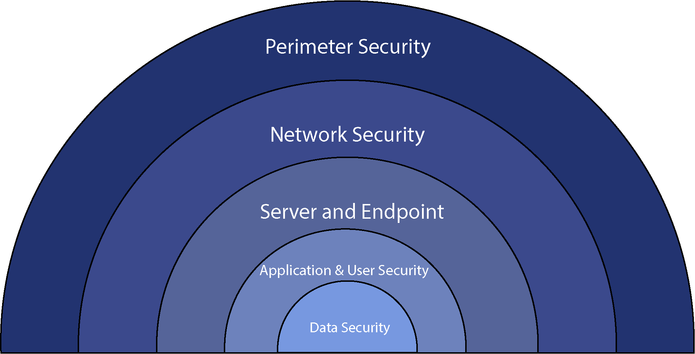

# Beveiliging

    Open de
    <a href="./assets/lessen/les-3b-network-security.pdf#page=1&zoom=75" target=”_blank”>les 3b network security</a>
    in a new tab window fullscreen.

## Intro

Beste studenten, van harte welkom bij het laatste onderwerp binnen het vak infrastructuur: security. Dit college zal bestaan uit twee onderdelen. In het eerste deel zullen we verschillende bedreigingen bespreken die we kunnen tegenkomen op onze computer netwerken. Het tweede deel zal focussen op technische maatregelen die we kunnen nemen om deze bedreigingen aan te pakken.

## Veiligheidseigenschappen

Er zijn vier eigenschappen die essentieel zijn voor een veilig netwerk: confidentialiteit, integriteit, beschikbaarheid en operationele veiligheid. Het is belangrijk om niet alleen technische maatregelen te nemen, maar ook om goed na te denken over waar kwetsbaarheden zitten en daar aandacht aan te besteden. Dit kan worden gedaan met behulp van security audits.

## Het Belang van Security

Het internet is niet erg veilig. Decennia geleden, bij de oprichting van het internet door Vint Cerf, was het niet bedoeld voor de massale uitwisseling van gevoelige informatie zoals nu. Er was weinig aandacht voor security in het oorspronkelijke ontwerp van het internet. Dit heeft geleid tot talloze beveiligingsincidenten en datalekken.

## Bedreigingen en Risico's

Op het internet kunnen we verschillende bedreigingen tegenkomen, zoals malware, virussen, spyware en ransomware. Malware kan zich verspreiden door op dubieuze links te klikken of kwetsbaarheden in software te misbruiken. Spyware kan toetsaanslagen en andere gevoelige informatie vastleggen en doorsturen naar kwaadwillende partijen. Ransomware versleutelt bestanden en eist losgeld in ruil voor de decryptiesleutel.

## Gevolgen van Bedreigingen

Recente incidenten, zoals de ransomware-aanval op de Universiteit van Maastricht, benadrukken de ernst van de situatie. Organisaties kunnen gegevens verliezen, financiële schade lijden en reputatieschade oplopen als gevolg van beveiligingsincidenten. Het is daarom essentieel om proactieve maatregelen te nemen om deze bedreigingen te voorkomen en te beheren.

## Botnets en Afluisteren

Als je pech hebt, kan jouw computer worden opgenomen in een botnet, een leger van computers dat is overgenomen door hackers. Deze botnets kunnen worden misbruikt om aanvallen uit te voeren, zoals DDoS-aanvallen, het afluisteren van verkeer of het versturen van spam.

## Onveilige Communicatiekanalen

Het uitwisselen van informatie over het internet kan riskant zijn, omdat het kanaal vaak onveilig is. Zelfs als zenders en ontvangers veilig zijn, kan de communicatie worden onderschept door derden die toegang hebben tot hetzelfde netwerk.

## Bad Guys/Girls Kunnen

Bad guys en girls kunnen verschillende aanvallen uitvoeren:

1. **Eavesdropping (afluisteren):** Dit is wanneer een aanvaller vertrouwelijke informatie onderschept die wordt uitgewisseld tussen twee partijen, zoals gevoelige gegevens of wachtwoorden, zonder dat de betrokken partijen hiervan op de hoogte zijn.

2. **Impersonation (imitatie):** Bij deze aanval doet de aanvaller zich voor als een legitieme gebruiker of entiteit om toegang te krijgen tot systemen, gegevens of privileges waar ze geen recht op hebben. Dit kan bijvoorbeeld gebeuren door valse e-mails of websites te gebruiken om inloggegevens te stelen.

3. **Hijacking (kapen):** Hierbij neemt een aanvaller controle over een actieve verbinding tussen twee partijen over, zoals een sessie tussen een gebruiker en een server. Dit stelt de aanvaller in staat om gegevens te onderscheppen, te wijzigen of zelfs de controle over te nemen.

4. **DDoS (Distributed Denial of Service):** Met deze aanval proberen aanvallers een service of netwerk onbeschikbaar te maken voor legitieme gebruikers door het overspoelen van het doelsysteem met een grote hoeveelheid verkeer of verzoeken. Dit kan resulteren in een verstoring van de normale werking van de dienst of zelfs in een volledige uitval.

## Risico's van Onveilige Communicatie

Een hacker kan onderschepte berichten manipuleren door ze te verwijderen, toe te voegen of te wijzigen. Hierdoor kan valse informatie worden verspreid, wat kan leiden tot misleiding, identiteitsdiefstal of andere vormen van fraude.

## Man-in-the-Middle (MitM) Aanvallen

Een veelvoorkomende vorm van aanval is de man-in-the-middle (MitM) aanval, waarbij een aanvaller zich voordoet als een vertrouwde partij om de communicatie tussen twee andere partijen te onderscheppen en te manipuleren.

## DoS en DDoS Aanvallen

Een ander type aanval is de Denial of Service (DoS) en Distributed Denial of Service (DDoS) aanval, waarbij de aanvaller een systeem overbelast met een grote hoeveelheid verkeer, waardoor legitieme gebruikers geen toegang meer hebben tot de dienst.

## Hoe DoS en DDoS Aanvallen Werken

DoS en DDoS aanvallen kunnen worden uitgevoerd door het gebruik van botnets, waarbij duizenden geïnfecteerde computers worden gebruikt om verkeer naar een specifiek doelwit te sturen. Dit kan resulteren in een overbelasting van de server, waardoor deze niet meer reageert op legitieme verzoeken.

## Complexiteit van DDoS Aanvallen

Distributed Denial of Service (DDoS) aanvallen zijn moeilijk te verdedigen tegen, omdat het verkeer er legitiem uitziet en vanuit verschillende bronnen afkomstig kan zijn. Deze aanvallen kunnen worden uitgevoerd door georganiseerde groepen die professioneel te werk gaan, waardoor ze steeds lastiger te detecteren zijn.

## Professionalisering van Cybercriminaliteit

Cybercriminaliteit is geëvolueerd tot een lucratief businessmodel, waarbij tools en diensten gemakkelijk verkrijgbaar zijn op het dark web. Ransomware-aanvallen en andere vormen van malware worden steeds vaker ingezet door georganiseerde criminele groeperingen.

## 4 Eigenschappen van Veilige Communicatie

Om netwerken en systemen te beveiligen, zijn vier eigenschappen van veilige communicatie essentieel: vertrouwelijkheid, integriteit, authenticiteit en beschikbaarheid.

## Vertrouwelijkheid

Vertrouwelijkheid zorgt ervoor dat alleen de zender en ontvanger de inhoud van de communicatie begrijpen. Encryptie wordt gebruikt om berichten te versleutelen, zodat deze alleen leesbaar zijn voor geautoriseerde partijen.

## Integriteit

Integriteit garandeert dat berichten tijdens de verzending niet worden gewijzigd, verwijderd of gemanipuleerd door kwaadwillende partijen. Dit wordt bereikt door middel van methoden zoals digitale handtekeningen en hashfuncties.

## Authenticiteit

Authenticiteit verifieert de identiteit van de communicerende partijen, zodat ze zeker weten met wie ze communiceren. Dit kan worden gedaan met behulp van wachtwoorden, certificaten of andere vormen van identiteitsverificatie.

## Beschikbaarheid

Beschikbaarheid zorgt ervoor dat communicatiediensten altijd operationeel zijn en niet worden verstoord door aanvallen of storingen. Dit vereist maatregelen zoals het beheer van verkeersstromen, het voorkomen van overbelasting en het regelmatig bijwerken van beveiligingspatches.

## Maatregelen ter Bescherming

Om een effectieve beveiliging te garanderen, moeten netwerkbeheerders en systeembeheerders proactief zijn in het implementeren van beveiligingsmaatregelen, zoals het gebruik van firewalls, het regelmatig bijwerken van software en het monitoren van het netwerkverkeer.

## Sociale Techniek en Social Engineering

Kevin Mitnick, een bekende hacker, staat bekend om zijn vaardigheden op het gebied van social engineering. Hij maakte gebruik van trucjes in het telefoonnetwerk om toegang te krijgen tot systemen. Zelfs nadat hij werd opgepakt door de FBI, bleef hij actief als consultant op het gebied van security.

## Effectiviteit van Social Engineering

Mitnick's expertise lag vooral in social engineering, waarbij hij mensen misleidde met overtuigende verhalen om toegang te krijgen tot beveiligde locaties. Hij wist bijvoorbeeld namen van medewerkers en supervisors te achterhalen om zich voor te doen als beveiligingspersoneel.

## Belang van Beleid en Beveiligingsbewustzijn

Hoewel technische maatregelen belangrijk zijn, benadrukt Mitnick dat effectieve beveiliging begint met een goed beleid en bewustwording bij het management. Het management moet het goede voorbeeld geven en het belang van security uitdragen naar de medewerkers.

## Regelgeving en Wetgeving

Naast interne beleidsmaatregelen zijn er ook externe factoren, zoals Europese AVG-wetgeving en Amerikaanse richtlijnen zoals Sarbanes-Oxley, die bepalen hoe organisaties met persoonsgegevens moeten omgaan. Niet-naleving kan leiden tot boetes en andere maatregelen.

## Risicoanalyse en Schadebeperking

Een essentieel onderdeel van beveiliging is het uitvoeren van een risicoanalyse, waarbij de mogelijke risico's worden geïdentificeerd en geëvalueerd op basis van hun ernst en waarschijnlijkheid. Dit stelt organisaties in staat om passende maatregelen te nemen om de schade te beperken in geval van een incident.

## Risicobeheer en Kostenafweging

Afhankelijk van de grootte van het risico moeten passende maatregelen worden genomen. Dit kan variëren van technische oplossingen tot het accepteren van het feit dat er dingen mis kunnen gaan. Het nemen van deze maatregelen moet in overeenstemming zijn met het risiconiveau dat aanvaardbaar is voor de organisatie.

## Kosten van Beveiligingsincidenten

Het is belangrijk om de potentiële kosten van beveiligingsincidenten te overwegen. Stel dat een incident zich voordoet en er schade wordt veroorzaakt, bijvoorbeeld een verlies van €80.000. Dit illustreert de financiële impact die een beveiligingsprobleem kan hebben.

## Risicoanalyse en Schatting

Het maken van een inschatting van de risico's is complex. Het is moeilijk om bijvoorbeeld te bepalen hoe vaak een website gehackt kan worden en wat de financiële gevolgen daarvan zijn. Toch is het mogelijk om op basis van historische gegevens en branche-informatie een verantwoorde schatting te maken.

## Eerst RA daarna Technische Maatregelen Nemen

Pas als we weten waar de risico's zitten wat de kwetsbare plekken zijn in het bedrijf en waar het echt pijn zal doen als het verkeerd gaat dan pas gaan we kijken naar enkele technische maatregelen.

- Firewall
- Routers. Modems etc with a packet filter
- Antivirus
- IDS/IDP
- Data protection Linux rwx
- Data Encryption
- Security Awareness

## Technische Maatregelen

Na het identificeren van risico's is het belangrijk om te kijken naar technische maatregelen om deze risico's te verminderen. Dit kan het installeren van firewalls, het gebruik van encryptie en het verbeteren van de bewustwording van security bij medewerkers omvatten.

## Defence In Depth

## Preventie als Verdediging

Het concept van preventie als verdediging kan worden vergeleken met een middeleeuws kasteel met een slotgracht. Het doel is om een verdedigingslinie op te zetten om indringers buiten te houden. Net zoals een kasteel een barrière heeft om te voorkomen dat vijanden binnenkomen, zo moeten organisaties proactief maatregelen nemen om zichzelf te beschermen tegen bedreigingen.

## Het Belang van Beveiliging

Het is belangrijk om beveiligingsmaatregelen te nemen, zelfs als je kunt zwemmen in de slotgracht. We moeten voorkomen dat krokodillen ons aanvallen terwijl we ons op het droge bevinden.

## Bescherming van Gegevens

Organisaties hebben gegevens die ze moeten beschermen. Dit geldt vooral voor applicaties die gegevens verwerken. Het is essentieel om ervoor te zorgen dat deze applicaties veilig zijn en geen beveiligingslekken bevatten.

## Beveiliging van Hosts

Naast het beschermen van applicaties moeten we ook de hosts waarop ze draaien veilig houden. Dit omvat het beperken van gebruikersrechten, het installeren van antivirussoftware en het regelmatig updaten van systemen.

## Beveiliging van het Netwerk

We moeten ook het netwerk veilig houden. Dit kan worden bereikt door het gebruik van firewalls, het monitoren van het netwerkverkeer en het implementeren van een intrusion detection system (IDS).

## Fysieke Beveiliging

Fysieke beveiliging is ook van groot belang. Dit omvat het beheren van toegang tot fysieke ruimtes met behulp van pasjes en sloten, zodat alleen geautoriseerd personeel toegang heeft tot servers en andere gevoelige apparatuur.

## Procedures en Richtlijnen

Naast technische maatregelen zijn ook procedures en richtlijnen essentieel voor een goede beveiliging. Dit omvat het definiëren van processen voor het omgaan met incidenten en het creëren van bewustzijn bij medewerkers over beveiligingskwesties.

## Het Verminderen van Risico's

Hoewel het voor een hacker nog steeds mogelijk is om beveiligingssystemen te omzeilen, kunnen deze maatregelen de kans hierop aanzienlijk verkleinen. Door een combinatie van technische en organisatorische maatregelen kunnen we de risico's op een succesvolle aanval verminderen.

## Toekomstige Maatregelen

In het volgende deel zullen we dieper ingaan op specifieke maatregelen die we kunnen implementeren om ons netwerk verder te beveiligen.
