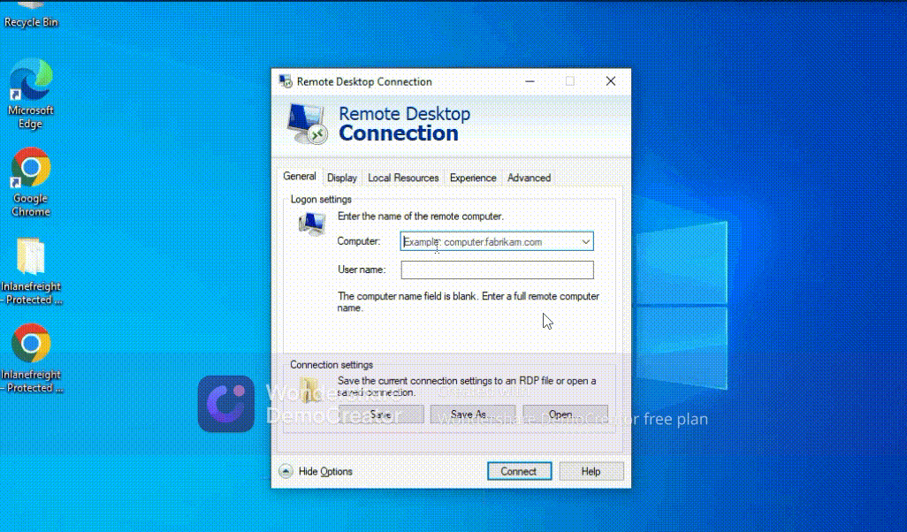
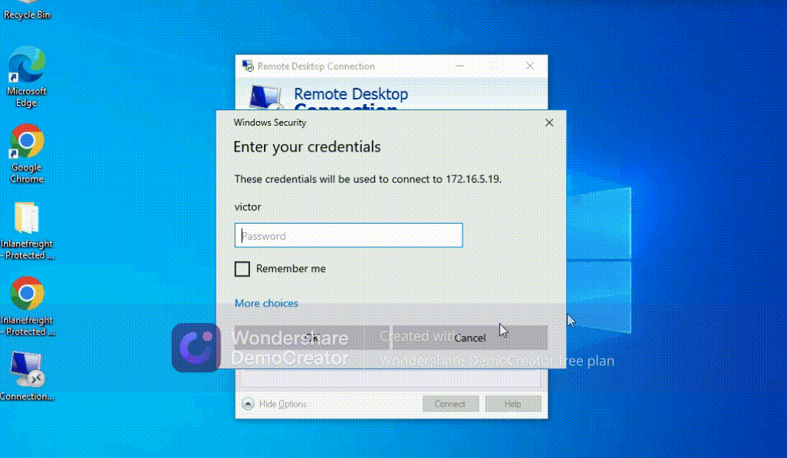
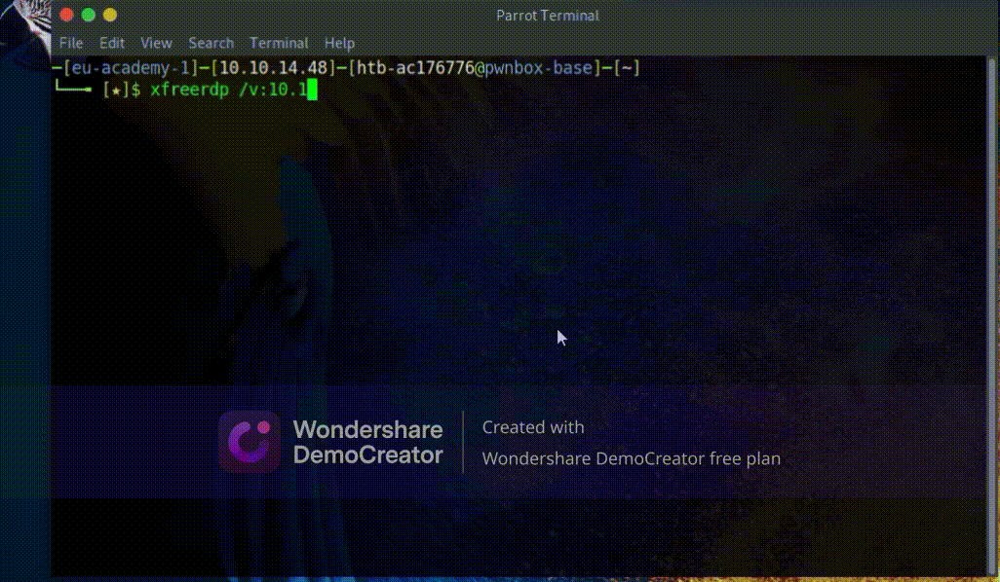

# Windows

This article is based on the [Windows](https://academy.hackthebox.com/module/49/section/454) module available at [hackthebox.com](hackthebox.com)

## Why?

### Corporate Environments

Windows is heavily used across corporate environments of all sizes. We often find ourselves gaining access to a Windows host during a penetration testing engagement.

### Navigation

It is important to understand how to navigate the file system and command line to perform effective enumeration, privilege escalation, lateral movement, and post-exploitation.

### Attack Box

Windows can also be used as our attack box during assessments.

### Many Servers Run It

Many servers run on Windows, and most companies deploy Windows workstations to their employees due to the ease of use for individuals and centralized administration that can be leveraged using Active Directory. This module covers the essentials for starting with the Windows operating system and command line.

## Introduction to Windows

As a penetration tester, it's crucial to understand Windows and Linux operating systems, as they are prevalent in most systems, whether on-premise or in the cloud.

Knowing how to attack and defend these systems, as well as using them for further penetration testing activities, is essential.

## The Windows Operating System

### Introduction

Microsoft introduced the Windows operating system on November 20, 1985, as a graphical shell for MS-DOS. Early versions featured programs like Windows File Manager, Program Manager, and Print Manager.

### Windows Desktop

- **Windows 95**: First full integration of Windows and DOS with built-in Internet support and Internet Explorer.
- **Subsequent Versions**: Over a dozen versions, including Windows XP, Vista, 8, and the current Windows 10.
- **Editions**: Various editions for consumers to enterprise customers.

### Windows Server

- **Initial Release**: Windows NT 3.1 Advanced Server in 1993.
- **Technological Advances**: Included IIS, networking protocols, and Administrative Wizards.
- **Windows 2000**: Introduced Active Directory, Microsoft Management Console (MMC), and dynamic disk volumes.
- **Windows Server 2003**: Added server roles, built-in firewall, and Volume Shadow Copy Service.
- **Windows Server 2008**: Included failover clustering, Hyper-V, Server Core, Event Viewer, and enhancements to Active Directory.
- **Recent Versions**: Server 2012, 2016, and 2019, with the latest adding Kubernetes, Linux containers, and advanced security features.

### Legacy and Support

- **End of Life**: Server 2008 and 2012 stopped receiving updates on January 14, 2020. Only Server 2012 R2 and later are supported.
- **Legacy Systems**: Older versions are often still in use due to critical applications, operational, or budgetary concerns.
- **Vulnerabilities**: Assessors must understand the differences and vulnerabilities of each version, including issues like the critical SMBv1 vulnerability (EternalBlue).

## Windows Versions

| Operating System Names                  | Version Number |
|-----------------------------------------|----------------|
| Windows NT 4                            | 4.0            |
| Windows 2000                            | 5.0            |
| Windows XP                              | 5.1            |
| Windows Server 2003, 2003 R2            | 5.2            |
| Windows Vista, Server 2008              | 6.0            |
| Windows 7, Server 2008 R2               | 6.1            |
| Windows 8, Server 2012                  | 6.2            |
| Windows 8.1, Server 2012 R2             | 6.3            |
| Windows 10, Server 2016, Server 2019    | 10.0           |

## Get-WmiObject

We can use the `Get-WmiObject` cmdlet to find operating system information, including instances of WMI classes. To find the version and build number, use the `win32_OperatingSystem` class, which reveals details such as being on a Windows 10 host with build number 19045.

```powershell
PS C:\Users\user> Get-WmiObject -Class win32_OperatingSystem | select Version,BuildNumber

Version    BuildNumber
-------    -----------
10.0.19045 19045
```

### Commands

Here are some useful `Get-WmiObject` commands:

- **Get Operating System Information:**

  ```powershell
  Get-WmiObject -Class win32_OperatingSystem
  ```

- **Get Process Listing:**

  ```powershell
  Get-WmiObject -Class Win32_Process
  ```

- **Get BIOS Information:**

  ```powershell
  Get-WmiObject -Class Win32_Bios
  ```

- **Get Information About Remote Computers:**

  ```powershell
  Get-WmiObject -Class Win32_OperatingSystem -ComputerName <RemoteComputerName>
  ```

- **Get Service Listing:**

  ```powershell
  Get-WmiObject -Class Win32_Service
  ```

  - **Start a Service:**

    ```powershell
    Get-WmiObject -Class Win32_Service -Filter "Name='<ServiceName>'" | ForEach-Object { $_.StartService() }
    ```

  - **Stop a Service:**

    ```powershell
    Get-WmiObject -Class Win32_Service -Filter "Name='<ServiceName>'" | ForEach-Object { $_.StopService() }
    ```

Find out more about this command [here](https://ss64.com/ps/get-wmiobject.html) and [here](https://adamtheautomator.com/get-wmiobject/)

## Local Access

If you are reading these words right now, you have local access to a computer of some kind.

`Input` is likely happening through a keyboard, trackpad &/or mouse. `Output` is coming from the display screen(s).

Local access involves directly interacting with a computer (e.g., smartphone, tablet, laptop, desktop). This is common in organizations where employees work on-site with company-owned devices, but remote work is increasing.

## Remote Access

Remote Access is accessing a computer over a network. Local access to a computer is needed before one can access another computer remotely.

Remote access allows connecting to a computer over a network. Common methods include:

- Virtual Private Networks (VPN)
- Secure Shell (SSH)
- File Transfer Protocol (FTP)
- Virtual Network Computing (VNC)
- Windows Remote Management (or PowerShell Remoting) (WinRM)
- Remote Desktop Protocol (RDP)

This module focuses on RDP.

## Remote Desktop Protocol (RDP)

### RDP Client/Server Model

RDP utilizes a client/server model where the client specifies the target computer's IP address or hostname over a network with RDP access enabled.

### Target Computer and Server Role

The target computer, where RDP is enabled, acts as the server and typically listens on port `3389`.

### Default Port and Application Access

In simpler terms, think of IP addresses as house addresses on a street (network subnet), and ports as windows/doors to access the house.

### Networking Analogy: IP Address and Ports

Requests, encapsulated within packets, are directed to the appropriate application on the destination computer based on the specified port.

### Request Routing and Application Handling

While IP addressing and protocol encapsulation are complex topics, for this module, it suffices to understand that each computer has an IP address for network communication, and applications listen on specific ports.

### Compatibility and Client Application

RDP allows connecting to a Windows target from a Linux or Windows attack host. For Windows hosts, the built-in RDP client application, `Remote Desktop Connection` (mstsc.exe), is commonly used.



### Allowed

For this to work, remote access must already be [allowed](https://learn.microsoft.com/en-us/windows-server/remote/remote-desktop-services/clients/remote-desktop-allow-access) on the target Windows system. By default, remote access is not allowed on Windows operating systems.

### Connection  Profiles

Remote Desktop Connection also allows us to save connection profiles. This is a common habit among IT admins because it makes connecting to remote systems more convenient.



### Locating Saved Remote Desktop Files

As penetration testers, searching for saved Remote Desktop Files (`.rdp`) during engagements can be advantageous for reconnaissance and potential exploitation.

### Remote Desktop Client Applications

While Remote Desktop Connection (mstsc.exe) is commonly used on Windows, numerous other Remote Desktop client applications exist. However, this module won't delve into each one. For a comprehensive list, refer to Microsoft's article titled "Remote Desktop clients."

Here is a list of the various Remote Desktop clients provided by Microsoft:

1. **Windows (MSTSC)**
2. **Remote Desktop app (Universal Windows Platform)**
3. **Android**
4. **iOS**
5. **macOS**
6. **Web Client**
7. **Azure Virtual Desktop Store app**

Each of these clients has different features and capabilities. For instance, they all support basic remote desktop sessions, multiple monitors, dynamic resolution, and multi-factor authentication, among other features.

For more detailed information on the specific features and capabilities of each client, you can refer to Microsoft's [feature comparison page](https://learn.microsoft.com/en-us/windows-server/remote/remote-desktop-services/clients/remote-desktop-features).

## Using xfreerdp

From a Linux-based attack host we can use a tool called xfreerdp to remotely access Windows targets. You will notice that we use xfreerdp across multiple modules because of its ease of use, feature set, command line utility, and efficiency. Check out the clip below to see basic usage from Pwnbox:



Remember that we can also copy and paste in xfreerdp commands in the command line, so we do not need to enter options manually. There are several options available to us with xfreerdp, such as drive redirection to be able to tranfer files to/from the target host, which are worth practicing and we will cover in other modules within HTB Academy.

Other RDP clients exist, such as [Remmina](https://remmina.org/) and [rdesktop](http://www.rdesktop.org/), and we encourage you to experiment with others and see what works best for you. Now that we have covered these concepts let's apply them by spawning the target below and connecting to it using RDP with the credentials provided.

**Command**

```bash
xfreerdp /v:<targetIp> /u:htb-student /p:Password
```
