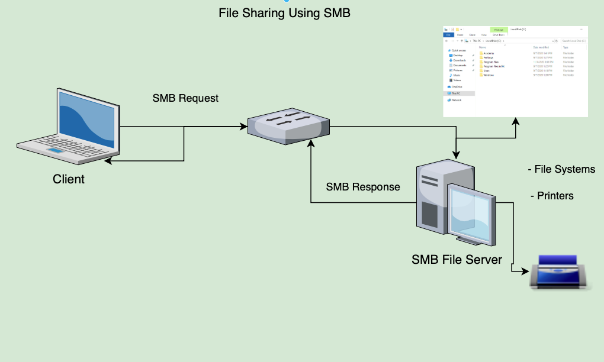

# NTFS vs. Share Permissions

Microsoft owns over 70% of the global market share on desktop operating systems with Windows.

This explains why most malware authors choose to write malware for Windows and why many perceive Windows as less secure than other operating systems.

From a business perspective it just makes sense for malware authors to expend resources on writing malware for Windows. It is a high-value target.

The idea that any OS is immune to malware is a technical fallacy. If software can be written for an operating system then a virus can be written for an operating system.

Keep in mind that a virus, by definition, is software written with malicious intent and can be written for any OS.

Many variants of malware written for Windows can spread over the network via network shares with lenient permissions applied.

It is also worth noting that to this day, the infamous `EternalBlue` vulnerability still haunts unpatched Windows systems running SMBv1 and often paves the way for ransomware to shut down organizations.

The `Server Message Block protocol` (`SMB`) is used in Windows to connect shared resources like files and printers. It is used in large, medium, and small enterprise environments. See the image below to visualize this concept:

NTFS permissions and share permissions are often understood to be the same.

Please know that they are not the same but often apply to the same shared resource.

Let’s take a look at the individual permissions that can be set to secure/grant objects access to a network share hosted on a Windows OS running the NTFS file system.

## Share Permissions

| Permission Type   | Description                                                                                                                                            |
|-------------------|--------------------------------------------------------------------------------------------------------------------------------------------------------|
| `Full Control`    | Users are permitted to perform all actions given by Change and Read permissions as well as change permissions for NTFS files and subfolders            |
| `Change`          | Users are permitted to read, edit, delete and add files and subfolders                                                                                 |
| `Read`            | Users are allowed to view file & subfolder contents                                                                                                    |

## NFTS Basic Permissions

| Permission Type         | Description                                                                                                                         |
|-------------------------|-------------------------------------------------------------------------------------------------------------------------------------|
| `Full Control`          | Users are permitted to add, edit, move, delete files & folders as well as change NTFS permissions that apply to all allowed folders |
| `Modify`                | Users are permitted or denied permissions to view and modify files and folders. This includes adding or deleting files              |
| `Read & Execute`        | Users are permitted or denied permissions to read the contents of files and execute programs                                        |
| `List folder contents`  | Users are permitted or denied permissions to view a listing of files and subfolders                                                 |
| `Read`                  | Users are permitted or denied permissions to read the contents of files                                                             |
| `Write`                 | Users are permitted or denied permissions to write changes to a file and add new files to a folder                                  |
| `Special Permissions`   | A variety of advanced permissions options                                                                                           |

## NTFS Special Permissions

| Permission Type                | Description                                                                                                                                                                                                                       |
|--------------------------------|-----------------------------------------------------------------------------------------------------------------------------------------------------------------------------------------------------------------------------------|
| `Full control`                   | Users are permitted or denied permissions to add, edit, move, delete files & folders as well as change NTFS permissions that apply to all permitted folders                                                                       |
| `Traverse folder / execute file` | Users are permitted or denied permissions to access a subfolder within a directory structure even if the user is denied access to contents at the parent folder level. Users may also be permitted or denied permissions to execute programs |
| `List folder/read data`          | Users are permitted or denied permissions to view files and folders contained in the parent folder. Users can also be permitted to open and view files                                                                             |
| `Read attributes`                | Users are permitted or denied permissions to view basic attributes of a file or folder. Examples of basic attributes: system, archive, read-only, and hidden                                                                      |
| `Read extended attributes`       | Users are permitted or denied permissions to view extended attributes of a file or folder. Attributes differ depending on the program                                                                                             |
| `Create files/write data`        | Users are permitted or denied permissions to create files within a folder and make changes to a file                                                                                                                              |
| `Create folders/append data`     | Users are permitted or denied permissions to create subfolders within a folder. Data can be added to files but pre-existing content cannot be overwritten                                                                        |
| `Write attributes`               | Users are permitted or denied to change file attributes. This permission does not grant access to creating files or folders                                                                                                       |
| `Write extended attributes`      | Users are permitted or denied permissions to change extended attributes on a file or folder. Attributes differ depending on the program                                                                                           |
| `Delete subfolders and files`    | Users are permitted or denied permissions to delete subfolders and files. Parent folders will not be deleted                                                                                                                      |
| `Delete`                         | Users are permitted or denied permissions to delete parent folders, subfolders and files                                                                                                                                          |
| `Read permissions`               | Users are permitted or denied permissions to read permissions of a folder                                                                                                                                                        |
| `Change permissions`             | Users are permitted or denied permissions to change permissions of a file or folder                                                                                                                                               |
| `Take ownership`                 | Users are permitted or denied permission to take ownership of a file or folder. The owner of a file has full permissions to change any permissions                                                                                 |

Keep in mind that NTFS permissions apply to the system where the folder and files are hosted. Folders created in NTFS inherit permissions from parent folders by default.

It is possible to disable inheritance to set custom permissions on parent and subfolders, as we will do later in this module.

The share permissions apply when the folder is being accessed through SMB, typically from a different system over the network.

This means someone logged in locally to the machine or via RDP can access the shared folder and files by simply navigating to the location on the file system and only need to consider NTFS permissions.

The permissions at the NTFS level provide administrators much more granular control over what users can do within a folder or file.

## Creating a Network Share

To get a solid fundamental understanding of SMB and it's relationship to NTFS, we will create a network share on the `Windows 10 target box`.

In this case, we will create a shared folder by first creating a new folder on the Windows 10 desktop.

Keep in mind that in most large enterprise environments, shares are created on a Storage Area Network (SAN), Network Attached Storage device (NAS), or a separate partition on drives accessed via a server operating system like Windows Server.

If we ever come across shares on a desktop operating system, it will either be a small business or it could be a beachhead system used by a penetration tester or malicious attacker to gather and exfiltrate data.

We will go through this process using the GUI in Windows.

## Creating The Folder

## Making The Folder A Share

## Share Permissions ACL (Sharing Tab)

## Using smbclient to list avaliable Shares

## Connecting to the Company Data share

## Windows Defender Firewall Considerations

## NTFS Permissions ACL (Security Tab)

## Mounting to the Share

## Installing CIFS Utilities

## Displaying Shares using net share

## Monitoring Shares from Computer Management

## Viewing Share access logs in Event Viewer
