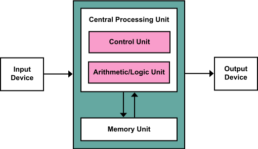
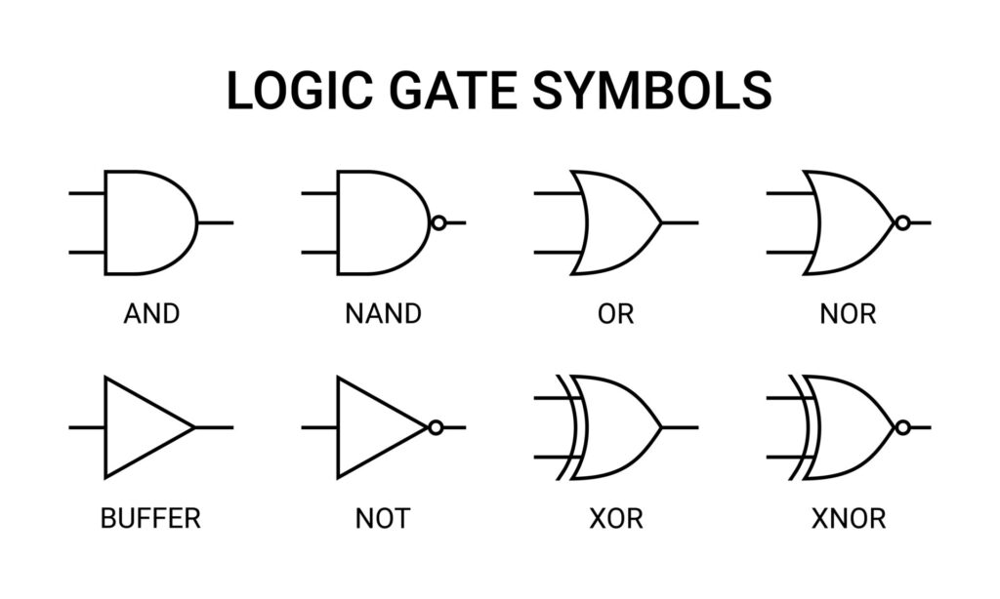

# System Engineering

<p>
    Open de
    <a href="./assets/SE.pdf#page=1&zoom=75" target=”_blank”>SE by Pum Walters</a>
    in a new tab window fullscreen.
</p>

## Minimal Magic

> Ik gaf ooit een inleidende cursus systeemengineering. Het magische aan systeemengineering is dat, zodra je een transistor begrijpt, je grotendeels een hele CPU kunt begrijpen. Later begon ik een boek te schrijven over term rewriting met een vergelijkbare basis: Ex Principiis Omnia. Dit bracht me op het idee om een blog te starten met werk en overdenkingen over dat onderliggende thema. by `Pum Walters`

## `I Part One`

### 4 Some Computing History

- **4.1 Oldest computers**
    ::: details Antwoord

    **Antikythera-mechanisme**

    Het Antikythera-mechanisme is een mechanische astrologische rekenmachine met 60 tandwielen, gemaakt zo'n 2000 jaar geleden.

    **Stonehenge als Oudste Computer**

    Het eerste Stonehenge is een ouder voorbeeld van 'computing' dan het Antikythera-mechanisme.

    

    **Theorie van de Kiezels**

    Rondom de stenen ligt een cirkel van kuilen. Een theorie suggereert dat priesters gekleurde kiezels dagelijks van de ene kuil naar de andere verplaatsten.

    **Astronomische Voorspellingen**

    Met de locatie van de kiezels konden astronomische voorspellingen zoals verduisteringen en equinoxen worden gedaan.

    

    Ouderdom van Computing

    Het eerste Stonehenge is ongeveer 5000 jaar oud, wat betekent dat 'computing' net zo oud is als het schrift!
    :::

- **4.2 Mechanical computing**
    ::: details Antwoord
    **Abacus**

    Een abacus is een frame met kralen dat grote gehele getallen kan vertegenwoordigen en handmatig bewerkingen zoals optellen, aftrekken, vermenigvuldigen, delen en het nemen van wortels kan uitvoeren.

    **Rekenliniaal**

    Een rekenliniaal vertegenwoordigt reële getallen door afstanden en kan vermenigvuldigen, delen en andere wiskundige berekeningen uitvoeren.

    **~1800: Vroege Mechanische Computers**

  - De eerste 'massaproductie' van mechanische rekenmachines.
  - De eerste weefgetouwen waarbij patronen werden gecodeerd in ponskaarten.
  - Het (onvolledige) ontwerp van Charles Babbage's Analytical Engine, met 16K geheugen, een ALU, besturingsstroom en zelfs voorwaardelijke vertakkingen. Let op: deze machine is nooit gebouwd.
    :::

- **4.3 Electric Computers**
    ::: details Antwoord
    **Hoogtepunten:**
  - De eerste programmeerbare elektromechanische (relais) computers: Zuse
  - Wiskunde en computerwetenschap zijn nauw verwant (Turing, Gödel)
  - Von Neumann-model: programma is data
  - Jaren '40: vacuümbuizen
  - Jaren '50: transistors
  - Jaren '60: geïntegreerde schakelingen
  - Jaren '20: kwantumcomputing

    <br />
    
    <br />

    **Systeemtechniek - Inleiding**

    Een huidige telefoon heeft meer sensoren (15+) en aanzienlijk meer rekenkracht (8+ 64-bit kernen) dan NASA in de jaren '60 had om op de maan te landen. Hij kan een jaar van je leven non-stop filmen, zonder moeite. Hij weegt ongeveer 150 gram.

    Hoe is dat mogelijk? Dat is de spits van systeemtechniek.
    :::

### 5 System Engineering - Introduction  

- **5.1 Engineering**
    ::: details Antwoord
  **Engineering gaat over:**
  - Het vinden van oplossingen voor problemen
  - Het benutten van kansen

  **Voorbeeld 1: Kaarsensnijder**

    Een kaarsensnijder is een kleine schaar met een doosje eraan bevestigd, gebruikt om de lont van een kaars te knippen voordat deze zwarte rook begint te produceren door slechte verbranding. De meeste zijn antiek omdat moderne kaarsen ze niet nodig hebben.

    In een moderne lont wordt één draad strak getrokken wanneer de kaars wordt gemaakt, wat resulteert in een krullende lont wanneer deze uit de was wordt gehaald. De krullende lont steekt uit de vlam, waar hij volledig verbrandt, waardoor hij niet te lang wordt en onvolledige verbranding van de was voorkomt. Eén draad strak trekken is een ingenieursoplossing.

  **Voorbeeld 2: Slechte Lijm**

    Een uitvinder creëerde 'slechte lijm' die niet goed werkte op papier en helemaal niet op andere materialen. Zes jaar lang werd het als nutteloos beschouwd. Tegenwoordig is Post-It een product van miljarden dollars en wordt het wereldwijd gebruikt!

  **Voorbeeld 3: Analoge Computers**

    Analoge computers gebruiken spanning om waarden weer te geven. Maar spanningen kunnen veranderen op basis van temperatuur, vochtigheid en aardmagnetisme. Stel je voor dat je salaris afhankelijk is van het weer. Ingenieurs losten dit probleem op door te begrijpen dat precieze spanningen veranderen, maar de afwezigheid of aanwezigheid van spanning binnen grenzen niet.

    Vandaag de dag heeft een telefoon meer dan 1.000.000.000 transistors die meer dan 1.000.000.000 keer per seconde schakelen (bepalen de aanwezigheid of afwezigheid van spanning).
    :::

- **5.2 Layers**
    ::: details Antwoord
    **Lagen**  
    Om systemen met miljarden onderdelen te begrijpen, moeten mensen structuur toepassen. Zoals de TCP/IP-stack wordt gebruikt om computernetwerken te begrijpen, wordt een ander gelaagd model gebruikt om systemen te begrijpen.

    **Probleemgerichte Taalniveau**  
    De meeste programma's en talen die we dagelijks gebruiken, bestaan op dit niveau, zoals browsers, tekstverwerkers, Java, JavaScript, HTML en SQL.

    **Assembler Taalniveau**  
    Talen zoals Java worden 'hoog' genoemd omdat ze werken met abstracte concepten die geschikt zijn voor mensen, terwijl andere talen eenvoudiger concepten gebruiken die geschikt zijn voor hardwareverwerking.

    **Besturingssysteem Machineniveau**  
    Het primaire doel van een OS is het beheren van alle resources, met drivers voor specifieke hardware en algoritmen om processen toegang te geven tot deze resources.

    **Instructieset Architectuurniveau**  
    Dezelfde software kan op verschillende hardware draaien omdat de hardware één specifieke processor simuleert, de zogenaamde Instructieset Architectuur (ISA).

    **Microarchitectuur Niveau**  
    Onder ISA bestaat een lager niveau, genaamd microarchitectuur.

    **Digitale Logica Niveau**  
    Het laagste niveau bestaat uit transistors en andere primitieve elektronische onderdelen, die worden gebruikt om grotere componenten zoals AND-poorten te bouwen, vandaar de naam Digitale Logica.
    :::

### 6 Transistors & Gates

- **6.1 Semiconductors**
    ::: details Antwoord
    **Semiconductors**  
    Een halfgeleider is een materiaal dat elektriciteit geleidt, maar niet zo goed als geleiders zoals de meeste metalen en beter dan isolatoren zoals de meeste kunststoffen.

    **Types Semiconductors**  
    Er zijn twee soorten halfgeleiders: N-type met een overvloed aan losgekoppelde elektronen en P-type met een overvloed aan 'gaten' waar elektronen zich kunnen binden.

    **Werking van een Transistor**  
    De P-type ondergrond voorkomt stroom van de bron (links) naar de afvoer (rechts). Wanneer er spanning op de poort wordt aangelegd, induceert de positieve lading in de diëlektrische laag een veld in de P-type ondergrond, waardoor elektronen naar de afvoer kunnen stromen.

    **Transistor Symbolen**  
    Eenvoudig gezegd: geen spanning op de poort betekent geen spanning op de afvoer, ongeacht de spanning op de bron; spanning op de poort betekent dat de afvoer spanning heeft wanneer de bron dat heeft.

    **Types Transistors**  
    Er zijn veel soorten transistors gebaseerd op deze principes. BJT-transistors versterken stroom en worden gebruikt in audioversterkers. MOSFET-transistors werken op spanning met zeer weinig stroom en zijn geschikter voor schakelingen in computers.

    **Focus van deze Blog**  
    In deze blog richten we ons op (logische) systeemengineering in plaats van elektronische engineering.
    :::

- **6.2 Digital Computers**
    ::: details Antwoord
    **Digitale Computers**  
    In een digitale computer kan de aanwezigheid of afwezigheid van spanning (in plaats van de exacte spanning) worden geïnterpreteerd als binaire gegevens.

    **Spanning als Binaire Gegevens**  
    Een lijn met een (bijna) nulspanning staat voor 0; een lijn met een hogere spanning staat voor 1. Spanningen tussen 0 en 0,8 volt worden geïnterpreteerd als 0, en spanningen van 2 tot 5 volt als 1.

    **Ontwerpen van Circuits**  
    Circuitry is zo ontworpen dat spanningen in het tussenliggende gebied worden vermeden, omdat deze tot dubbelzinnige resultaten zouden leiden.

    **Positieve en Negatieve Spanningen**  
    Ontwerpers kiezen of positieve of negatieve spanningen worden gebruikt om niet-nulwaarden weer te geven. Vaak staat -5v voor 1.

    **Transistors als Rekenkundige Componenten**  
    Op basis hiervan kunnen transistors worden gebruikt om waarden te berekenen. Bijvoorbeeld, twee (TTL-type) transistors in serie berekenen de Booleaanse AND-functie: elektriciteit kan alleen stromen als beide transistors dit toestaan.
    :::

- **6.3 Gates**
    ::: details Antwoord
    **Logic Gate**  
    Een logic gate is een component bestaande uit een paar transistors (met ondersteunende elementen zoals diodes of weerstanden) die een Booleaanse functie berekenen.

    **Booleaanse Operatoren**  
    Logische poorten bestaan voor alle primitieve Booleaanse operatoren, maar afhankelijk van de specifieke technologie heeft de ene poort meer transistors nodig dan de andere, en alle Booleaanse operatoren kunnen met andere worden berekend. Bijvoorbeeld, de NAND kan alle andere Booleaanse operatoren berekenen.

    **Specifieke Gates**  
    Vanwege dit gegeven bevoordelen verschillende technologieën (TTL, NMOS, CMOS) specifieke poorten die minder ruimte of tijd gebruiken.

    **Terminologie**  
    Let op: verwarrend genoeg wordt het deel in een transistor dat de stroom regelt een 'gate' genoemd, en een component gemaakt van een paar transistors wordt ook een 'gate' genoemd.

    **Ontwerp van Digitale Elektronica**  
    Gates vormen de ontwerpeenheid voor digitale elektronica (hoewel er grotere modules en moduleringstechnieken bestaan). Bezoek bijvoorbeeld <https://hackaday.io/project/9795-nedonand-homebrew-computer> voor een project waarin een 8-bit processor wordt gemaakt van 74F00-chips, elk met twee NAND-poorten.

    <br />
    
     <br />

    **Oefening**  
  - Maak een inverter (NOT-operator) met alleen NAND-poorten.
  - Maak een OR-poort met alleen NAND-poorten.
    :::

## `II Part Two`

### 7 Boolean Arithmetic - Numbers

- **7.1 Booleans**
    ::: details Antwoord
    **Booleans**  
    Er zijn twee waarden: waar en onwaar. Veel bewerkingen, zoals vergelijkingen op andere gegevens (bijv. getallen, datums), resulteren in een Booleaanse waarde. Bijvoorbeeld: x>5 is waar als x groter is dan 5, anders is het onwaar.

    **Booleaanse Operatoren**  
    Waarheidswaarden kunnen worden gecombineerd of berekend met Booleaanse operatoren.

    **AND Operator**  
    AND geeft alleen waar als beide argumenten waar zijn, anders geeft het onwaar. Bijvoorbeeld, je kunt alleen deze attractie betreden als je lengte tussen 1,40 en 2,10 meter is en je gewicht niet meer dan 150 kg is. canJoin = (len > 1.40 EN len < 2.10) EN gewicht < 150

    **Andere Operatoren**  
    Andere operatoren zijn OR, NAND, NOR en NOT.
    :::

  - **7.1.1 Boolean Arithmetic**
      ::: details Antwoord
      **Boolean Arithmetic**  
      Soms is het handig om Booleaanse waarden als getallen te representeren: 0 (onwaar) en 1 (waar). Een enkel bit kan worden geïnterpreteerd als een geheel getal of als een Booleaan.

      **AND Operator**  
      Wanneer 0 en 1 worden gebruikt om waarheidswaarden voor te stellen, wordt de AND-operator vaak geschreven als *. Vermenigvuldiging berekent inderdaad de AND-operatie: p* q is alleen gelijk aan 1 als zowel p als q 1 zijn.

      **OR Operator**  
      Evenzo wordt OR geschreven als + en NOT als unary -. Merk op dat Integer- en Booleaanse + en (unair) - niet samenvallen met de gehele getalbewerkingen: Booleaanse 1+1 is 1 en -1 is 0.

      **Programmering**  
      In veel programmeertalen worden AND en OR vaak geschreven als & en |. Identifiers true en false worden over het algemeen in de programmering gebruikt om verwarring met gehele getallen te voorkomen.
      :::

- **7.2 Truth Tables**
    ::: details Antwoord
    **Truth Tables**  
    Een waarheidstabel is een techniek om de waarde van Booleaanse expressies te berekenen. In een waarheidstabel worden alle mogelijke waarden van alle variabelen samen met de waarde van de expressie (of de subexpressies als de expressie complex is) vermeld.

    **Voorbeelden**  
    De waarheidstabellen van NOT en AND zijn:
    :::

- **7.2.1 Complex Truth Tables**
    ::: details Antwoord
    **Complexe  Truth Tables**  
    Met waarheidstabellen kunnen de waarden van complexe Booleaanse expressies worden berekend, zelfs als hun waarde niet direct duidelijk is.

    **Voorbeeld**  
    Wat is bijvoorbeeld de waarde van (p of q) en niet (niet p en niet q)?

    **XOR-operator**  
    Een belangrijke operator is XOR (exclusief of): p xor q = (p of q) en niet (p en q). Deze operator is nuttig in encryptie omdat het geen informatie verliest.

    **Gates**  
    Beschouw de waarheidstabellen van (niet p en q) of (p en niet q) en p xor q. We zien dat ze identiek zijn.
    :::

- **7.2.2 Binary Numbers**
    ::: details Antwoord
    **Binary Numbers**

    De meeste mensen gebruiken vandaag het Arabische cijfersysteem op basis van tien cijfers, een positioneel nummeringssysteem waarbij de bijdrage van een cijfer aan een getal wordt bepaald door het cijfer en door zijn positie in het getal.

    **Positie Notatie**

    Het Arabische cijfersysteem is gebaseerd op tien cijfers, van 0 tot 9, en de waarde van een cijfer wordt bepaald door zijn positie in het getal.

    **Binair Systeem**

    Op hardwareniveau is het gebruik van tien cijfers onpraktisch, maar het gebruik van twee cijfers heeft wel zin: de cijfers 0 en 1. In het binaire systeem vertegenwoordigt '10' niet tien, maar twee.

    **Verschil in Notatie**

    Er is een verschil tussen een getal en hoe het wordt weergegeven. Bijvoorbeeld, het getal twaalf kan worden weergegeven als '12' in het decimale systeem, '1100' in het binaire systeem en 'c' in het hexadecimale systeem.
    :::

- **7.2.3 Binary to Decimal Conversion**
    ::: details Antwoord
    **Conversion from Binary to Decimal**

    Het omzetten van binair naar decimaal is heel eenvoudig:

  - Schrijf de gewichten van zoveel cijfers als je nodig hebt.
  - Tel voor elk cijfer 1 de overeenkomstige gewichtwaarde op.

    **Voorbeeld:**

    Om bijvoorbeeld 1001 naar decimaal om te zetten, schrijf je de gewichten: 8, 4, 2, 1 (elke positie wordt vermenigvuldigd met twee). Er zijn enen op de eerste en laatste positie, dus de waarde is 9.

    Merk op dat het gewicht van de n-de positie van rechts 2ˆn is, de n-de macht van 2.
    :::

- **7.2.4 Decimal to Binary Conversion**
    ::: details Antwoord
    **Decimal to Binary Conversion**

    Om een decimaal getal naar een binair getal om te zetten, doe het volgende:

    1. Als het getal even is, schrijf een 0 op.
    2. Als het getal oneven is, schrijf een 1 op en trek 1 af van het getal.
    3. Deel het getal door twee.
    4. Ga naar stap 1 tenzij je 0 hebt bereikt.

    De cijfers die je hebt opgeschreven zijn de binaire cijfers van rechts naar links.

    **Voorbeeld:**

    Om bijvoorbeeld 91 om te zetten:

    (91) 1 (45) 1 (22) 0 (11) 1 (5) 1 (2) 0 (1) 1 (0)

    Binair: 1011011 (controleer: 1+2+8+16+64=91)

    **Oefeningen:**

    1. Zet het binair getal 101 om naar decimaal.
    2. Zet het decimaal getal 101 om naar binair.
    :::

- **7.3 Binary Arithmetic**
  ::: details Antwoord
  **Binary Arithmetic**

  Precies dezelfde regels en methoden bestaan voor binaire rekenkunde als voor decimale rekenkunde: 1 + 1 kan niet 2 zijn, dus is het 10; dat is 0 met een overdracht van 1.

  Bijvoorbeeld, dit is de optelling van 1101 en 1011 (controleer: 13 + 11 = 24).

  De tabellen van vermenigvuldiging zijn triviaal, dus vermenigvuldiging is een kwestie van nauwgezette discipline:
  :::

### 8 Components

- **8.1 Adders**
    ::: details Antwoord
    **Adders**

    **Half Adder**  
    Een halfadder telt de rechtse bits van twee getallen op en produceert de som en de overdracht.

    **Full Adder**  
    Een volledige adder telt andere bits van twee getallen op en produceert de som en de overdracht.
    :::

- **8.2 Larger Components**
    ::: details Antwoord
    **Larger Components**

    Vanuit deze onderdelen kunnen grotere componenten worden gemaakt. Dit is een N-bit opteller, gemaakt van één halfopteller en (N-1) volledige optellers.
    :::
  - **8.2.1 Decoder**
    ::: details Antwoord
    **Decoder**

    Een 1-van-de-8-decoder gebruikt drie adresbits om één van acht bits aan te zetten (en de rest uit). Bijvoorbeeld, decode(1,0,0) => (0,0,0,1,0,0,0,0). De bits zijn genummerd van rechts naar links, beginnend met 0, dus 100 (als decimaal 4) adresseert de vijfde rechts-meest bit. Elke uitvoerbit wordt ingeschakeld voor een specifieke combinatie van invoer.

    **Ontwerp van de decoder**

    - o(2), de meest significante adresbit, wordt alleen ingesteld als één van de meest significante invoerbits is ingesteld.
    - o(0) wordt alleen ingesteld als één van de oneven genummerde invoerbits is ingesteld.
    - o(1) wordt ingesteld wanneer oneven paren zijn ingesteld.

    **Encoder**

    Een encoder doet het omgekeerde: gegeven invoeren waarvan er één 1 is (en de anderen 0 zijn), produceert een encoder het adres van de ingestelde bit.

    **Ontwerp van de 8 naar 3 encoder**

    o = (a EN c) OF (b EN NIET c)

    **Multiplexer**

    Een multiplexer kopieert één van twee of meer invoeren naar de uitvoer, afhankelijk van één of meer besturingssignalen.

    **Ontwerp van een 2-input multiplexer**

    De schakeling volgt eenvoudig uit de formule: o = (a EN NIET c) OF (b EN c).

    **Uitbreidingen van de multiplexer**

    Dit concept kan worden uitgebreid naar bredere invoeren, meer dan twee invoeren (waardoor meer dan één besturingssignaal nodig is), en 'outputmultiplexing'.

    **Demultiplexer**

    Een demultiplexer maakt het mogelijk om één invoer naar twee of meer uitvoeren te kopiëren, op basis van besturingssignalen.

    **Alternatieve constructie van een multiplexer**

    Een multiplexer kan ook worden gemaakt met behulp van een decoder door elke decoderuitvoer te EN-en met één invoer.
    :::

- **8.3 Flip-Flops, Latches**
    ::: details Antwoord
    **Flip-Flops, Latches**

    Niet alle componenten zijn Booleaanse functies. Flip-flops en latches zijn componenten die een interne staat (0 of 1) behouden: ze zijn één-bit geheugens.

    **SR Latch**

    De eenvoudigste vorm is een SR-latch, met twee ingangen S en R en twee uitgangen Q en Q (not Q). Als S en R 0 zijn, zal Q of Q 1 zijn (en de andere 0) afhankelijk van de huidige toestand.
    :::

- **8.4 Flip-Flops & Latches => Registers**
    ::: details Antwoord
    **Andere Flip-Flops en Latches**

    Er zijn veel andere flip-flops en latches, zoals een D-latch met een controle (C) en een gegevensinvoer (D).

    **Registers**

    Flip-flops en latches kunnen een bit opslaan die kan worden gelezen of gewijzigd met behulp van besturingslijnen. Door flip-flops of latches in een rij van 8, 16, 32, 64 of meer bits te plaatsen, wordt een logische component gemaakt, een register genoemd, dat een waarde opslaat: een geheel getal, een karakter, een floating-point getal, een adres.
    ::: details Antwoord
    :::

### 9 Data

- **9.1 Positional Number Systems**
    ::: details Antwoord
    **Positional Number Systems**

    Getallen zijn een abstractie en kunnen op vele manieren worden gerepresenteerd, waaronder positionele nummersystemen.

    **Binair als nummersysteem**

    Binaire getallen zijn handig voor elektronica omdat ze direct kunnen worden gerepresenteerd en berekeningen ermee kunnen worden uitgevoerd.

    **Het gebruik van het decimale systeem**

    Mensen vinden lange rijen enen en nullen verwarrend, daarom gebruiken ze het decimale systeem met tien cijfers.

    **Probleem met lange decimale getallen**

    Lange rijen cijfers zijn echter niet eenvoudig te interpreteren, zoals het decimale getal 3232235775.

    **IPv4-notatie**

    Om dit te vereenvoudigen, wordt het nummer vaak geschreven als vier decimale getallen gescheiden door punten, zoals 192.168.0.254.

    **Nadelen van de decimale notatie**

    Hoewel deze notatie werkt voor IPv4, heeft het een nadeel: elke 8-bit sectie gebruikt 1, 2 of 3 plaatsen in de decimale notatie.
    :::

- **9.2 Hexadecimal**
    ::: details Antwoord
    **Hexadecimal**

    Om deze reden wordt vaak gebruik gemaakt van hexadecimaal, met de 16 cijfers 0-9 en A-F.

    Hierdoor kan een 4-bits nummer (ook wel een nibble genoemd) worden geschreven met één hexadecimaal cijfer, en een byte met twee cijfers.

    **Gemak van hexadecimale notatie**

    Lange nummers kunnen op een manier worden geschreven die mensen in één oogopslag kunnen kopiëren.

    Bijvoorbeeld, het IP-adres (v6) van de primaire DNS-server van Google is: 2001:4860:4860::8888 (let op: :: betekent alle nullen).

    **Gebruik van hexadecimale notatie**

    Hexadecimaal wordt ook uitgebreid gebruikt bij geheugendumps.

    Geheugen is meestal verdeeld in bytes (8 bits) en vervolgens in records (op schijf) of pagina's (in het geheugen) van 512, 1024 of 4096 bytes elk (2^9, 2^10, 2^12).

    **Voorbeelden van hexadecimaal gebruik**

    Een voorbeeld is te zien in een screenshot van een Wireshark-dump van een HTTP GET-bericht voor hva.nl.

    De linkerkolom toont de offset binnen het pakket, het middengedeelte toont de inhoud in hexadecimaal, en de rechterkolom de karakterinterpretatie (omdat mensen dit gemakkelijker lezen wanneer het tekst voorstelt).

    **Noodzaak van hexadecimale vaardigheden**

    Omdat geheugendumps in hexadecimale vorm zijn, moeten specialisten die ze gebruiken in staat zijn om bijna direct hexadecimaal naar decimaal naar ASCII om te zetten.
    :::

- **9.2.1 Hexadecimal to Decimal**
    ::: details Antwoord
    **Hexadecimaal naar Decimaal**

    **Eén nibble:** cijfers 0-9 blijven hetzelfde; cijfers A-F of a-f worden 10-15.

    **Eén byte:** 16 keer de eerste nibble plus de tweede. Bijvoorbeeld, f9 => 15*16+9=249.

    **Grotere getallen:** per byte of nibble, en vermenigvuldig elk met een macht van 16 (nibble) of 256 (byte). Bijvoorbeeld, A4c9 = (10 *16 + 4)* 256 + (12 * 16 + 9) = 42185.

    Zo'n berekening kan met pen en papier worden gemaakt.
    :::

- **9.2.2 Hexadecimal to Binary and Vice-Versa**
    ::: details Antwoord
    **Hexadecimaal naar Binair:**
    Leer de tabel uit je hoofd.
    1. 0: 0000 4: 0100 8: 1000 12 C: 1100
    2. 1: 0001 5: 0101 9: 1001 13 D: 1101
    3. 2: 0010 6: 0110 10 A: 1010 14 E: 1110
    4. 3: 0011 7: 0111 11 B: 1011 15 F: 1111

    Voor grotere getallen: plaats de cijfers gewoon achter elkaar. Bijvoorbeeld, A4c9 => 1010 0100 1100 1001.

    **Binaire naar Hexadecimaal:**
    Omgekeerd is net zo makkelijk:
    101 1100 1001 0100 1010 => 5C94A.
    :::

- **9.2.3 Decimal to Hexadecimal**
    ::: details Antwoord
    **Decimaal naar Hexadecimaal**

    Als je comfortabel bent met lang delen: herhaaldelijke deling door 16 waarbij je de resten noteert, werkt prima.

    1. 50109 / 16 = 3131 rest 13 (D)
    2. 3131 / 16 = 195 rest 11 (B)
    3. 195 / 16 = 12 rest 3
    4. 12 / 16 = 0 rest 12 (C)

    50109 = 0xC3BD.

    Als dat niet het geval is, is conversie naar binair het makkelijkst, waarbij je de nibble-waarden noteert met behulp van de tabel.
    :::

- **9.3 Two’s Complement**
    ::: details Antwoord
    **Naïeve Representatie van Negatieve Getallen**

    Op naïeve wijze zouden negatieve getallen kunnen worden gerepresenteerd door één specifieke bit te gebruiken om het teken voor te stellen.

    **Tweecomplement Representatie**

    In tweecomplement wordt een negatieve waarde gerepresenteerd als het complement wanneer het wordt afgetrokken van de eerstvolgende macht van twee.

    **Eigenschappen van Tweecomplement Representatie**

    In deze representatie vertegenwoordigt het meest linkse bit inderdaad het teken: 1 => negatief, 0 => nul of positief. En belangrijker nog, de regels voor optelling werken of een getal nu negatief of positief is.
    :::

  - **9.3.1 Conversion**
      ::: details Antwoord
      **Conversion**

      Beschouw deze 4-bits optelling (we gebruiken 4-bits getallen om de voorbeelden klein te houden):

      1011 + 0101 = 0000

      Is het eerste getal positief (11) of is het negatief (-5)? Dat kun je niet zeggen! De regels voor optelling zijn identiek voor positieve en negatieve getallen, dus de context bepaalt hoe dit geïnterpreteerd moet worden.

      In het algemeen zijn data gewoon reeksen bits; ze interpreteren zonder context is onmogelijk.

      We hebben uitgelegd hoe het tweecomplement kan worden berekend door het aftrekken van de eerstvolgende macht van twee, maar er is een makkelijkere manier om het te doen:

      1. flip de bits (1 <=> 0)
      2. voeg één toe

      Dus: 00000101 => 11111010 => 11111011. Interessant genoeg werkt de omgekeerde manier precies hetzelfde!
      :::

- **9.4 Other Data**
    ::: details Antwoord
    **Andere Gegevens**

    Wat betekent het getal 10111010101011011111000000001101? Dat is afhankelijk van de context waarin het wordt gebruikt
    :::

- **9.4.1 Information ≠ Data**
    ::: details Antwoord
    **De Ambiguïteit van Data**

    Het is een strikvraag: je kunt het niet weten. Het is gewoon data, maar zonder context is het geen informatie.

    **Mogelijke Interpretaties**

  - Het zou een IPv4-adres kunnen voorstellen: 186.173.240.13.
  - Of het kan een groot geheel getal zijn: 3131961357.
  - Het zou ook een negatief geheel getal kunnen aangeven: -1163005939.
  - Het kan ook een korte tekst zijn: (*$\degree-\eth$*) gevolgd door een nieuwe regel.
  - Of het kan dienen als een geheugenpointer; de inhoud blijft onzeker.

    **Diverse Representaties**

    Bovendien kunnen binaire getallen zwevendekommagetallen (benaderende reële getallen) coderen. In dit geval is het getal -0.0013270393.

    **Onverwachte Ontdekkingen**

    Verbazingwekkend genoeg levert dit getal (-0.0013270393) verschillende zoekresultaten op Google op. Het is een foutmelding van Microsoft die een beschadigde heap aangeeft; zet het om naar hexadecimaal om de grap te begrijpen!
    :::

- **9.5 Floating Point Numbers**
    ::: details Antwoord
    **IEEE Standaard 754**

    IEEE standaard 754 is een standaard voor de representatie van benaderende reële getallen:

    **Diverse Toepassingen**

  - De grootste getallen gebruikt in de wetenschappen, zoals het aantal atomen in het universum.
  - De kleinste positieve getallen gebruikt in de wetenschappen, zoals het gewicht van een elektron.
  - Precieze representatie van gehele getallen (niet benaderd).
  - Veelvoorkomende bewerkingen (optellen, vergelijken) kunnen eenvoudig worden uitgevoerd in hardware.

    **Beperking tot 32 bits**

    En we gebruiken slechts 32 bits voor elk getal.
    :::

  - **9.5.1 Scientific Notation**
      ::: details Antwoord
      **Scientific Notation**

      **Menselijke Beperkingen**

      Mensen zijn slecht in lange reeksen van getallen. Wat zou je liever krijgen: C1341265142643 of C924395963572?

      **Wetenschappelijke Notatie**

      Wetenschappers hebben al lang begrepen dat lange getallen moeilijk te lezen zijn en hebben een notatie bedacht die hierop verbetering brengt. Bijvoorbeeld, 1341265142643 = 1.34 × 10^12 = 1.34e12.

      **Voordelen van Wetenschappelijke Notatie**

      Deze 'wetenschappelijke' notatie biedt twee voordelen:

    - Het exponentgedeelte geeft direct een indruk van de schaal van het getal (in het bovenstaande voorbeeld, 1.3e12 vs 9.2e11; het eerste getal is groter).
    - Zoveel cijfers kunnen worden getoond als nodig is gezien de omstandigheden.

      **Mantissa en Exponent**

      In de notatie 1.34e12 wordt 1.34 de mantisse genoemd en 12 de exponent. In rekenmachines wordt vaak het symbool 'e' gebruikt: 1.34e12. Let op dat de exponent zowel positief als negatief kan zijn. Bijvoorbeeld, 10^-3 = 1/(10^3) = 0.001. Dus 1.34e-2 = 0.0134.
      :::
  - **9.5.2 Calculation**
      ::: details Antwoord
      **Calculation**

      **Vermenigvuldiging**

      Bij vermenigvuldiging worden de mantissen vermenigvuldigd terwijl de exponenten worden opgeteld. Bijvoorbeeld: 2e2 x 3e-3 = 6e-1.

      **Optelling**

      Bij optelling moet eerst de exponent hetzelfde worden gemaakt en vervolgens kunnen de mantissen worden opgeteld. Bijvoorbeeld: 1.2e4 + 2.2e2 = ± 120e2 + 2.2e2 = 122.2e2 of ± 1.2e4 + 0.022e4 = 1.222e4 of zelfs ± 12e3 + .22e3 = 12.22e3.
      :::

  - **9.5.3 IEEE 754**
      ::: details Antwoord
      **Binaire Wetenschappelijke Notatie**

      De wetenschappelijke notatie wordt als basis gebruikt in IEEE 754 met een voor de hand liggende aanpassing: aangezien we binaire getallen gebruiken, is de basis voor de exponent 2.

      **Normalisatie van Getallen**

      Elk binair getal, behalve nul, bevat een één (voor of na de komma). Dit betekent dat elk getal (behalve 0) genormaliseerd kan worden door het naar links of rechts te verschuiven totdat het geschreven is als 1.×.

      **Opslag van Gegevens**

      De exponent kan positief of negatief zijn. In plaats van het op te slaan als een 2's complement getal, wordt het gewoonweg verschoven met 127. Dit maakt sorteren (de > operator) hetzelfde voor gehele getallen als voor drijvende komma getallen.
      :::
  - **9.5.4 Conversion to Decimal**
      ::: details Antwoord
      **Binaire Representatie**

      Welk drijvendekomma getal vertegenwoordigt 0x40490fdb:
    - binair: 01000000010010010000111111011011
    - teken: positief
    - exponent: 10000000 (128) - 127 => 1
    - mantisse: 1.10010010000111111011011

      **Opmerking**

      Het werken met fracties van 2 wordt al snel foutgevoelig. Een alternatief is om dit te beschouwen als een groot geheel getal en het om te zetten naar hexadecimaal.
      :::

- **9.6 ASCII**
    ::: details Antwoord
    **Tekstverwerking met ASCII**

    Computers verwerken in wezen nullen en enen.

    Met positionele getallen kunnen we alle niet-negatieve gehele getallen verwerken; met tweecomplement kunnen we negatieve gehele getallen verwerken; en met de drijvendekommarepresentatie kunnen we (bijna) reële getallen verwerken.

    Kortom, we kunnen de meeste 'soorten' getallen verwerken.

    **Belang van ASCII**

    ASCII is een oudere standaard die nog steeds een belangrijke rol speelt.

    Het vertegenwoordigt veelvoorkomende karakters in getallen.

    **Gebruik van Unicode**

    Tegenwoordig gebruiken we Unicode om vrijwel alle bekende symbolen te coderen, en gebruiken we coderingen zoals UTF-8 om Unicode-karakters in enkele of dubbele bytes te verpakken.

    **Lezen van ASCII**

    Een goed voorbereide programmeur kan enigszins (hexa)decimale gegevens lezen die tekst voorstellen.
    :::

### 10 Mechanisms

- **10.1 Memory**
    ::: details Antwoord
    **Opslag van Gegevens**

    Geheugen kan een groot aantal bytes opslaan, elk met een uniek adres.

    **Registers**

    Een register bestaat uit flipflops of latches, met minstens vier transistors.

    **Dynamisch RAM**

    Dynamic RAM vereist slechts 1 transistor per bit, maar elke bit moet vaak worden gelezen en geschreven om degradatie te voorkomen.

    **Geheugenfunctionaliteit**

    Geheugen heeft drie ingangen: controle (voor opslag of ophalen), adres (voor locatie) en data (voor opslaan), afhankelijk van de controle.

    **Gegevensoverdracht**

    Gegevens worden niet individueel, maar in blokken opgehaald of opgeslagen, waarbij de CPU een adres op de adresbus plaatst en vervolgens wacht op het lezen van de waarde van de gegevensbus.
    :::

- **10.2 Address ≠ Data**
    ::: details Antwoord
    **Begrip van Adressen**

    Het is belangrijk om te begrijpen dat een adres slechts 'gegevens' zijn totdat het op een adresbus wordt geplaatst.

    **Berekening van Adressen**

    Het berekenen van een adres is slechts een geheeltallige berekening.

    **Voorbeeld**

    Bijvoorbeeld, om A[5]=1024 uit te voeren, moet het adres van cel 5 worden berekend door de huidige locatie van de eerste cel &A te verkrijgen en daarbij de grootte van de cellen te vermenigvuldigen met het aantal cellen dat moet worden overgeslagen.
    :::

- **10.3 Registers**
    ::: details Antwoord
    **Snelheid van Registers**

    Registers worden gebruikt om optimale snelheid te bereiken, aangezien ze veel sneller zijn dan het geheugen.

    **Soorten Registers**

    Er zijn twee categorieën registers: speciaal doel en algemeen doel registers.

    **Gebruik van Registers**

    Algemeen doel registers worden gebruikt om verschillende resultaten van een programma te berekenen en vast te houden, terwijl speciaal doel registers specifieke waarden bevatten die relevant zijn voor de CPU, zoals statusindicatoren in de vlag-register.
    :::

- **10.4 Fetch-Decode-Execute**
    ::: details Antwoord
    **Uitvoeren van Instructies**

    Een processor voert een fetch-decode-execute-cyclus uit op een laag niveau.

    **Fetch-Fase**

    Instructies worden opgehaald uit het geheugen.

    **Decode-Fase**

    De instructie wordt ontcijferd om te zien welke bewerking moet worden uitgevoerd op welke operanden.

    **Uitvoeren**

    De bewerking wordt uitgevoerd.
    :::

- **10.5 Program Counter + Instruction Register**
    ::: details Antwoord
    **Locus of Execution**

    Een uitvoerend programma heeft een 'locus van uitvoering': een punt in het programma dat beschrijft wat er op een bepaald moment moet gebeuren.

    **Program Counter (PC)**

    De processor houdt het adres van de volgende instructie bij in een register, traditioneel het programmatelraam (PC).

    **Instructie Ophalen**

    Het ophalen van instructies betekent het verkrijgen van de byte(s) die worden aangewezen door de PC en deze in een speciaal instructieregister of Opcode-register (IR, OPC) plaatsen voor decodering.

    **Algemene Doelregisters**

    Algemene doelregisters maken verschillende soorten berekeningen mogelijk. Bijvoorbeeld, de ARM-instructie SUBS R8, R8, #240 neemt de inhoud van register R8 en trekt daar de waarde 240 vanaf, waarbij het resultaat wordt opgeslagen in register R8.

    **Program Counter als Algemeen Doelregister**

    Het behandelen van de PC als een algemeen doelregister is zinvol omdat veel 'algemene doel' bewerkingen betekenisvol zijn in deze context.

    **Branch Instructie**

    In ARM is dit de Branch-instructie, in dit geval met een negatieve offset. Het resultaat is een lus.
    :::

- **10.6 Autoincrement**
    ::: details Antwoord
    **Incrementeren van Programmatelraam (PC)**

    Bij het ophalen van een instructie wordt de PC direct geïncrementeerd. Dit kost geen extra tijd; het wordt door de hardware in dezelfde machinencyclus uitgevoerd.

    **Automatisch Incrementeren**

    Dit is een voorbeeld van automatisch incrementeren, wat vaak wordt gebruikt, bijvoorbeeld bij het gebruik van stacks.
    :::

- **10.7 Stacks**
    ::: details Antwoord
    **Stapels**

    **Functieaanroepen en Retourpad**

    Bij het aanroepen van een functie wordt de huidige locatie van uitvoering onderbroken en wordt later hersteld.

    **Stapelen in de CPU**

    De programmateller wordt opgeslagen in een geheugenblok dat de stapel wordt genoemd, met behulp van automatisch incrementeren en decrementeeracties.

    **Stapelgeheugen voor Variabelen**

    Parameters en lokale variabelen worden opgeslagen in stapelkaders, waardoor ze kunnen worden hersteld na functieaanroepen.

    **Gebruik van een Frame Pointer**

    Een speciaal register en pointer-trucs worden gebruikt om de CPU te helpen bij het vinden van stapelkaders.
    :::

- **10.8 Interrupt**
    ::: details Antwoord
    **Directe Reactie op Gebeurtenissen**

    Wanneer je de muis op je computer beweegt, moet die beweging onmiddellijk worden verwerkt, waarvoor een interrupt wordt gebruikt.

    **Interruptverwerking**

    Een interrupt onderbreekt een CPU-kern, voert kort code uit om bijvoorbeeld de muisaanwijzer bij te werken, en laat de kern dan verder gaan met wat hij aan het doen was.

    **Hervatting van Taken**

    Na de interrupt moet de CPU-kern doorgaan met zijn oorspronkelijke taken, zonder wijzigingen in de registers.

    **Contextbehoud**

    De context van de taken wordt opgeslagen in het geheugen, vergelijkbaar met hoe dat gebeurt bij functieaanroepen.
    :::

- **10.9 Tri-State**
    ::: details Antwoord
    **Tri-State**

    **Samenvoeging van Uitgangen**

    Wanneer twee uitgangen zijn verbonden met de invoer van een derde component, worden ze niet simpelweg opgeteld of veroorzaken ze kortsluiting.

    **Tri-State Outputs**

    Tri-state uitgangen kunnen een derde, zwevende staat hebben die geen invloed heeft op de 0 of 1 staat van andere componenten.

    **Technologieën**

    In sommige technologieën resulteert het verbinden van een 0 met een 1 gewoon in een 1-uitgang, terwijl andere technologieën tri-state ondersteunen waarbij de uitgangen worden geOR'd.

    **Modern CPU-gebruik**

    Moderne CPU's gebruiken tri-state alleen op externe poorten om schade te voorkomen wanneer bijvoorbeeld een USB-stick verkeerd wordt ingestoken.
    :::

- **10.10 Buses**
    ::: details Antwoord
    **Buses**

    **Verbindingen en Inputs**

    Het verbinden van één uitgang van een component met de invoer van een andere is eenvoudig: plaats gewoon een draad of een gemetaliseerd pad ertussen.

    **Uitgangen en Problemen**

    Het wordt ingewikkelder wanneer meerdere uitgangen zijn verbonden met één of meer invoeren; als de uitgangen het niet eens zijn, kunnen willekeurige waarden worden gelezen.

    **Oplossing met Bussen**

    Een bus is een apparaat dat dit probleem oplost; naast het rasterpad heeft het een poort en een besturingslijn naar elke uitgang.

    **Besturingslogica**

    De besturingslogica zorgt ervoor dat er altijd hoogstens één uitvoer naar de bus wordt doorgegeven.
    :::

- **10.11 Delays**
    ::: details Antwoord
    **Delays**

    **Fysieke Beperkingen**

    Hoe snel kan een processor werken? Transistors schakelen ongelooflijk snel, maar hebben nog steeds meer dan nul tijd nodig.

    **Transistor Snelheid**

    De schakelsnelheid van moderne transistors is op het niveau van picoseconden, maar dit is niet de beperkende factor.

    **Sequencing**

    Bij het sequencen van operaties, zoals bij een N-bit adder, kunnen kleine vertragingen zich ophopen, vooral bij stateful componenten zoals latches.
    :::

- **10.12 Clocks**
    ::: details Antwoord
    **Clocks**

    **Kwartskristal**

    Een klok is een component gebaseerd op een kwartskristal dat elke paar nanoseconden een puls genereert.

    **Klokken maken**

    Circuitry gebruikt een klok als basis om andere klokken te creëren met verschillende fasen, frequenties of vertragingen.

    **Klokrooster**

    Een klokrooster verspreidt de klokpuls over de hele CPU om ervoor te zorgen dat alle componenten deze met minimale vertraging kunnen gebruiken.
    :::

- **10.13 Flip-flops & Latches Revisited**
    ::: details Antwoord
    **Flip-flop versus Latch**

    Een flip-flop verandert wanneer de besturingslijn hoog is, terwijl een latch alleen verandert wanneer de besturing wijzigt, van laag naar hoog.

    **Timing Control**

    De mogelijkheid om te kiezen stelt ons bijvoorbeeld in staat om een berekening uit te voeren wanneer de klok hoog is en het resultaat vast te leggen wanneer de klok verandert naar laag.
    :::

## `III Part Three`
  
### 11 Bigger Things

  ::: details Antwoord
  So far we’ve looked at the lowest level of Bits & Gates, but now we’re off to bigger things.
  Designing a CPU in terms of billions of transistors or gates as logical units would be like
  designing a city in terms of sand, wood and glue: it doesn’t work that way.
  
  We use transistors and gates to design bigger and bigger functional components, which, together,
  form the functional parts of a CPU.
  :::

- **11.1 Data Path**
    ::: details Antwoord
    **Beschrijving**

    Een datarij is het deel van de μarchitectuur dat zich bezighoudt met gegevens en berekeningen. Het bestaat uit registers, bussen en de ALU.

    **Functionaliteit**

    Tijdens elke cyclus bepalen controles welke registers gegevens uitvoeren op bussen A en B, welke functie de ALU moet uitvoeren, en naar welke registers het resultaat wordt opgeslagen via bus C.
    :::

- **11.2 ALU**
    ::: details Antwoord
     **ALU**

    **Complexiteit van de ALU**

    De rekenkundige en logische eenheid (ALU) is waarschijnlijk het meest complexe onderdeel van een CPU, dat alle berekeningen uitvoert.

    **Onderdelen van de ALU**

    De ALU bestaat uit verschillende onderdelen, waaronder optellers voor gehele getallen, poorten voor logische functies, decoders voor registerselectie, en multiplexers voor invoer- en functiekeuze.

    **Functies van de ALU**

    De ALU voert verschillende functies uit, zoals rekenkundige bewerkingen (optellen, vermenigvuldigen), logische bewerkingen (EN, OF), en meer. Het heeft meerdere ingangen voor de gewenste bewerking, operanden en uitvoer, inclusief vlaggen zoals nul, negatief, overflow en carry.
    :::
  - **11.2.1 Boolean Logic**
      ::: details Antwoord
      **Basis Boolean Logica**

      We beginnen met de basis van de Boolean-logica, waarbij we ten minste de gangbare operatoren zoals EN, OF en XOR nodig hebben, die we al hebben gezien.

      **Efficiëntie in Componenten**

      Het toevoegen van componenten voor NAND enzovoort is overdreven, aangezien we eigenlijk alleen een NOT achter de EN nodig hebben, die we aan of uit kunnen zetten.

      **Toevoeging van de NOT-operator**

      Naast de bestaande operatoren moeten we ook de NOT-operator toevoegen. We kunnen de uitkomst van de binaire operatoren omkeren, maar momenteel kunnen we NIET A berekenen.

      **Logische Eenheid Completeren**

      Om het ontbrekende deel op te lossen, voegen we een operator toe die simpelweg A kopieert en B negeert. Dit geeft ons de logische eenheid met drie besturingsbits om relevante functies zoals EN, OF, XOR en NOT te berekenen, en bijna gratis NAND, NOR, NXOR en 'A kopiëren' toe te voegen.
      :::
  - **11.2.2 Arithmetic**
      ::: details Antwoord
      **Twee's Complement voor Additie en Substractie**

      Een binair opteller kan worden gebruikt voor zowel het optellen als aftrekken met behulp van de twee's complementnotatie.

      **Optellen en Aftrekken**

      Een aparte schakeling voor aftrekken maken is eigenlijk niet nodig: aftrekken is hetzelfde als optellen van het negatieve van dat getal.

      **Berekening van Negatieve Getallen**

      Het berekenen van het negatieve van een getal is eenvoudig: keer de bits om en voeg één toe.

      **Optellen en Aftrekken in de Praktijk**

      Het toevoegen van één lijkt misschien een extra cyclus te vereisen, maar het is eigenlijk heel vergelijkbaar met een extra carry.

      **Aanpassingen in de Schakeling**

      Door de halfopteller te veranderen in een volledige opteller, kunnen we één toevoegen of niet, afhankelijk van de bewerking.
      :::

- **11.2.3 Shifters**
    ::: details Antwoord
    **Verschoven**
    Shiften is een belangrijke bewerking op binaire waarden en wordt gebruikt voor verschillende toepassingen, zoals transmissie en snelle vermenigvuldiging/divisie met machten van twee.

    **Logische Verschuivingen**
    Logische verschuiving naar rechts (LSR) kopieert het meest rechtse bit naar de carry (om te testen en te gebruiken).

    **Arithmetische Verschuivingen**
    Arithmetische verschuiving naar rechts houdt het tekenbit op zijn plaats, waardoor delen door 2 geldig is (naar beneden afronden naar negatieve oneindigheid).

    **Rotaties**
    Rotatie naar links en rotatie naar rechts via carry.
    :::

- **11.2.4 Barrel Shifter**
    ::: details Antwoord
    **Barrel Shifter**

    **Barrel Shifter Werking**
    Een barrel shifter kan een willekeurig aantal keren verschuiven in één cyclus, wat handig is voor adresberekeningen en andere toepassingen waarbij meerdere verschuivingen nodig zijn.

    **Werking van een Barrel Shifter**
    De barrel shifter gebruikt een driebits invoer B om het aantal posities te bepalen dat moet worden verschoven. Elke bit van B controleert een rij demultiplexers, waardoor de verschuivingen op de juiste manier worden uitgevoerd.

    **Componenten van een ALU**
    De belangrijkste componenten van een ALU zijn nu behandeld, waaronder een logische eenheid, een rekenkundige eenheid en een barrel shifter die rotatieoperaties mogelijk maakt.

    **Uitbreiding van een Barrel Shifter**
    Een uitgebreide barrel shifter voert verschillende soorten verschuivingen uit, zoals ROL, LSL, ROR, LSR en ASR, waardoor het een veelzijdig onderdeel van een ALU wordt.
    :::

### 12 ISA and μArchitecture

  ::: details Antwoord
  **De opkomst van ISA en μArchitecture**

  **Introductie van ISA en μArchitecture**
  Rond 1950, toen de vraag naar krachtigere en snellere processors toenam, kwam een ingenieur met het idee om een eenvoudige, betrouwbaardere 'CPU' te creëren die complexere processors simuleert.

  **ISA en μArchitecture**
  Een Instruction Set Architecture (ISA) is een abstract model van een CPU, terwijl een microarchitectuur het meest complexe digitale logische component is dat dit model simuleert.

  **Programmeursmodel van een ISA**
  Een ISA biedt een programmeursmodel met registers, instructies, en een fetch-decode-execute cyclus waarin instructies worden opgehaald, gedecodeerd en uitgevoerd.

  **Bekende ISA-modellen**
  x86 en ARM zijn twee bekende ISA-modellen, waarbij x86 teruggaat tot 1978 en ARM tot de jaren 1980.

  **Evolutie naar RISC**
  De opkomst van CISC (Complex Instruction Set Computer) en RISC (Reduced Instruction Set Computer) weerspiegelt twee verschillende filosofieën in het ontwerp van computers.

  **Implementatie van RISC**
  Hoewel RISC op zichzelf niet sneller is dan CISC, heeft het eenvoudige instructies en adresseringsmodi, waardoor het chipontwerp eenvoudiger wordt.

  **Gebruik van Verilog en VHDL**
  Tegenwoordig worden circuits beschreven met talen zoals Verilog en VHDL, waarna computers chips maken op basis van die beschrijvingen.
  :::

- **12.1 Micro Architecture**
    ::: details Antwoord
    **Micro-architectuur**

    **Definitie van Micro-architectuur**
    Een micro-architectuur (μArchitecture) is een hardwareprocessor die een ISA simuleert en wordt vaak geassocieerd met belangrijke processor generaties.

    **Rol van de Micro-architectuur**
    De μArchitecture implementeert de ISA en kan complexe instructies interpreteren door ze direct te implementeren of door simulatie van één ISA-instructie met meerdere μArchitecture-instructies.

    **Innovatie en Compatibiliteit**
    Chipfabrikanten kunnen nieuwe μArchitecture ontwerpen zolang deze de standaard ISA implementeert, die meestal achterwaarts compatibel is. Bijvoorbeeld, de x86-familie heeft zich uitgebreid over vele generaties.

    **Complexiteit en Implementatie**
    De μArchitecture is het meest complexe component dat nog steeds begrepen kan worden in termen van onderliggende hardware, zoals transistoren.

    **Aanpassingen en Beveiliging**
    Soms wordt de μArchitecture aangepast door software om de ISA-interpreter te wijzigen, bijvoorbeeld bij hardwarefouten of om kwetsbaarheden zoals Specter te voorkomen.
    :::

  - **12.1.1 Mic-1**
      ::: details Antwoord
      **Registers in Mic-1**

      **Program Counter (PC) en Registers**
      Mic-1 heeft tien 32-bit registers met verschillende doelen, waaronder het opslaan van het programma en communicatie met het geheugen.

      **Fetch en Decode**
      Elke cyclus kopieert het Memory Address Register (MAR) 36 bits naar het Memory Instruction Register (MIR) voor ophalen en decoderen.

      **ALU en Shifter**
      De ALU accepteert 6 controlelijnen voor 64 mogelijke bewerkingen, terwijl de shifter een extra verschuiving binnen dezelfde cyclus mogelijk maakt.

      **Status en Voorwaardelijke Jumps**
      De N en Z uitgangen reflecteren of het resultaat van een numerieke bewerking negatief of nul is, wat wordt gebruikt voor voorwaardelijke sprongen.

      **Communicatie met Geheugen**
      Mic-1 communiceert met het geheugen via twee methoden: 8-bits gegevens of 32-bits woorden, waarbij de PC wordt gebruikt als adres voor instructie-ophalen.
      :::

- **12.2 Conclusion**
    ::: details Antwoord
    **Conclusie**

    Vanaf de bescheiden start van de transistor hebben we nu de werking van een μArchitectuur kunnen schetsen en daarmee inzicht gekregen in de werking van moderne processors.

    Er zijn nog verschillende aspecten die niet zijn besproken:

  - **Taalverwerking:** We hebben het woord 'interpretatie' losjes gebruikt, maar we zullen kort ingaan op taalverwerking in het algemeen.

  - **Parallelisme:** Om steeds betere prestaties te bereiken, blijven CPU's worden ontwikkeld. De belangrijkste manier om dit te doen is door manieren te bedenken waarop meer berekeningen tegelijkertijd kunnen plaatsvinden, door parallelisatie.

  - **Virtueel Geheugen:** Het beschouwen van geheugen als een array van bytes is een vereenvoudiging.

  - **Multitasking:** Ten slotte, hoe kunnen processoren duizenden programma's lijken uit te voeren en hoe maken ze gebruik van de enorme opslagcapaciteit tot hun beschikking?
    :::  

### 13 Data Types

::: details Antwoord
**Moderne ISA**

Een moderne ISA begrijpt verschillende gegevenstypen (geïmpliceerd door een instructie):

• **Bits**

• **Bytes**

• **Ints** (32 of 64 bits, afhankelijk van wat in een berekeningsregister past)

• **Korte en lange ints** (16, 32, 64, 128 bits) normaal gesproken geen deel van een ALU-berekening maar ondersteund in verschillende instructies

• **Pointers** (dwz. adressen)

• **Instructies**

• **Andere**: floats, strings, zeer lange ints (momenteel 512 bits), vectoren, . . .
:::

- **13.1 Word**
    ::: details Antwoord
    **Word**

    Een woord is een aantal bytes dat past in een rekister en op een ALU-bus, wat vaak ook de breedte is van de databus. Bytes en woorden kunnen in één instructie worden opgehaald en opgeslagen. Vaak kunnen ook andere groottes in één instructie worden opgehaald en opgeslagen.

    De volgorde van bytes in een woord, en dus in het geheugen, kan verschillen tussen systemen, hoewel ze om voor de hand liggende redenen hetzelfde zijn in één systeem. Genoemd naar Gulliver's reizen worden ze Little Endian genoemd (minst significante byte heeft laagste adres) en Big Endian.

    CS-experts moeten zich bewust zijn van dit mogelijke verschil om geheugendumps te interpreteren.
    :::

- **13.2 Addressing Modes**
    ::: details Antwoord
    **Adresmodi**

    De CPU is verbonden met het geheugen via een adresbus, meestal 16, 24 of 32 bits breed, waardoor toegang mogelijk is tot verschillende geheugengroottes door banken te selecteren.

    ATmega-microcontrollers gebruiken het Harvard-model, met apart programma- en datageheugen dat wordt aangesproken via twee 16-bits adresbussen.

    ISA-instructies gebruiken verschillende modi om operanden te lokaliseren, waaronder registers, onmiddellijke waarden, directe geheugenadressen, indirecte geheugenadressering via registers, geïndexeerde adressering met registerwaarden als offset, en stackgebaseerde operanden.

    Deze modi kunnen dienen als zowel bron- als bestemmingsoperanden, waarbij mv-instructies meer opties bieden dan ALU-instructies.
    :::

- **13.3 Larger Structures**
    ::: details Antwoord
    **Array:**
    Een array is een opeenvolging van cellen met hetzelfde type, toegankelijk door het berekenen van het adres van de eerste cel plus de grootte van een cel vermenigvuldigd met de index van de gewenste cel. Toegang tot een element is hierdoor constant en onafhankelijk van de grootte van de array.

    **Struct:**
    Een struct is een verzameling cellen met verschillende typen, waarvan de lay-out vooraf bekend is bij het programma dat ze gebruikt. Toegang tot een veld is constant en onafhankelijk van de grootte van de struct, omdat de compiler alle offsets van tevoren berekent.

    **Stack:**
    Een stack vertoont last-in-first-out (LIFO) gedrag, geïmplementeerd met een array en een pointer. Toevoegen van een element betekent opslaan en het verplaatsen van de pointer. Over- of onderloop van de stack is een fout, vaak geassocieerd met recursie en functieaanroepen.

    **Queue:**
    Een queue vertoont first-in-first-out (FIFO) gedrag en kan worden geïmplementeerd met een array. Toevoegen gebeurt aan het ene uiteinde en verwijderen aan het andere. Het heeft twee pointers en kent twee toestanden: invoeging boven of onder verwijdering.

    **Linked List:**
    Een linked list bestaat uit structs met pointers naar andere structs, waarbij de volgorde wordt bepaald door de links. Het wordt gebruikt voor stacks en queues wanneer prestaties niet cruciaal zijn.

    **Binair boom:**
    Er zijn veel andere pointer-gebaseerde structuren, zoals de binaire zoekboom, geoptimaliseerd voor verschillende sorteeropties en zoekomstandigheden.
    :::  

- **13.4 Memory Pyramid**
    ::: details Antwoord
    **Registers:**
    Registers zijn extreem snel maar beperkt in aantal vanwege de nabijheid tot de ALU. Ze bieden slechts ruimte voor honderden bytes, met een snelheid van 1 ns.

    **Caches:**
    Caches zijn hoogwaardig geheugen dat zich in de CPU bevindt, met een grootte van enkele megabytes en een snelheid van 3 ns.

    **RAM:**
    RAM is relatief snel en biedt veel meer opslagruimte in gigabytes, maar is langzamer dan registers en caches, met een snelheid van 50 ns.

    **Lokale secundaire opslag:**
    Lokale secundaire opslag, zoals Solid State Disks (SSD) en harde schijven (HD), is veel trager dan RAM maar biedt aanzienlijk meer opslagruimte in honderden gigabytes tot terabytes, met verschillende toegangstijden.

    **Overige opslag:**
    Andere vormen van opslag, zoals tapes, laser disks, en CD/DVD's, worden meestal gebruikt voor offline opslag en hebben diverse snelheden en kosten per byte.
    :::  

- **13.4.1 Caches**  
  ::: details Antwoord
  **Cache Definitie:**
  Een cache is een blok snel geheugen waarin een kopie van gegevens uit trager geheugen wordt bewaard om die gegevens sneller te kunnen benaderen.

  **Cache-operatie:**
  Wanneer de kopie in de cache wordt gewijzigd, wordt deze als 'dirty' beschouwd en is het de taak van het cachesysteem om die gegevens terug te kopiëren naar het trage geheugen.

  **Instructie Fetching:**
  Wanneer een CPU een instructie ophaalt, wordt het geheugenblok waarin die instructie zich bevindt (meestal 4K, genaamd een pagina) van het geheugen naar de cache gekopieerd.

  **Cache-niveaus:**
  Een Level 1-cache bevindt zich in een processorcore (er kunnen er meer dan één zijn), vaak zijn er twee L1-caches in een kern: één voor gegevens en één voor instructies. Een L2-cache bevindt zich ook in elke kern en bevat zowel instructies als gegevens. Het L1-cache cacht het L2-cache. Vaak is er ook één L3-cache per CPU (gedeeld door alle kernen).

  **Uitdagingen van multi-core systemen:**
  In een multi-core systeem introduceren L1- en L2-caches een technische uitdaging: een wijziging in het cachegeheugen van één kern kan het cachegeheugen van een andere kern ongeldig maken.
  :::

- **13.4.2 Virtual Memory**  
  ::: details Antwoord
  **Virtueel Geheugen**

  **Principe:**
  Hetzelfde principe wordt gebruikt om de inhoud van de schijf in het geheugen te cachen.

  **Virtual Memory:**
  Dit type cache staat bekend als virtueel geheugen en zal afzonderlijk worden besproken.
  :::

### 14 Language Processing

- **14.1 Assembler**  
  ::: details Antwoord
  **Bits naar Taal**

  Een CPU haalt bits uit het geheugen, decodeert en voert ze uit. Mensen zijn niet zo goed met getallen. Programmeren met bits of hexadecimaal is complex.

  **Assembly Language en Assembler**

  Assembly Language is de programmeertaal van de ISA, en een assembler vertaalt Assembly naar bits. Assembly biedt geen abstracties zoals controlestructuren of gegevensstructuren.

  **Assembler Functies**

  Assembler biedt labels, mnemonics voor instructies, pseudo-opcodes en mnemonische notatie voor adresmodi.

  **Effectief Leren**

  Studeren op je eigen computer met de GNU C-compiler is effectief.
  :::

- **14.1.1 The GNU C compiler**  
    ::: details Antwoord
    **The GNU C compiler**

    **Installatie en Gebruik**

    gcc is standaard geïnstalleerd op elke Linux-machine, VM of Mac, of kan eenvoudig worden geïnstalleerd. Het compileert C naar uitvoerbare code en kan ook assemblytaal produceren.

    **Voorbeeldprogramma**

    Een klein programma is gecompileerd met gcc -S asmtst.c, wat resulteert in het bestand asmtst.s. Dit programma is gecompileerd op een Mac met een Intel-processor.

    **Voorbeeldcode**

    ```c
    #include <stdio.h>
    int main() {
        int s = 55;
        for (int i = 20; i <= 30; i++) {
            s += i;
        }
        printf("%d\n", s);
        return 0;
    }
    ```

    :::

- **14.1.2 Assembly**  
    ::: details Antwoord
  - **Labels**: Labels zijn het begin van een regel gevolgd door een dubbele punt. Ze worden gebruikt voor jmp (jump) of jg (jump-on-greater).
  - **Instructies**: De meeste regels hebben de vorm opc oprnd, waarbij opc een opcode is: de naam van een ISA-instructie, en oprnd zijn de nul of meer operanden die die instructie vereist.
  - **Frame Pointer**: %rbp is de frame pointer; lokale variabelen zijn geïndexeerd vanaf die pointer. Een voorbeeld hiervan is movl $55, -8(%rbp), waarbij 55 wordt verplaatst naar de lokale variabele s.
  - **Macro's**: Een macro-mechanisme waarbij een set instructies een naam kan krijgen, zodat het gebruik van die naam zal leiden tot het invoegen van die instructies.
  - **Vergelijking en Springen**: Bijvoorbeeld, cmpl $30, -12(%rbp) jg LBB0_4 vergelijkt i met 30 en springt uit de lus als het groter is.
  - **Gebruik van Labels**: Labels vermijden het tellen van instructiebytes. De assembler vertaalt het label naar een passende offset.
  - **Vertaling van C-taal**: De verklaring s += i; vertaalt naar drie instructies: i wordt in het register eax geplaatst, s wordt eraan toegevoegd, en het resultaat wordt opgeslagen in s.
    :::

- **14.1.3 Machine Language**  
    ::: details Antwoord
    **Machine Language**

    Machinetaal is de laagste programmeertaal die direct wordt begrepen door de computer en bestaat uit binaire instructies die rechtstreeks door de processor worden uitgevoerd.    :::
- **14.1.4 Lower & Higher Level Languages**  
    ::: details Antwoord
    **Lower & Higher Level Languages**

    Assembly is low-level, offering minimal abstraction with labels, opcodes, and macros.

    C is seen as a "portable assembly language," providing functions, control structures, and data types.

    Languages like Java, C#, JavaScript, and Python offer extensive features such as object orientation and advanced data types.

    Despite the distinction, most modern languages are high-level.
    :::

- **14.2 Functional vs Imperative Languages**  
  ::: details Antwoord
  **Functional vs Imperative Languages**

  All mentioned languages are imperative, where statements change state.

  Functional languages, like JavaScript, avoid state changes and focus on function definitions and calls.

  JavaScript, despite its imperative capabilities, is also considered functional.
  :::

- **14.2.1 Is There Something Wrong With Imperative Languages?**  
    ::: details Antwoord
    **Is There Something Wrong With Imperative Languages?**

    Mutability in imperative languages can lead to subtle bugs, as changes in one variable can affect others.

    In 1998, Ericsson achieved exceptional uptime with the AXD301 telephone switch, attributed to the immutability of Erlang data structures.

    Erlang, and languages like Elixir derived from it, prioritize immutability, contributing to their reliability.
    :::  

- **14.3 Compilation**  
  ::: details Antwoord
  **Compilation**

  An assembler converts assembly into object code, a series of numbers, in a process known as compilation.

  The C compiler can compile programs into either assembly or directly into object code.

  Compilation, in essence, involves translating one computer language into another.
  :::

  - **14.3.1 Source-to-ISA Compilation Phases**  
    ::: details Antwoord
    **Bron naar ISA-compileringsfasen**

    - **Lexicale Analyse**: Dit omvat het groeperen van karakterreeksen in tokens zoals identifiers, trefwoorden en operatoren.

    - **Syntaxisanalyse**: Hierbij wordt de grammaticale structuur van tokenreeksen bepaald en worden ze georganiseerd in een abstracte syntaxisboom die de hiërarchie van inhoud weergeeft.

    - **Semantische Analyse**: Deze stap past semantische regels toe zoals variabelenbereik om correctheid te waarborgen.

    - **Generatie van Tussentijdse Code**: Het produceert uitvoerbare code voor een abstracte machine zoals een virtuele machine.

    - **Code-optimalisatie**: Het toepassen van heuristieken om de code te optimaliseren, zoals het verwijderen van overbodige instructies.

    - **Codegeneratie**: De laatste stap omvat het genereren van daadwerkelijke ISA-instructies.

    - **Symbooltabel**: Het houdt bij welke identificatoren in de code worden gebruikt.
    :::

  - **14.3.2 Compilation, and what’s wrong with it**  
    ::: details Antwoord
    **Compilation, en wat er mis mee is**

    - Het belangrijkste nadeel van compilatie is de beperkte draagbaarheid. Om op een platform te werken, moet de compiler specifiek worden geïmplementeerd voor dat platform, inclusief het besturingssysteem.

    - Voor C moet dit sowieso gebeuren: de meeste besturingssystemen zijn geschreven in C.

    - Voor andere talen zou deze ontwikkeling buitengewoon duur zijn.
    :::

  - **14.3.3 Compilation and Virtual Machines**
    ::: details Antwoord
    - **Oplossing voor Draagbaarheid: Virtuele Machines**
      De gebruikelijke oplossing voor het probleem van draagbaarheid van gecompileerde code is het gebruik van "Virtuele Machines".

    - **Standaard Virtuele Processor**
      Dit concept houdt in dat een standaard "virtuele processor" wordt geboden door een ISA, die wordt geïmplementeerd op verschillende platforms door verschillende microarchitecturen.

    - **Veelzijdigheid van Virtuele Machines**
      Zo'n "Virtuele Machine" biedt een standaard doel voor een taal of een groep talen, vergelijkbaar met een ISA, maar biedt ook veel 'hogere niveau'-aspecten, zoals objectoriëntatie, gegevensstructuren, geheugenbeheer enzovoort.

    - **Gescheiden Draagbaarheid en Taalontwikkeling**
      Nu is de draagbaarheid gescheiden van de taalontwikkeling; de compiler van de hogere programmeertaal vertaalt naar de standaardtaal voor de virtuele machine.

    - **Eenvoudig Porten naar Nieuwe Platforms**
      Dit betekent dat het porten van de taal(len) naar een ander platform alleen vereist dat de Virtuele Machine op dat platform wordt geïmplementeerd; zodra dat is gedaan, zullen alle talen die zijn gemaakt voor die Virtuele Machine werken op het nieuwe platform.

    - **Compatibiliteit van Taalcompilers**
      De taalcompiler zelf is vaak geschreven in zijn eigen taal, dus zodra de Virtuele Machine is geïmplementeerd op een nieuw platform, zal de compiler ook op dat platform werken.

    - **Eenvoudig Porten van de Virtuele Machine**
      De Virtuele Machine is over het algemeen geschreven in C en vereist slechts milde aanpassingen aan elk nieuw platform, dus het porten van de VM is meestal eenvoudig.
    :::

  - **14.3.4 Some Common Virtual Machines**  
    ::: details Antwoord
    - **.Net CLR**
      Een van de vele redenen waarom het .Net-platform succesvol is, is dat het is gebouwd rond een goed gedocumenteerde virtuele machine die wordt gebruikt als doel voor tientallen, zo niet honderden talen, waaronder Java en C#.

    - **JVM**
      De Java Virtual Machine is tegenwoordig ook goed gedocumenteerd en ondersteunt vele brontalen.

    - **Beam**
      De Erlang virtuele machine ondersteunt een handvol talen die gericht zijn op zijn specifieke conceptuele model.

    - **Python Virtual Machine**
      Ondersteunt voornamelijk Python en afgeleiden.
    :::  

- **14.4 Interpretation**  
  ::: details Antwoord
  **Interpretatie**

  Na compilatie naar een virtuele machine kan interpretatie of verdere compilatie volgen voor uitvoering.

  **Verdere Compilatie**

  Virtuele machinecode wordt mogelijk verder gecompileerd tot machinetaal, bijvoorbeeld bij .Net CLR.

  **Interpretatie**

  Een interpreter kan virtuele machine-instructies uitvoeren, vergelijkbaar met een processor die ISA-instructies uitvoert.
  :::

- **14.4.1 Bytecode**  
    ::: details Antwoord
    **Bytecode**

    Veel talen worden niet op broncode niveau geïnterpreteerd vanwege herhaalde analyse van de broncode. Hoog-niveau talen worden eerst vertaald naar een tussenliggende bytecode voor interpretatie. Deze bytecode wordt vaak gemodelleerd als een virtuele machine.
    :::

- **14.4.2 Reverse Polish Notation (RPN)**  
    ::: details Antwoord
    **Omgekeerde Poolse Notatie (OPN)**

    OPN is een wiskundige notatie waarbij operatoren hun operanden volgen, waardoor de noodzaak van haakjes wordt geëlimineerd.

    Bij het berekenen van OPN-uitdrukkingen wordt een stapel gebruikt om operanden en tussenresultaten vast te houden, waardoor de berekening eenvoudig verloopt.

    OPN-uitdrukkingen kunnen worden geoptimaliseerd door registers te gebruiken voor snellere berekeningen, en compilers gebruiken vaak OPN in eerdere fasen.
    :::

- **14.4.3 PDF**  
    ::: details Antwoord
    **PDF en RPN**
  
    Sommige talen, zoals PDF, zijn gebouwd op RPN. In een pdf-document zie je RPN-snippets naast gecodeerde gegevens.
    :::  

- **14.5 Language Processing**  
  ::: details Antwoord
  **Language Processing**

  Moderne taalverwerkingsystemen bestaan meestal uit de volgende fasen:

  1. Compilatie: broncode wordt omgezet in tussentijdse bytecode.
  2. Tussentijds: bytecode wordt geïnterpreteerd door een virtuele machine.
  3. Of: compilatie: bytecode wordt omgezet in C/assembler, gevolgd door interpretatie op het niveau van de instructieset.
  :::

- **14.5.1 Linking**  
    ::: details Antwoord
    **Linking**

    Bibliotheken zijn cruciaal in softwareontwikkeling omdat ze eerder werk hergebruiken, maar bij het aanroepen van functies moeten we hun locatie kennen.
    :::

- **14.5.2 JIT**  
    ::: details Antwoord
    **JIT**

    Compilatie kost tijd. Soms zijn gelinkte bibliotheken handig, maar vaak wordt just-in-time compilatie (JIT) gebruikt. De bibliotheek wordt pas gecompileerd en geladen als deze nodig is.
    :::  

### 15 Parallelism

  ::: details Antwoord
  **Parallelism**

  Gebruikers willen niet wachten, en een enkele ALU is snel, maar beperkt. Parallelisme versnelt processors.

  **ALU Parallelism**

  De ALU berekent meerdere functies tegelijk, en een multiplexer kiest het gewenste resultaat.

  **CPU Parallelism**

  Verschillende delen van een CPU werken parallel. We bespreken slechts enkele aspecten voor een overzicht.
  :::

- **15.1 Multiple Cores**  
  ::: details Antwoord
  **Multiple Cores**

  Moderne desktop-CPU's hebben vaak veel cores, zoals Intel i9 met 18 cores en AMD Naples met 32 cores.

  **Household Use**

  Voor huishoudelijk gebruik, inclusief gamen, zijn ongeveer 16 cores voldoende.

  **Server CPUs**

  Server-CPU's hebben grotere aantallen cores, zoals Intel Xeon Phi met 72 cores en Ampere met een 128-core ARM-processor.

  **Chip Design**

  Chips ontwerpen wordt steeds meer geautomatiseerd en toegankelijk, wat leidt tot meer bedrijven en banen voor systeemingenieurs.

  **Cache Engineering**

  Het toevoegen van cores is eenvoudig, maar het effectief laten werken van deze cores met gedeelde geheugen- en netwerkverbindingen is moeilijk.

  **Software Compatibility**

  Alle software is gericht op het enkelvoudige x86- of ARM-model, maar kan gebruikmaken van meerdere cores indien beschikbaar.
  :::

- **15.2 Pipeline**  
  ::: details Antwoord
  **Pipeline**

  Een core voert de fetch-decode-execute cyclus uit.

  **Idle Circuitry**

  De fetch- en decode-circuits zijn inactief terwijl de ALU uitvoert.

  **Instruction Fetch**

  De volgende instructie kan al worden opgehaald en gedecodeerd tijdens de uitvoering van de eerste.

  **5-Stage Pipeline**

  Rond 1980 werd de 5-staps pipeline geïntroduceerd: instructie ophalen, decoderen, uitvoeren, geheugen toegang, register terugschrijven.

  **Jump Instructions**

  Bij een jump wordt de juiste instructie opnieuw opgehaald tijdens de decode fase.
  :::

- **15.2.1 Conditional Branches**  
    ::: details Antwoord
    **Conditional Branches**

    Bij conditionele vertakkingen kan de sprong wel of niet worden genomen.

    **Branch Prediction**

    Branch prediction is een techniek om vertraging te verminderen.

    **Percentage Branches**

    Ongeveer 20% van de instructies zijn conditionele vertakkingen.

    **Pipeline Impact**

    Een ideale 6-staps pipeline zonder voorspelling wacht dus 20% van de tijd.

    **Cycle Calculation**

    Dit betekent dat in plaats van 1 cyclus per instructie, het 0.8+0.2*6 cycli nodig heeft.
        :::

- **15.2.2 Branch prediction**  
  ::: details Antwoord
  **Branch Prediction Heuristics**

  **Always Taken**

  De tak wordt altijd genomen; dit is ongeveer 70% correct.

  **Backwards Taken Forward Not**

  Herhalingslussen nemen meestal de teruggaande tak, maar voorwaartse takken worden meestal niet genomen.

  **One Bit**

  Een tabel per tak met één bit om aan te geven of de tak de vorige keer werd genomen.

  **Two Bit**

  Een twee-bits teller per tak, nuttig voor opeenvolgende takken zoals in een switch-statement.

  **Development Timeline**

  De meeste heuristieken zijn ontwikkeld tussen 1990 en 2000.

  **Current Performance**

  Huidige prestaties zijn ongeveer 5% af van 'altijd juiste' voorspelling.
  :::  

- **15.3 Superscalar**  
  ::: details Antwoord
  **Superscalar**

  Veel instructies vereisen meer dan één cyclus, zoals floating point-bewerkingen en geheugeninstructies.

  **Idle Pipeline Avoidance**

  Tijdens de uitvoering van zulke instructies moet de pipeline niet stil staan.

  **Multiple ALU Functions**

  Een superscalar verlengt de pipeline zodat meerdere ALU-functies tegelijk uitgevoerd kunnen worden.

  **Additional Units**

  De ALU kan bijvoorbeeld een extra integer- en floating point-eenheid bevatten.

  **Continuous Operation**

  Zo kan bijna elke cyclus een nieuwe operatie starten, ondanks de langere duur van sommige instructies.
  :::

- **15.4 Simultaneous multithreading & Hyperthreading**  
  ::: details Antwoord
  **Threads on Boxes**

  Processoren adverteren vaak met n cores, m threads (waarbij m=2n).

  **Brief Waits**

  Elke core wacht soms minder dan een microseconde wanneer data of instructies uit het geheugen moeten komen.

  **OS Process Swap**

  Bij langere wachttijden kan het besturingssysteem een ander proces laten draaien, maar dat duurt enkele microseconden.

  **Simultaneous Multithreading**

  Voegt een tweede (of meer) set registers toe aan een core.

  **Intel Hyperthreading**

  Intels vergelijkbare oplossing noemt dit een virtuele core.

  **Advancing Threads**

  Als een thread kort moet wachten, wordt een andere set registers gebruikt om een andere thread verder te laten gaan.

  **Integration**

  De pipeline en superscalar moeten geïntegreerd zijn om dit te laten werken.
  :::

  - **15.4.1 Thread vs Process**  
    ::: details Antwoord
    **Thread vs Process**

    Threads delen altijd geheugen, dus gelijktijdige multithreading introduceert geen problemen met gedeelde bronnen.

    **Hyper-Processes**

    Hyper-processen zouden veel problemen veroorzaken met gedeelde bronnen en beveiliging, wat te complex is om in microseconden hardwarematig op te lossen.

    **Desktop vs Server CPUs**

    Bij desktop-CPU's is het maximum 2 logische cores per echte core, maar server-CPU's kunnen meer hebben.
    :::  

- **15.5 SIMD**  
  ::: details Antwoord
  **SIMD**

  Onze processormodel kan SISD worden genoemd: een enkele instructie verwerkt een paar enkele gegevenswaarden.

  **Vector Processing**

  In een SIMD-processor drijft een enkele pipeline meerdere verwerkingsunits aan, die enkele ALU-functies implementeren.

  **Gebruik**

  Belangrijke toepassingen zijn afbeeldingen en cryptografie. De x86 heeft bijvoorbeeld 32 512-bits vectorregisters die veel zwevende komma en gehele SIMD-operaties ondersteunen.

  **WebAssembly**

  WebAssembly maakt het mogelijk assemblerachtige code in een browser te laden en te gebruiken, wat op veel verschillende platforms wordt ondersteund.
  :::  

### 16 Virtual Memory

::: details Antwoord
**Virtual Memory**

In de begindagen waren geheugenkosten hoog. Programma's werden klein geschreven. Grotere programma's werden opgedeeld.

**Handmatig Geheugenbeheer**

Met toenemend geheugen werden eisen hoger. Programmeurs besteedden veel tijd aan beheer.

**Oplossing: Virtueel Geheugen**

Programma's gebruiken meer geheugen dan fysiek beschikbaar. Virtueel geheugen wordt op schijf opgeslagen. Fysiek geheugen fungeert als cache.

**Belangrijk Verschil**

Dit verschilt van tussentijdse resultaten opslaan in een bestand.
:::

- **16.1 Paging**  
  ::: details Antwoord
  **Paging**

  - Virtueel geheugen draait om paging.
  - Programmageheugen is verdeeld in pagina's.
  - Bij een page fault wordt een pagina van schijf naar geheugen geladen.
  - Gebruikte frames worden hergebruikt, vuile frames worden eerst naar schijf geschreven.
  - Page tables worden veel gebruikt en gecached.
  - De MMU zorgt voor berekeningen.
  - Bij CPU-wachten neemt een tweede logische kern snel over (multithreading).
  :::

  - **16.1.1 Memory Management Unit, Translation Lookaside Buffer**  
      ::: details Antwoord
      **Memory Management Unit (MMU), Translation Lookaside Buffer (TLB)**

    - Een MMU controleert geheugen toegang.
    - Het kan in de caches of de paginatabel kijken.
    - Een TLB is een cache voor veelgebruikte pagina's.
    - Een TLB-hit geeft direct een fysiek adres.
    - Een TLB-miss vereist het doorzoeken van paginatabellen.
    - De MMU roept het OS op bij fouten of ontbrekende pagina's.
      :::

  - **16.1.2 Page Table Entry**  
      ::: details Antwoord
      **Page Table Entry (PTE)**

    - Bevat virtueel en fysiek paginadres.
    - Bevat besturingsinformatie zoals dirty bit, R/W bit en toegangsrechten.
    - MMU genereert een trap bij overtreding van toegangsrechten of buiten bereik van virtueel geheugen.
      :::  

- **16.2 Segmentation**  
  ::: details Antwoord
  **Segmentatie**

  - Programma verdeelt geheugen in segmenten voor verschillende aspecten.
  - Gebruikt voor virtual memory en programmeerstructuur.
  - Onderscheid: paging is automatisch, segmentatie is onder programmacontrole.
  - 'Segmentation fault' in C duidt op geheugentoegangsprobleem.
  :::

- **16.3 Page Size**  
  ::: details Antwoord
  **Segmentatie**

  - Programma's verdelen geheugen in segmenten.
  - Segmentatie wordt gebruikt voor virtual memory en als programmeerstructuur.
  - Verschil met paging: paging is automatisch, segmentatie is onder programmeercontrole.
  - 'Segmentation fault' in C wijst op geheugentoegangsprobleem.
  :::

- **16.4 x86-64 Paging**  
  ::: details Antwoord
  **x86-64 Paging**

  - Meeste Intel processoren hebben 4-level paging.
  - Volgende generatie is 5-level paging, goed voor 128 PiB.
  - Dit gebruikt 57 bit adressen.
  - Let op: 128 PiB = 1,4 x 10^17 bytes.
  :::

- **16.5 x86-64 Five-level Paging**  
  ::: details Antwoord
  **x86-64 Vijf-level Paging**

  - Onderste 12 bits zijn de offset in de fysieke pagina (2^12=4k).
  - Andere lagen gebruiken 9 bits = 512 ingangen (2^9=512) van 64 bits.
  - Een 40-bits basisteken en verschillende bedieningsbits.
  - De basis van de paginatabelboom wordt aangewezen door register CR3.
  - Elk proces heeft zijn eigen CR3-register dat niet eenvoudig kan worden gewijzigd, dus elk proces is beperkt tot zijn eigen geheugen.
  - In een virtualisatieomgeving zijn de hogere niveaus eigendom van de gast, maar de lagere niveaus zijn eigendom van de host.
  :::

### 17 Multitasking

::: details Antwoord
**Multi-tasking, Concurrency en Parallelisme**

**Parallelisme**: maximaliseert de uitvoeringssnelheid van een enkel, sequentieel ISA-programma door activiteiten te paralleliseren.

**Concurrentie**: meerdere programma's die tegelijkertijd op één systeem draaien, mogelijk informatie uitwisselen.

**Multi-tasking**: computers lijken veel dingen tegelijk te doen, hoewel echte paralleliteit niet nodig is.
:::

- **17.1 Multitasking**  
  ::: details Antwoord
  **Multitasking**

  **Vroege single-CPU computers en CPU-tijdverdeling**: Oudere systemen verdeelden CPU-tijd door gebruikers elk een beperkte tijd te geven.

  **Het mechanisme achter CPU-tijdverdeling**: Processen werden onderbroken en andere uitgevoerd om CPU-tijd te verdelen.

  **De rol van preëmptie in CPU-tijdbeheer**: Preëmptie, vaak gestart door onderbrekingen, was cruciaal voor het beheer van CPU-tijd, waarbij processen werden onderbroken om anderen te laten draaien.
  :::

- **17.1.1 Concurrency issues**  
    ::: details Antwoord
    **Concurrency problemen**

    Het gelijktijdig uitvoeren van programma's met verschillende I/O-apparaten vereist complexe signalering en kan subtiele bugs veroorzaken.

    **Gelijktijdige I/O-variatie**

    Mechanismen moeten garanderen dat slechts één programma tegelijk bepaalde bronnen gebruikt, maar het waarborgen van wederzijdse uitsluiting is moeilijk.

    **Wederzijdse Uitsluiting**

    Het is uitdagend om te zorgen dat slechts één programma tegelijk bepaalde bronnen gebruikt vanwege de complexiteit van wederzijdse uitsluiting.

    **Non-determinisme**

    Communicatie tussen programma's of het delen van bronnen kan leiden tot verschillende resultaten vanwege non-determinisme.

    **Deadlock**

    Deadlock kan optreden wanneer programma's elkaar blokkeren door te wachten op bronnen die door andere programma's worden gebruikt.
    :::

- **17.1.2 Non-Determinism**  
    ::: details Antwoord
    **Non-Determinism**

    Gewone programma's zijn deterministisch maar bij parallelle programma's kan het delen van bronnen zoals geheugen non-determinisme veroorzaken.

    **Mogelijke Uitkomsten**

    De uitkomst van parallelle programma's kan variëren afhankelijk van de volgorde van uitvoering en gelijktijdige toegang tot gedeelde bronnen.

    **Complexiteit**

    Non-determinisme kan leiden tot meerdere correcte uitkomsten, waardoor het schrijven van betrouwbare gelijktijdige software uitdagend is.

    **Menselijke Interventie**

    Het waarborgen dat non-determinisme de bedoelde uitkomsten niet verstoort, vereist vaak menselijke tussenkomst bij het ontwikkelen van gelijktijdige software.

    **Automatiseringstekortkomingen**

    Hoewel er pogingen zijn geweest om het schrijven van gelijktijdige software te automatiseren, blijft betrouwbare ontwikkeling voornamelijk een taak voor menselijke programmeurs.
    :::  

- **17.2 Mutual Exclusion**  
    ::: details Antwoord

    **Onderlinge Uitsluiting**

    Het probleem in ons P1|P2-voorbeeld komt voort uit het feit dat beide programma's onbeperkte toegang hebben tot de gedeelde variabele.

    Wat we willen is Onderlinge Uitsluiting: terwijl het ene programma toegang heeft tot x, heeft het andere programma dat niet.
    :::

- **17.2.1 Semaphores**  
    ::: details Antwoord
    **Semaphores**

    **Een basismechanisme in programmeren**: om dit te bieden is een Semaphoor: een OS-niveau mechanisme dat de toegang tot een gedeelde bron (zoals variabele x) kan beperken.

    **Met een semafoor kan de instructie x=x+3 worden omgezet**: in een kritieke regio. Terwijl het ene programma toegang heeft, wordt het andere opgeschort als het probeert toegang te krijgen tot x.

    **Het hart van een semafoor wordt mogelijk gemaakt door een atomische Test-and-Set instructie**: een hardware-instructie die een vlag instelt en de waarde van de vlag retourneert voordat deze is ingesteld.

    **Een programma dat de kritieke regio wil betreden**: 'Test-and-Sets' de vlag en controleert vervolgens het resultaat. Alleen als de retourwaarde aangeeft dat geen ander programma x 'gebruikte' (de vlag was nog niet ingesteld), zal het doorgaan.

    **Semaforen stellen ons in staat om non-determinisme te beheren**: maar voorkomen het niet noodzakelijkerwijs volledig. Ons eerdere voorbeeld heeft nog steeds twee mogelijke uitkomsten.
    :::  

- **17.3 Deadlock**  
  ::: details Antwoord
  **Deadlock**

  **Bewerken van de Maanfoto**

  Stel je voor dat je een enorme foto van de maan aan het bewerken bent met Gimp (een open-source programma vergelijkbaar met Photoshop). Om dit te doen, heeft Gimp een zeer groot stuk geheugen nodig en toegang tot het fotobestand op je harde schijf.

  **Conflict met Schijfcompressieprogramma**

  Nu probeert Gimp toegang te krijgen tot het bestand, maar precies op dat moment is je automatische schijfcompressieprogramma begonnen met het comprimeren van dit enorme fotobestand, en heeft het unieke toegang tot gekregen.

  **Deadlock Situatie**

  Dit is deadlock: proces A heeft exclusieve toegangsrechten tot bron a en heeft toegangsrechten nodig tot bron b, maar moet wachten op proces B dat exclusieve toegangsrechten heeft tot bron b maar wacht op toegang tot bron a.

  **Beheer van Bronnen**

  De primaire taak van een besturingssysteem (de kernel) is het beheren van bronnen - dat wil zeggen, processen in staat stellen om de meest efficiënte gebruik van bronnen te maken.

  **Gedeelde versus Unieke Toegang**

  Soms kan een bron worden gedeeld (bijv. meerdere processen lezen één bestand), maar soms moet de toegang uniek zijn (bijv. schrijven naar een bestand).

  **Complexiteit van Deadlock**

  Het probleem met deadlock is dat het bijna onmogelijk te voorspellen is en niet altijd gemakkelijk te herkennen.

  **Deadlock Detectie**

  In het algemeen proberen besturingssystemen deadlock te detecteren door veel timers te gebruiken voor allerlei verwachtingen.

  **Deadlock Preventie en Beëindiging**

  In sommige besturingssystemen kan deadlock worden voorkomen door alle programma's vooraf alle bronnen te laten claimen. Andere besturingssystemen beëindigen eenvoudigweg één programma als ze vermoeden dat het deel uitmaakt van een groep programma's in deadlock.
  :::  

**18 Processes**  
::: details Antwoord
**Process Overview**

A process encompasses:

- An executable program (i.e., ISA instructions).
- Data utilized by that program (variables, stack, buffers, etc.).
- An execution context representing the current state.

**OS Management**

The operating system (OS) oversees various facets, including:

- Pending I/O operations.
- Resource sharing or exclusive usage.
:::
- **18.1 Resource & Process Management**
    ::: details Antwoord
    **Memory Tables**

    **I/O-tabels**: worden gebruikt om alle lopende I/O-activiteiten te monitoren.

    **Bestandstabellen**: bevatten details over de locatie en andere attributen van het hiërarchische bestandssysteem.

    **Processentabel**: behoudt informatie (zoals de status) over alle herkende processen.
    :::

  - **18.1.1 Process Table**
      ::: details Antwoord
      **Processentabel**

    - Gebruikersprogramma + Gegevens (bijv. Stack)
    - Procesbeheer blok
      - ID's (deze, ouder, gebruiker)
      - Processors Status
        - Zichtbare registers van gebruiker inclusief Stack Pointers
        - Controle- en statusinformatie (PC, vlaggen, onderbrekingsmaskers)
      - Processtatus
        - Status, prioriteit, planningsinformatie, blokkerend evenement
      - Gegevensstructuren zoals alle wachtenden
      - Interprocescommunicatie zoals semaforen
      - Privileges zoals root, quotum
      - Geheugenbeheer
      - Eigendom en gebruik van bronnen (bestanden, CPU-gebruiksstatistieken)
      :::

  - **18.1.2 Memory Management**
      ::: details Antwoord
      **Geheugenbeheer**

      Verantwoordelijkheden van het besturingssysteem:

    - **Processisolatie**: programma's mogen niet in staat zijn om gegevens van andere programma's te inspecteren of te wijzigen (tenzij ze gegevens delen).
    - **Toegangscontrolebescherming**: mechanismen zijn aanwezig om programma's in staat te stellen geheugen te delen (in de hele hiërarchie).
    - **Automatische toewijzing en behee**r: Toewijzing in de hiërarchie moet automatisch en transparant zijn voor de programmeur.
    - **Procesherplaatsing**: processen moeten mogelijk worden verplaatst (bijvoorbeeld voor swappen).
      - **Vraag**: hoe is dat mogelijk?
    - **Ondersteuning voor modulaire programmering**: creatie, vernietiging en wijziging van programmodules.
    - **Persistentie**: toegang tot langdurige opslag.
      :::

  - **18.1.3 Information Protection**
      ::: details Antwoord
      **Informatiebescherming**

    - **Beschikbaarheid**: een informatiedienst moet toegankelijk zijn voor beoogd gebruik (denk aan DDOS-aanvallen).
    - **Vertrouwelijkheid**: informatie moet toegankelijk zijn voor beoogde partijen en niet voor anderen (denk aan phishing).
    - **Integriteit**: informatie mag alleen worden gewijzigd door beoogde processen (bijv. XSS-aanvallen).
    - **Authenticiteit**: informatiebronnen (wanneer bedoeld om toegankelijk te zijn) moeten waarheidsgetrouw zijn (denk aan spoofing).
    - **Verantwoordelijkheid**: alle wijzigingen kunnen worden herleid naar identiteiten.
      :::

- **18.2 Scheduling**
    ::: details Antwoord
    **Plannen**

    Welk proces krijgt toegang tot de twee belangrijkste hulpbronnen: CPU en geheugen?

  - **Langetermijnplanning**: toevoegen aan de pool van gereed of gesuspendeerde processen (toestaan in virtueel geheugen).
  - **Mediumtermijnplanning**: toevoegen aan de pool van gereed of geblokkeerde processen vanaf opschorting (toestaan in geheugen).
  - **Kortetermijnplanning**: toevoegen aan de pool van lopende processen (toestaan in CPU).
  - **I/O**: beheer van slapen/wakker worden voor I/O.
    :::

  - **18.2.1 Scheduling Goals**
      ::: details Antwoord
      **Planningsdoelen**

    - **Eerlijkheid**: de huidige Linux-planner heet 'Completely Fair Scheduler', die een rood-zwart boom (een zelfbalancerende binaire zoekboom) gebruikt om een tijdslijn voor elk proces te onderhouden door echte of virtuele (wanneer het wacht) nanoseconden aan prioriteit toe te voegen.

    - **Differentiële Reactievermogen**: individuele toepassingen kunnen prioriteit nodig hebben (telefoon => real-time planner, first-person shooter => werkt beter in Windows).

    - **Efficiëntie**: maximale doorvoer, minimale responstijd, minimale overhead. Deze doelen zijn vaak tegenstrijdig.
      :::

  - **18.2.2 Short-term scheduling aka Dispatch**
      ::: details Antwoord
      **Korte-termijnplanning alias Dispatch**

      Welk gereedstaand proces moet als volgende worden uitgevoerd?

    - Wordt zeer frequent aangeroepen:
      - Klokonderbrekingen
      - I/O-onderbrekingen
      - OS-oproepen (traps)
      - Signalen (bijv. semaforen)
    - Criteria:
      - Prioriteiten
      - Reactievermogen
      - Doorvoer
      - Kwalitatieve criteria zoals voorspelbaarheid

      Bron: Richard Stallings, Operating Systems: Internals and Design Principles

    - First Come First Serve
    - Kortste proces eerst
    - Kortste resterende tijd volgende
    - Hoogste reactieverhouding volgende (gebruikersinformatie of eerdere ervaring)
    - Terugkoppeling: geef lagere prioriteit aan langlopende processen
      :::

  - **18.2.3 Process State**
      ::: details Antwoord
      **Processtatus**

      Vertegenwoordigt of een proces kan draaien (of mogelijk waarom niet). Het boek bouwt op naar het zeven-statenmodel, maar we hebben hier twee toegevoegd voor run-level en preëmptie status.

    - **Nieuw**: proces is zojuist aangemaakt.
    - **Klaar/Gesuspendeerd**: klaar proces is naar de schijf verplaatst om geheugen vrij te maken.
    - **Klaar**: proces staat klaar in het geheugen en wacht op de CPU en niet op I/O.
    - **Actief**: proces is momenteel actief in de CPU.
      - Gebruikersstatus
      - Systeemstatus
      - Geëmpteerde
    - **Geblokkeerd**: proces wacht op I/O.
    - **Geblokkeerd/Gesuspendeerd**: is van geheugen naar schijf verplaatst.
    - **Zombie**: voltooid, geen bronnen maar nog steeds in tabel (voor ouder).
      :::

  - **18.2.4 Termination**
      ::: details Antwoord
      **Beëindiging**

    - Normale voltooiing
    - Overschrijding van de tijdslimiet
    - Geen geheugen
    - Grensovertreding
    - Beschermingsschending
    - Rekenkundige fout
    - Tijdsoverschrijding
    - I/O-fout
    - Ongeldige instructie
    - Bevoorrechte instructie
    - Gegevenstypefout
    - Ingrijpen (bijv. deadlock)
    - Ouder beëindigd
    - Ouder verzoek
      :::

- **18.3 Processes vs Threads**
    ::: details Antwoord
    **Proces:**

  - 'Bezit' bronnen
  - Planning/Uitvoering
    Maar deze zijn onafhankelijk!
  - Enkel uitvoering: Thread

    **Proces heeft:**

  - Virtuele adresruimte (& geheugen)
  - Processortijd
  - Toegang tot andere processen, bestanden, I/O

    **Thread heeft:**

  - Status (PC, registers)
  - Stapel met lokale variabelen
  - (Gedeelde) toegang tot procesbronnen

    Threads zijn 'licht', Processen zijn 'zwaar'.
    :::

- **18.3.1 Thread Uses**
    ::: details Antwoord
      **Threadgebruik**

  - Voorgrond (UI) / Achtergrond (Logica, Gegevens)
  - Asynchroon
  - Modulariteit
  - Parallelisme
    :::

- **18.3.2 Thread Types**
    ::: details Antwoord
    **Threadtypen**

  - **Gebruikersniveau-threads**: de applicatie beheert deze (met behulp van een threadbibliotheek). De kernel 'ziet' geen threads (alleen het volledige proces heeft een status).
    - Voordelen: geen moduswisseling, plannen specifiek voor de toepassing, onafhankelijk van het besturingssysteem.
    - Nadelen: één blokkeert allen, geen multiprocessing.
  - **Kernelniveau-threads**: het beheer wordt door de kernel uitgevoerd.
    - Belangrijkste nadeel: moduswisseling (kan resulteren in een vertraging van een factor 10). Sommige besturingssystemen combineren ULT en KLT.
    :::
