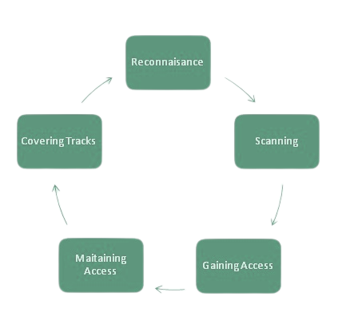

# Test plan template - hackxpert.com/pentest

## 0. Document revision history

| Version       |  Revisor      | Comments      | Date         |    
| ------------- | :-----------  | :----         | :-----       |
|  V 0.1.0      |  skkylimits   | ✅            |  21-12-2021  |
|  v 1.0.0      |  client       | Awesome job!  |  01-01-2022  |

## 1. Goal of the document

[Write down what you are trying to achieve with this document]

In this document we will describe the testing strategy including but not limited to:

- The features to be tested
- The methodology
- The roles and responsibilities
- The entry and exit criteria for testing

## 2. Who is this document for

[Write down the intended readers of the document in this section, this can be brief]  

This document has been created to inform the security representative at "skkylimits"
and the CEO of how testing will be conducted.

## 3. Project description

[Describe what the product you are testing does. What it's functionalities are and who
it's intended audience is briefly.]  

The project is a webshop that is partially completed intended to sell merchandise. Mock
payments can be made but no action is taken such as reducing stock. The project is
intended for the fans of the owner of the website and is a B2C website.

## 4. Testing objectives

[Write down what you want to achieve with testing. This can be brief and can be similar
for most of your clients but make sure it's adapted to every client.]  

**The objective of security testing of the product is to:** 

Define security goals through understanding security requirements of the
applications;

Identify any potential security threats;

Validate that the security controls operate as expected;

Eliminate the impact of security issues on the safety and integrity of the product;

Guarantee that the product will function correctly under malicious attacks;

## 5. Roles and responbilities

[Will the tester be operating alone? Who is to sign off on what document?]

| Who           |  What                                                                                             |   Contact                  |
| :------------- |  :-----------                                                                                     |   :----                     |
| Project lead  |  Oversee all documentation is complete and signed Initiate contact                                |   skkylimits@gmail.com     |
| Tester        |  Will test the application Will create a debriefing video- Will create a detailed report          |   Your contact here        |

## 6. Scope

### 6.1 In scope

[Mention the domains that are in scope or a wildcard. Could also be IP adresses or
applications on any other device.]  

hackxpert.com/pentest

### 6.2 Out of scope

[Mention anything explicitly out of scope]  

Port scanning is out of scope
mail.hackxpert.com is out of scope

## 7. Testing methodology

[Outline what tests you will be doing on what sections of the scope]

We will be following the OWASP top 10 methodology by taking the following steps:
Testing for excessive logging
...

### 7.1 Testing entry criteria

[List anything you need before you can start testing]

### 7.1 Testing entry criteria

[List anything you need before you can start testing]

- The domain needs to be shared with the tester
- VPN access needs to be working
- The site needs to be online
- Test plan needs to be signed off on

### 7.2 Testing entry criteria

[List anything that could possibly hinder testing]

- If the test environment goes down, testing will be delayed and so will the results

### 7.3 Exit criteria

[Define when testing is done]

- All above mentioned tests have been executed on the complete scope
- The testing will stop if remote code execution has been reached

## 8. Results/Deliverables

[Define what you will give to the client to exit the testing]

• Signed NDAs  
• Signed test contract  
• Signed test plan  
• Signed daily reports  
• Signed test report

• A debriefing video has been delivered  
• A sign-off slip has been approved and signed off on 

## 9. Tools

[Define any tools you will be using]

Nmap  
Nikto  
...  
Burp suite  

## 10. Methodologies

The phases 5 of the pentest

Every pentest start with recon, we must map out our attack surface and understand which areas would require the most attention due to their business-critical functionality. 
We will use this information to create a coverage progression report from which we start enumerating.

This information allows us to analyze vulnerabilities and potential craft an exploit for them. After all this we will report that we have either failed or succeeded in abusing the mentioned exploit.

## 11. Track defects

How and where to track defects

We are using JIRA as a defect tracker, please enter all defects found in there. For the login data, please email skkylimits@gmail.com

## 12. Glossary

[If you've used words that are not common knowledge, define them here.]

OWASP top 10 = The  **_OWASP Top 10_**  is a standard awareness document for
developers and web application security.

...

## 13. Sign off

This document needs to be signed by both parties before testing can commence.  
This constitutes a contract of engagement. 

Signed:________________________________  
Name: _________________________________   
Title: ________________________________  
Date: ________________     
RECIPIENT (skkylimits)   
Signed:________________________________   
Name: skkylimits  
Title: President / Security Engineer  
Date: ________________________________    

