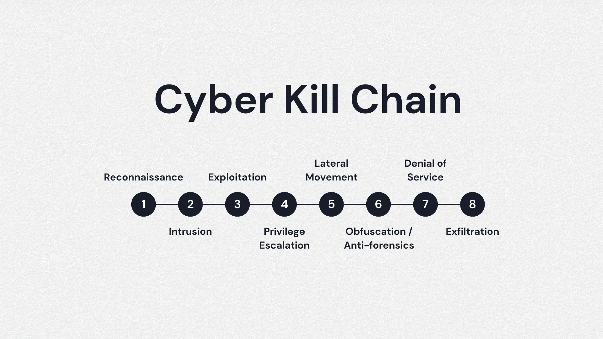

# Lockheed Martin's Cyber Kill Chain®

The goal of Lockheed Martin's Cyber Kill Chain (CKC) is to provide a structured framework for understanding the various stages of a cyber attack and to assist organizations in developing strategies to prevent, detect, and respond to such attacks effectively. By breaking down the attack lifecycle into distinct phases, the CKC helps security professionals identify potential vulnerabilities and implement appropriate defenses at each stage.

Each step in the CKC represents a point in the attack process where defensive measures can be applied to disrupt or thwart the attacker's progress. By understanding how attackers operate and the techniques they use, organizations can better prioritize their resources and investments in cybersecurity to protect against both known and emerging threats.

Ultimately, the goal of using the CKC is to enhance an organization's cybersecurity posture by improving its ability to detect and respond to cyber threats in a timely and effective manner, thereby reducing the risk of successful attacks and minimizing the potential impact on operations, data, and reputation.

## 1 Reconnaissance

Gathering information about the target, such as IP addresses, server locations, and potential vulnerabilities.

## 2 Intrusion

Gaining initial access to the target system or network through various means, such as exploiting vulnerabilities or using stolen credentials.

## 3 Exploitation

Taking advantage of weaknesses in the system to execute malicious code or gain further access.

## 4 Privilege Escalation

Elevating the attacker's privileges within the system or network to gain access to restricted resources or perform additional actions.

## 5 Lateral Movement

Moving laterally across the network from one system to another, seeking out valuable assets and spreading the attack.

## 6 Denial of Service

Launching attacks to disrupt or deny access to services, resources, or networks for legitimate users.

## 7 Exfiltration

Stealing and extracting sensitive data from the target system or network.
