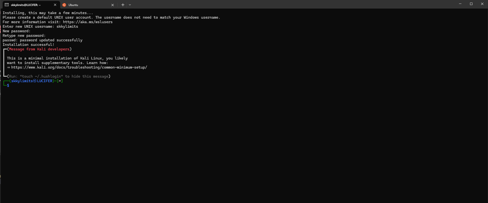

# Win-Kex

Visit [Official Kali Win-Kex Docs](https://www.kali.org/docs/wsl/win-kex/) for more information

## Install a Linux Distribution

### List installed distro's

`wsl --list`

### List Available Distributions

`wsl --list --online`

### ⚠ Install A Distribution Via Powershell

For some reason this version we're pulling wron wsl --list --online is not the current version of kali linux.

> Do not do this ⚠

`wsl --install -d kali-linux`

### Work Around

1. **Open Microsoft Store**:
   - Search for "Linux" to see available distributions like Ubuntu, Debian, Kali Linux, openSUSE, etc.

2. **Select the distribution you want to install** and click "Get" to install it.

### Open Distribution & Choose Username/Password

<br />


### Update Dependencies

`sudo apt update`  
`&& sudo apt upgrade`

## Installing Kali-Win-Kex

`sudo apt install kali-win-kex -y`

::: details Troubleshooting

### Troubleshooting dpkg

```bash
sudo apt install -y kali-win-kex

E: dpkg was interrupted, you must manually run 'sudo dpkg --configure -a' to correct the problem.
```

When you encounter the error `E: dpkg was interrupted, you must manually run 'sudo dpkg --configure -a' to correct the problem`, it means that a previous installation or update process was interrupted and dpkg (the Debian package manager) needs to be configured to fix the issue. Here's how you can resolve this:

#### Step-by-Step Process

1. **Open the Kali Linux terminal** in WSL.

2. **Fix the interrupted dpkg process**:

   ```bash
   sudo dpkg --configure -a
   ```

3. **Update the package list**:

   ```bash
   sudo apt update
   ```

4. **Install Win-KeX**:

   ```bash
   sudo apt install -y kali-win-kex
   ```

This should resolve the interrupted installation issue and allow you to successfully install Win-KeX. If you continue to experience issues, please provide any additional error messages for further assistance.

### Troubleshooting  dpkg Locked By Another Process

The error message indicates that another process is currently using `dpkg`, which locks the frontend to prevent multiple processes from conflicting. Here are the steps to resolve this:

#### Step-by-Step Solution

1. **Identify the process holding the lock**:
   Since the error mentioned a process ID (PID), you can use it to identify and manage the process.

   - In your case, the PID is `194`. You can check which process this is using:

     ```bash
     ps -p 194
     ```

2. **Terminate the process (if safe)**:
   If the process is not critical, you can terminate it. Use `kill` to stop the process:

   ```bash
   sudo kill -9 194
   ```

   **Note:** Be cautious when terminating processes to avoid stopping critical system operations.

3. **Ensure no other package managers are running**:
   Sometimes, the package manager might be running in another terminal or session. Ensure no other instances of `apt`, `dpkg`, or other package management tools are running:

   ```bash
   ps aux | grep -E 'apt|dpkg'
   ```

4. **Run dpkg configuration again**:
   After ensuring no other processes are running, attempt to reconfigure `dpkg`:

   ```bash
   sudo dpkg --configure -a
   ```

5. **Retry updating and installing Win-KeX**:
   Once the above command completes successfully, update the package list and install Win-KeX:

   ```bash
   sudo apt update
   sudo apt install -y kali-win-kex
   ```

### Troubleshooting lib6

```bash
Setting up libc6:amd64 (2.38-10) ...
debconf: DbDriver "config": /var/cache/debconf/config.dat is locked by another process: Resource temporarily unavailable
dpkg: error processing package libc6:amd64 (--configure):
 installed libc6:amd64 package post-installation script subprocess returned error exit status 1
dpkg: dependency problems prevent processing triggers for libc-bin:
 libc-bin depends on libc6 (>> 2.37); however:
  Package libc6:amd64 is not configured yet.
 libc-bin depends on libc6 (<< 2.38); however:
  Version of libc6:amd64 on system is 2.38-10.

dpkg: error processing package libc-bin (--configure):
 dependency problems - leaving triggers unprocessed
Errors were encountered while processing:
 libc6:amd64
 libc-bin
```

The error messages indicate that the installation or configuration of the `libc6` package was interrupted and is now causing dependency problems with `libc-bin`. Additionally, there was a locking issue with `debconf`. Here are the steps to resolve these issues:

### Step-by-Step Solution

1. **Ensure no other package managers are running**:
   Make sure no other package managers (`apt`, `dpkg`, `synaptic`, etc.) are running:

   ```bash
   sudo killall apt apt-get dpkg
   ```

2. **Clear the `debconf` lock**:
   The lock on `/var/cache/debconf/config.dat` may be preventing the process. Ensure no processes are using it and then remove the lock if safe:

   ```bash
   sudo rm /var/cache/debconf/config.dat
   ```

3. **Reconfigure packages**:
   Try reconfiguring the problematic packages manually:

   ```bash
   sudo dpkg --configure -a
   sudo dpkg-reconfigure libc6:amd64
   sudo dpkg-reconfigure libc-bin
   ```

4. **Fix broken dependencies**:
   Attempt to fix any broken dependencies:

   ```bash
   sudo apt --fix-broken install
   ```

5. **Retry the Win-KeX installation**:
   After ensuring all packages are correctly configured, attempt to install Win-KeX again:

   ```bash
   sudo apt update
   sudo apt install -y kali-win-kex
   ```

### Detailed Commands

1. **Terminate all running package managers**:

   ```bash
   sudo killall apt apt-get dpkg
   ```

2. **Remove the debconf lock file**:

   ```bash
   sudo rm /var/cache/debconf/config.dat
   ```

3. **Reconfigure `libc6` and `libc-bin` packages**:

   ```bash
   sudo dpkg --configure -a
   sudo dpkg-reconfigure libc6:amd64
   sudo dpkg-reconfigure libc-bin
   ```

4. **Fix any broken dependencies**:

   ```bash
   sudo apt --fix-broken install
   ```

5. **Update package list and install Win-KeX**:

   ```bash
   sudo apt update
   sudo apt install -y kali-win-kex
   ```

By following these steps, you should be able to resolve the issues with `libc6` and `libc-bin` and successfully install Win-KeX. If problems persist, please provide any additional error messages for further assistance.

### Additional Notes

- If you frequently encounter issues with locked processes, consider reviewing what might be causing interruptions (e.g., system updates, other package managers running in the background, etc.).
- Always avoid forcefully removing lock files, as this can lead to system instability. Follow the steps above to safely manage the processes.

By following these steps, you should be able to resolve the lock issue and proceed with installing Win-KeX.
:::
